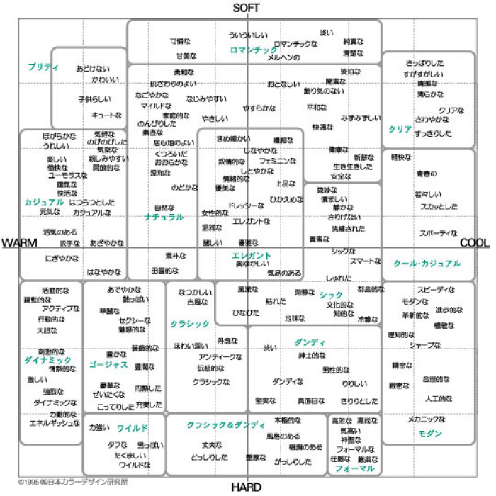
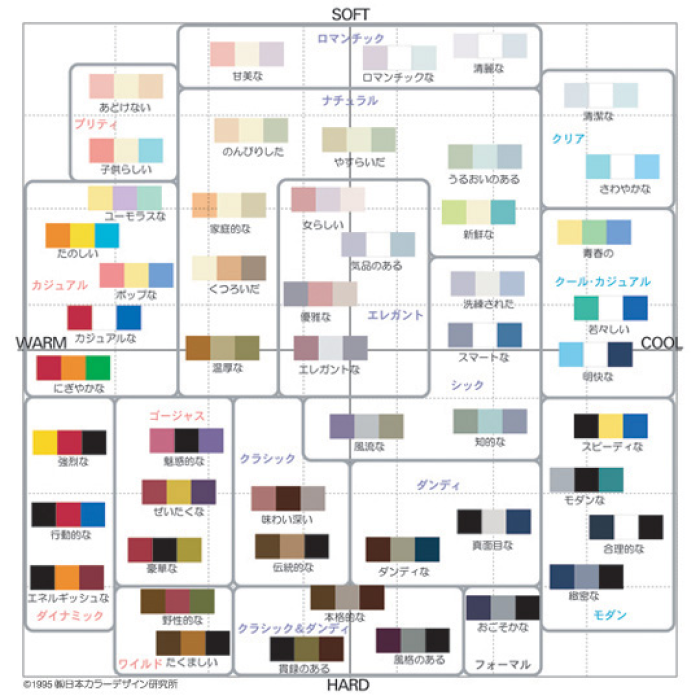

## 色の持つ意味

色自体に意味はありませんが、私たちは赤といえば攻撃的・警告であったり、緑であれば植物・自然などなんとなくイメージするものがありますよね。  
色の持つポジティブ・ネガティブなイメージを考えることで自ずとサービスのテーマカラーが決まる場合もあります。  
ここでは詳しく解説しませんが、[デザイナーじゃなくても知っておきたい色と配色の基本](https://baigie.me/officialblog/2021/01/27/color_theory/)を読み、色が漠然と連想させるイメージがあるということを覚えておきましょう。

### イメージスケール

`イメージスケール`は日本カラーデザイン研究所が研究・開発した感性マッピングツールです。  
色に対して抱くイメージは人によって微妙に異なりますが、共通する部分も多く認められます。そのイメージの共通感覚を心理学的研究の蓄積で明らかにしたものが、イメージスケールです。  
基本のイメージスケールは、イメージの判断基準である WARM－COOL、SOFT－HARD の座標軸上に単色、形容詞、形容動詞を表現した配色が配置されています。  
(本来は第 3 軸として CLEAR-GRAYISH の軸があり、3 次元のイメージ空間となっています)

#### 言語イメージスケール

言語イメージスケールでは形容詞や形容動詞など修飾的に使われる語を中心に 180 の言葉がプロットされています。  
私たちが色に対して持っている共通した感覚を研究し、カラーイメージスケールと相互の関係を重視して開発されています。  
そのため単色イメージスケール、配色イメージスケールと強い互換性があります。  
例えば、カラーイメージスケールで赤がある位置に、言語イメージスケールでは`元気な`、`快活な`などの言葉があります。  
これは赤に対して私たちは`元気`、`快活`といったイメージを持ちやすいということになります。

#### 配色イメージスケール

単色と同様、２軸上に配色がプロット、配色を使うことで、単色では表現できなかったイメージもあらわせるようになり、スケール全体に広がっています。  
複数の色を組み合わせることで単色より複雑で繊細なイメージの違いを表現することができます。

### 個人シートに学んだことを記入しましょう！

#### 今回やったこと

- 色の持つ意味
- 言語イメージスケール
- 配色イメージスケール

できたら次に進みましょう。
