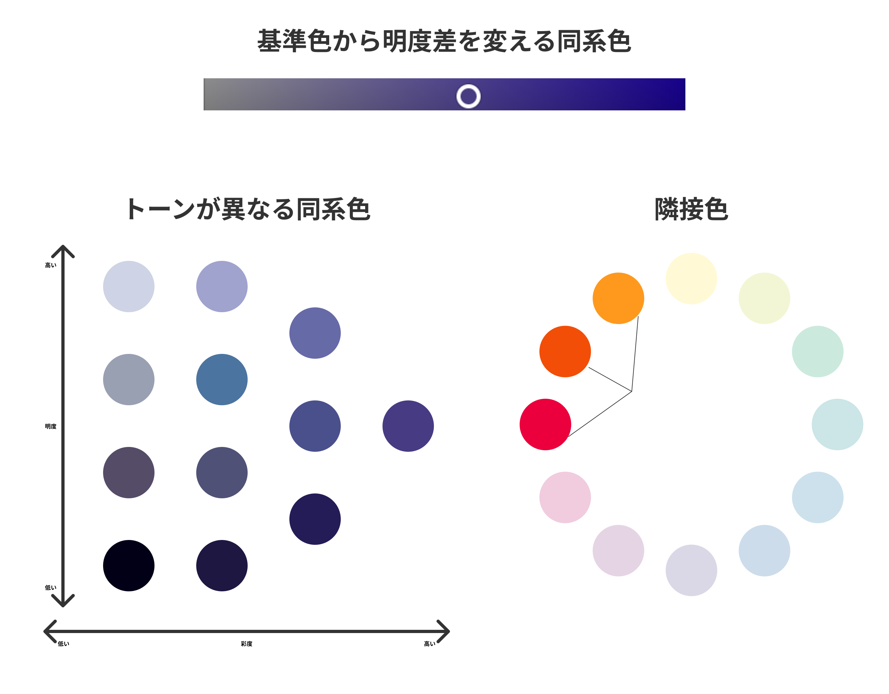
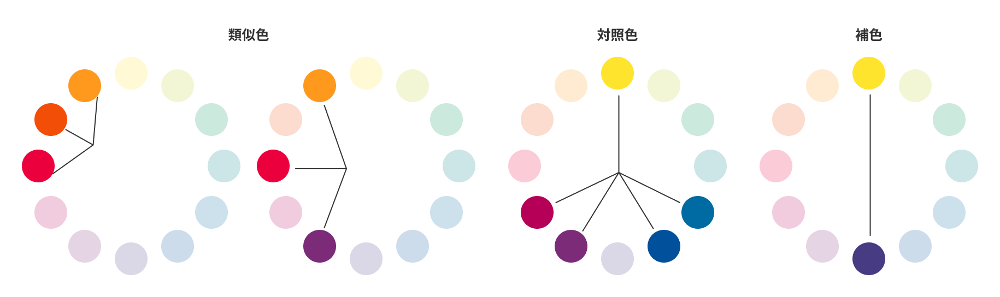
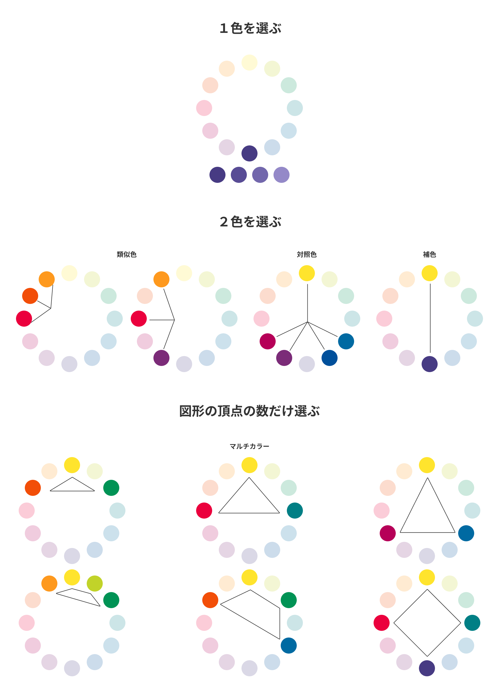

## 配色

複数の色を組み合わせる配色には、いくつかのセオリーや考え方があります。  
配色は奥が深くマスターするには時間がかかりますが、基本的なものを紹介します。

### 無彩色を使う配色

白、黒、グレーといった無彩色は特定の色を持たないため、どの有彩色と組み合わせてもうまくまとまります。  
特に黒・白は、合わない色はほとんどありません。  
色が苦手な人でも、有彩色は 1 色にし、あとは無彩色で構成すれば、手軽にまとまりある配色を実現できるでしょう。  
注意が必要なのは WEB サイトで真っ黒はのっぺり感が出るのでほぼ使いません。  
有彩色を黒に近づけ無彩色にするなどちょっとした工夫は必要です。

### 同系色を使った配色

無彩色との組み合わせと同様に、比較的うまくまとめることができるのが、同系色を使った配色です。  
同系色とは、主に以下の 3 パターンとなります。

- 明度もしくは彩度だけが異なる色の組み合わせ
- トーンは異なるが同じ色相の色の組み合わせ（トーン・オン・トーン）
- 隣接色の組み合わせ

### 色相環の見方

色相環の見方には３種類あります。

#### 1.隣接色・類似色

隣り合う色を`隣接色`、30~60 度の色相差がある色を`類似色`と言います。  
近い色になるため、比較的扱いやすい配色です。  
これらの色を組み合わせると、統一感やまとまりがある印象になります。

#### 2. 対照色

120~150 度の色相差がある色を`対照色`と言います。  
このあと説明する補色と比較的近い、ダイナミックな印象を与えることができます。  
補色と比べる色の距離は近く、選択肢も多いため、より多彩な印象形成が可能です。  
ロゴなどでは、補色よりも多く使われる配色です。

#### 3. 補色

正反対にある色（補色）を組み合わせた配色です。  
色の差が大きいため、ダイナミックな印象、カジュアルな印象を与えることが可能になります。  
お互いの色を引き立てあう効果がありますが、使う割合を同じくらいにしてしまうと全体的に散らかった印象になる場合があり、注意が必要です。

### 色相環から考える配色

色相環で配色を考える場合、以下の種類があります。  
使う色味が増えれば増えるほど、統一感が出にくくなるので難易度が上がります。

### Adobe Color で見てみよう！

[Adobe Color](https://color.adobe.com/ja/create/color-wheel)を開いてみましょう。  
類似色・補色などを自動で選んでくれます。  
メインカラーが決まった場合など参考にしてみるといいかもしれません。  
隣のタブ(テーマ・グラデーションを抽出)などイメージとなる写真から色を抽出することもできます。

### 参考

- [色相環で考える配色｜明度 、彩度とは](https://sevendex.com/post/7275/)
- [デザイナーじゃなくても知っておきたい色と配色の基本](https://baigie.me/officialblog/2021/01/27/color_theory/)
- [デザイン戦略](https://twitter.com/arai_yusaku/status/1485768024632492033?t=5PmbOrzUgzSqZvOlFsDm-Q&s=19)

### PGwebで課題を完了しましょう！

PGwebで "課題を完了済みにする" ボタンを押してこの課題は完了です。

#### 今回やったこと

- 無彩色を使う配色
- 同系色を使った配色
- 色相環の見方
- 色相環から考える配色

次の課題へ進みましょう！
