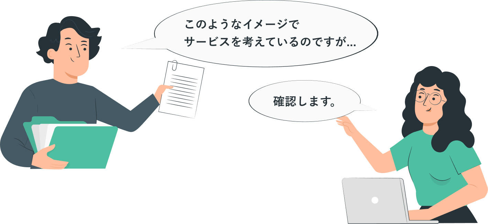
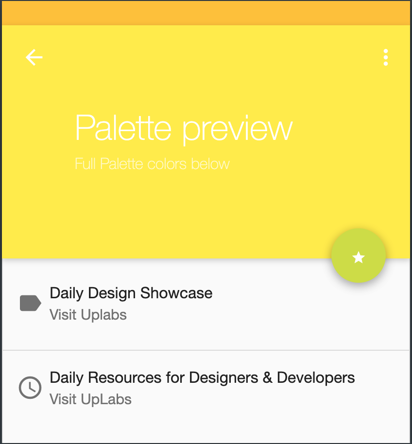
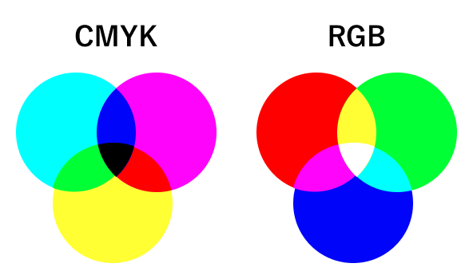
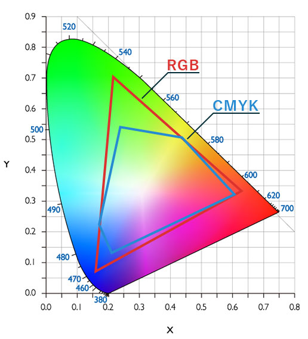
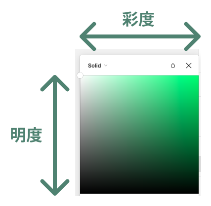
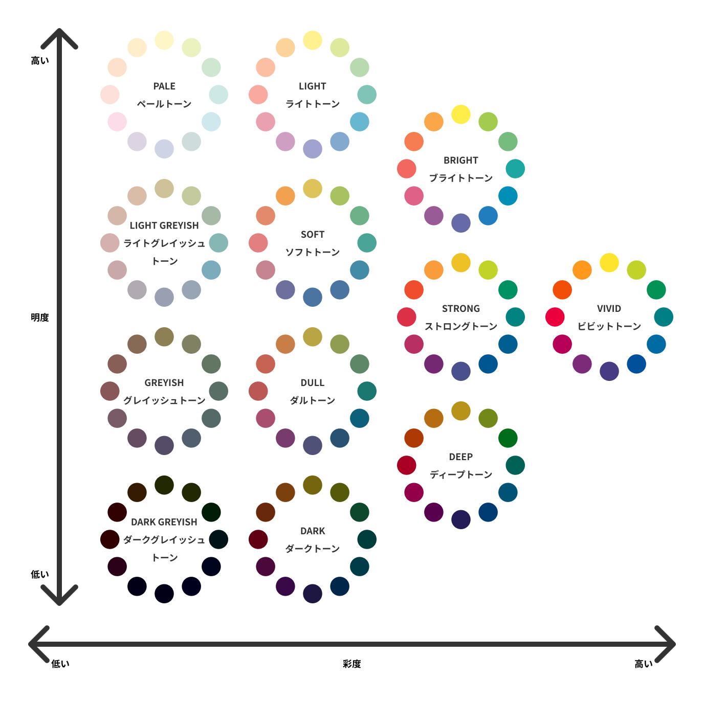

## 色からサービスを考える

あなたは、今デザイナーとしてアプリの開発プロジェクトにアサインされています。  
数回目のクライアントとの mtg で、アプリのイメージについて話しています。

[[right | クライアントからアプリのイメージを渡されました(右写真)。 どのような感想を持ちましたか？     例えば... ・黄色と黄緑相性悪そう... ・明るく親しみやすい雰囲気を出したいのかな？ ・黄色背景に白い文字は見にくいな...   このような感想を論理的に説明し、新しい色味を提案できるようになるのがこの課題での目標です。 順番に見ていきましょう。]]
|  [material palette](https://www.materialpalette.com/)より

### そもそも色ってどのようにできてるの？

色の三原色は聞いたことがありますよね？  
すべての`色`というのは光から刺激を受け、カラー認識をしています。  
これが`光の三原色`と呼ばれる色彩、`RGB`といわれる Web 上やテレビのディスプレイなどで表現される基本の色です。

#### 減法混色(CMYK)と加法混色(RGB)

##### CMYK とは

Cyan、Magenta、Yellow、Key plate(≒ 黒、墨)から頭文字 1 文字ずつ取ったものが CMYK です。  
これらは混ぜると暗い色へと変化していくため、`減法混合や減法混色`と呼ばれます。  
印刷の際に使われます。

##### RGB とは

Red、Green、Blue の三つの原色を混ぜて幅広い色を再現する加法混合の一種が RGB です。  
これら混ぜると明るい色へと変化していくため`加法混合や加法混色`と呼ばれます。  
コンピュータやテレビの映像表示に使われています。

#### CMYK と RGB で色を表現しよう！

全ての色が表現できると思っているあなたは大間違いです。  
金色・銀色など、表現できないものを`特色`と言います。  
また、CMYK と RGB で表現できる範囲も異なりますから、PC で作ったポスターを印刷するなどの場合は注意が必要です。

### 色の三属性(トーン)

#### 1.色相

赤・青・緑など私たちが想像する色そのもののことです。

#### 2.明度

色の明暗のことです。色が明るいほど明度が高く、暗いほど明度は低くなります。

#### 3.彩度

鮮やかさの度合いのことです。彩度が高いほど、鮮やかでハッキリとした色合いになり、低いほど薄暗く濁ったような色合いになります。

また、明度と彩度が同じ色相グループを`トーン`といいます。  
PCCS（日本色研配色体系）では、縦軸を明度、横軸を彩度とし、以下のように色相環(色相を環状に配置したもの)で体系化されています。  
次のページでは配色を考えてみましょう。

### 個人シートに学んだことを記入しましょう！

#### 今回やったこと

- 色の作られ方
- 減法混色(CMYK)と加法混色(RGB)
- 色の三属性(トーン)

できたら次に進みましょう。
