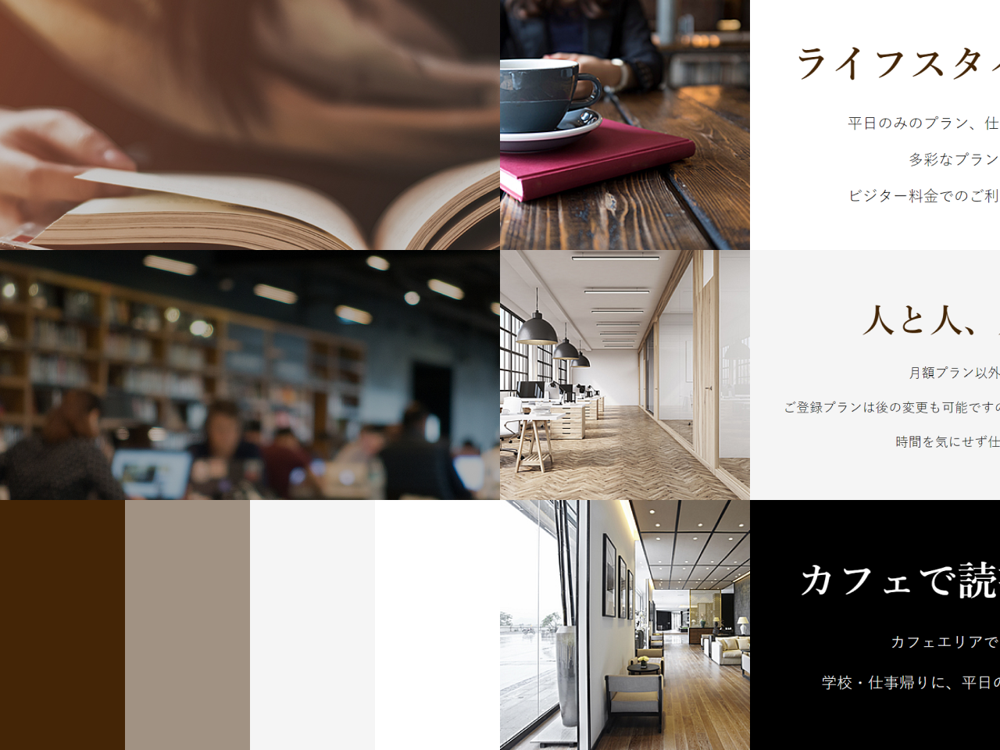
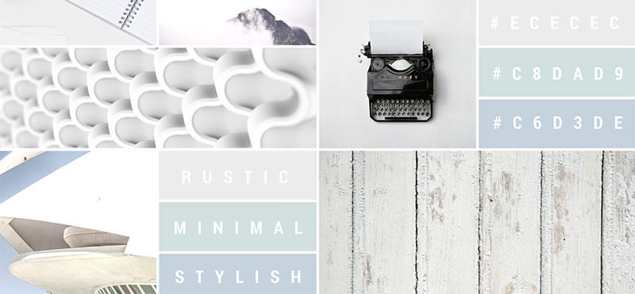
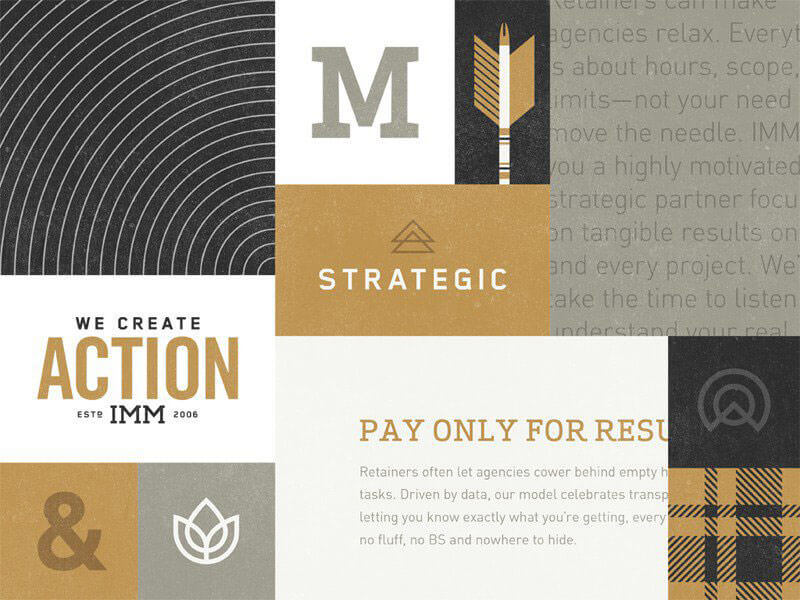
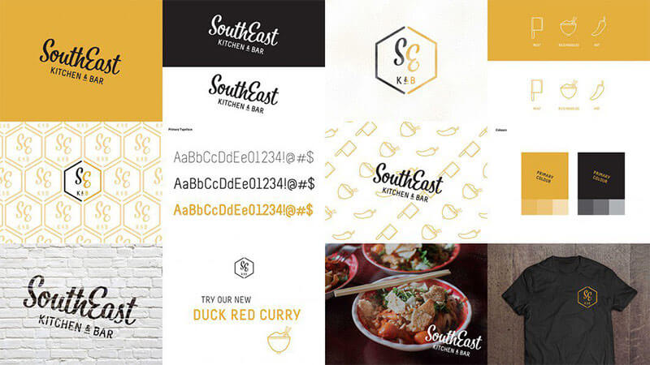

## 配色課題

配色の決め方の例としてムードボードを活用する方法があります。
今回はムードボードを作成してみましょう。

### ムードボード

ムードボードとは、コンテンツに関わる視覚的要素を1枚のボードにまとめたものです。

メリット
- デザインのコンセプトを決め、簡単に1枚のボードで表すことができる。
- だれかとデザインのコンセプトを共有するときの材料になる。

ムードボードを利用する流れの一例
1. 何を作るのか決める（Webサイト, アプリ, 広告 etc.）
2. 載せたい情報を整理し、画面枠や広告枠の中でどう配置するか決める。
3. ムードボードを作成し、デザインコンセプトを決める。
4. デザインコンセプトを反映させて完成。

ムードボードの例

[実際のサイト](https://demo.tcd-theme.com/tcd063/)


ほかにもこんなものが．．．

|  |  |
| --------------------------------------- | --------------------------------------- |
|  |  |


### 課題

では、実際にムードボードを作成してみましょう。

今回は上記で紹介した「ムードボードを利用する流れ」とは逆になりますが、好きなサイトを見つけてムードボードを作成しましょう。
すでにデザインが完成しているものから逆にムードボードを作ってみるとムードボードを作るコツがつかめると思います！

流れ
```
1. 何でもいいので好きなサイトを1つ決める。困ったら「サイト デザイン 参考」で検索して探してみましょう。
2. 決めたサイトから「テキスト、背景色、画像」など素材を収集する。
3. Figmaの課題ファイルの`配色課題`と書かれたページに収集したものをコピペしていく。
4. 収集したものを使ってムードボードを1枚作成する。
```

条件
```
ムードボードのフレームサイズ、縦横比は自由
素材はサイトを部分的にスクショして集めていくでOK！
```

### 完成したら

この課題では合否はないです(^▽^)

Pgritで`#design_review`を付けて修了生からコメントをもらいましょう！（修了生からのレビューの待機中では次の課題を進めてOK）

 参考サイト：[デザイン認識の違いを防ぐ、効果的なムードボードの作り方ポイントまとめ](https://photoshopvip.net/87871)
