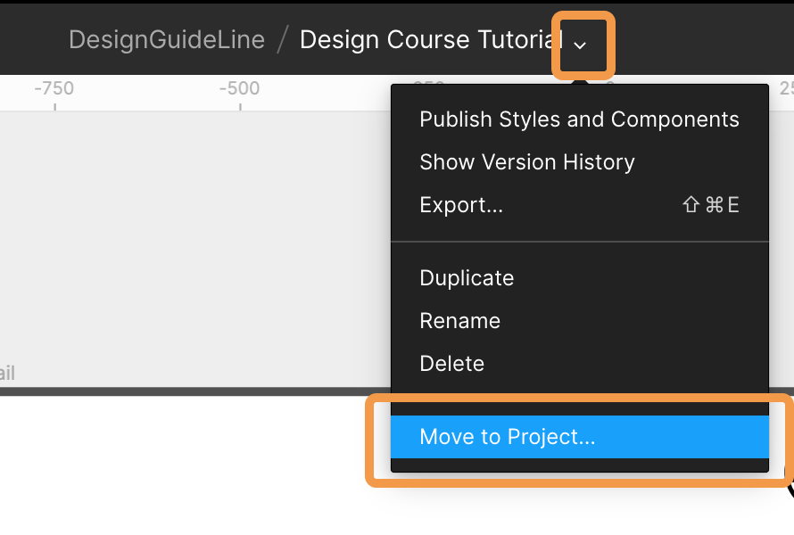
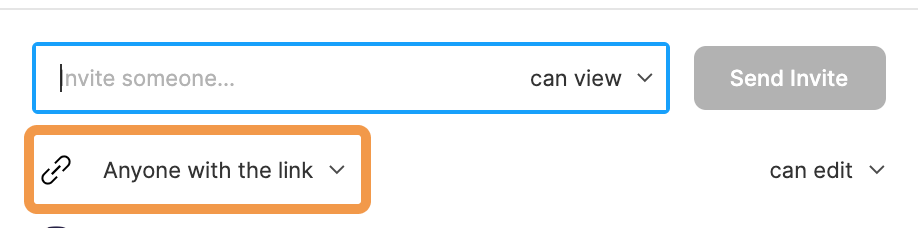

これからは、Figma という Web デザインツールを用いて学びます。基本的な操作方法を学びましょう。  
**[chot design](https://chot.design/figma-beginner/)**という外部サイトを利用して学びます。会員登録をして学習記録をどんどん残しましょう！

まずは、Figma のユーザー登録、インストール、Shinonome チームへの参加をしてもらいます。  
リンクから**`1. Figma の概要とインストール`**の章を全て読み、デスクトップアプリをインストールしましょう。
この章では Figma の強みなどが書かれています。読み終わったらどのようにその強みが活かせるのか考え、 Study Diary に書いてみましょう。

### インストールが済んだら

Shinonome のチームに招待をするので@akane さんに Figma の登録メールアドレスを伝えて、招待してもらいましょう。

### 招待してもらったら

教材を自分用に複製しましょう。

1. Figma を開いて左側のサイドバーから shinonome をクリック
2. DesignGuideLine をクリック
3. Design Course Turtrial を右クリックして複製
4. 複製したものを Design Course Tutorial (Username)のように自分の名前をつけて rename
5. 複製したものをダブルクリックして中身を見る
6. 画像のように ▽ をクリックして Move to Project から Drafts を選択
7. 右上の`Share`ボタンから`Anyone with link`を選択

| Move to Project                         | Anyone with link             |
| --------------------------------------- | ---------------------------- |
|  |  |
