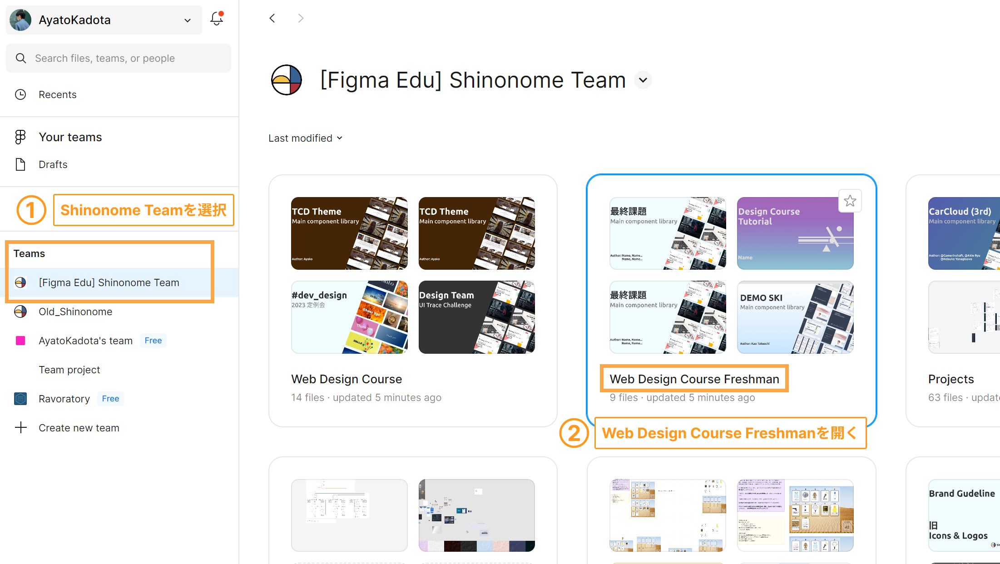
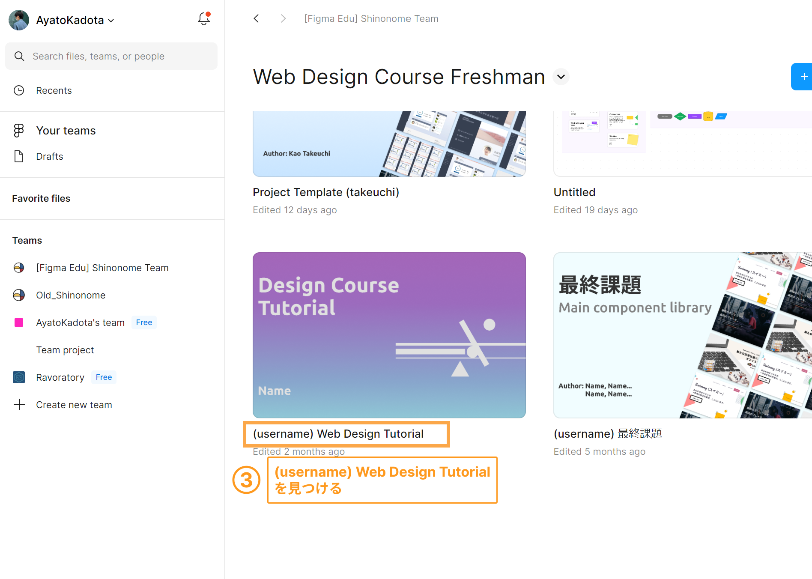
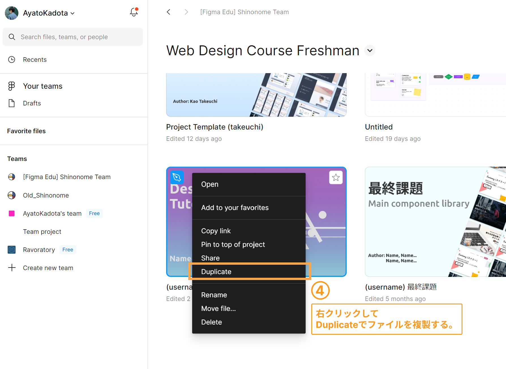
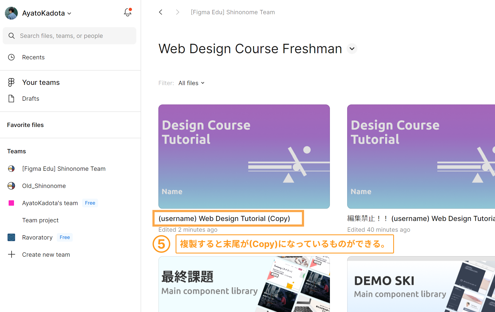
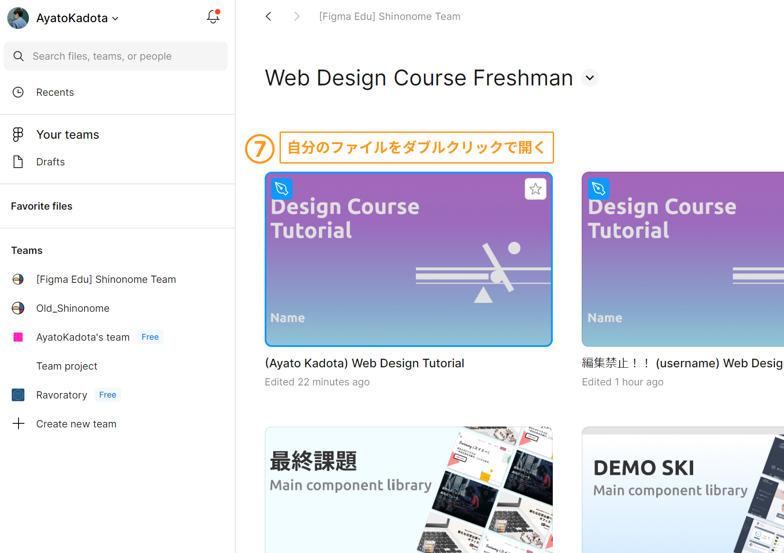
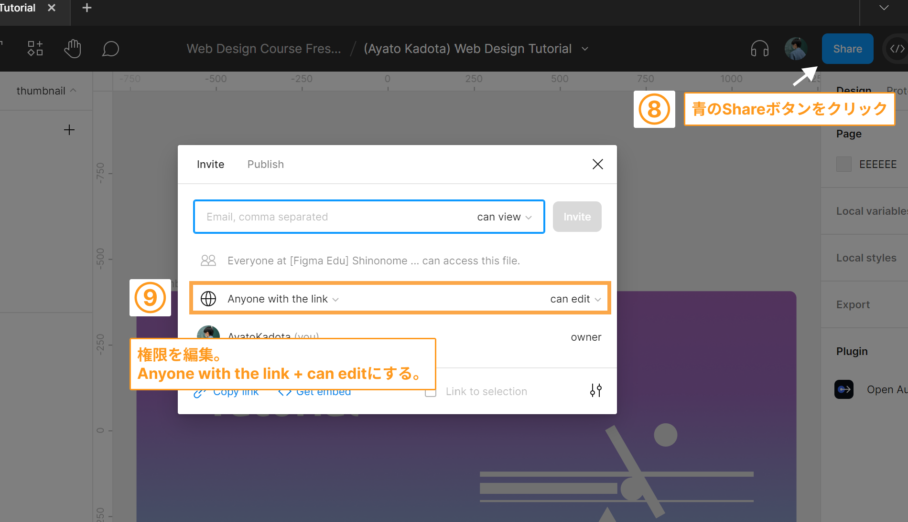
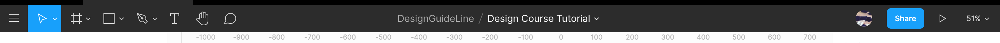
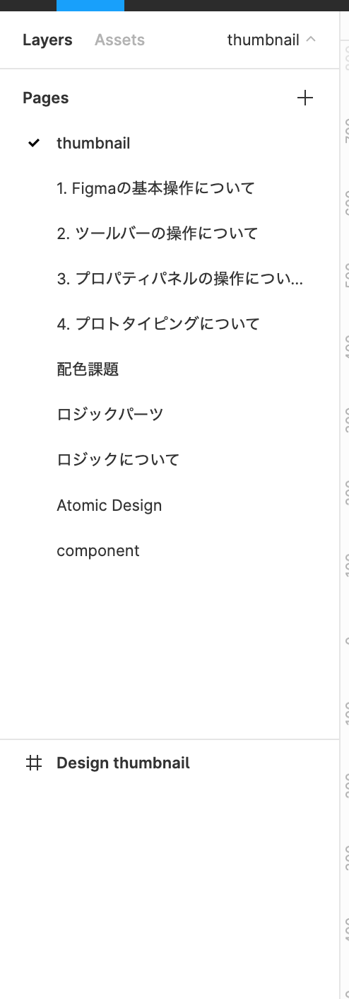
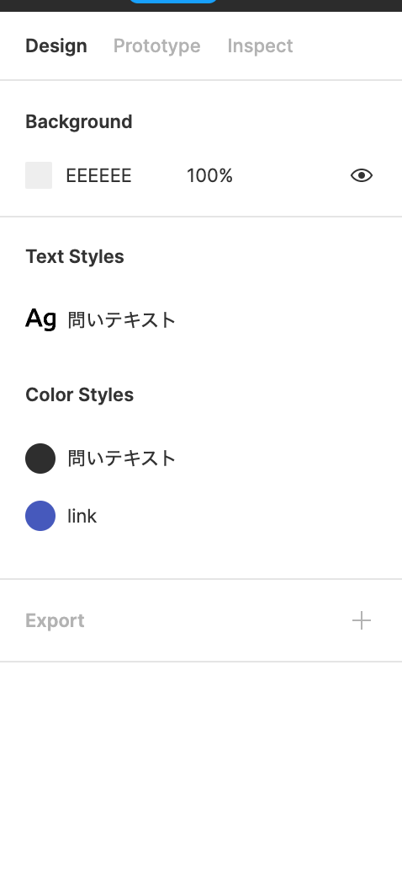
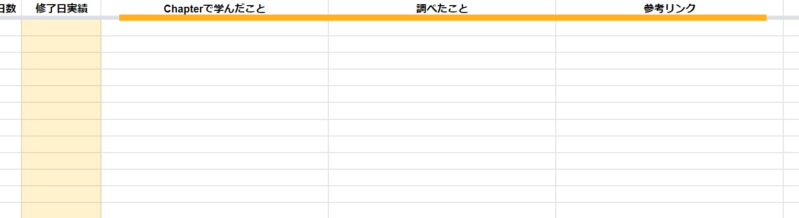

## この章で学ぶこと

- Figma とは
- Figma のインストール

### Figma とは

Figma は 2016 年 9 月にリリースされた UI デザインツールです。  
デザインツールは他にも Sketch や Illustrator などありますが、Web アプリ開発に必要な機能を一通り備えているのが Figma です。

#### チーム開発に最適な Figma

Figma の最大の利点は複数人での作業がしやすいことです。デザインに直接コメントできる機能やバージョン管理などチームでの横断的な使用を前提とした機能をがあります。  
また、デザイナーだけでなく、エンジニアが、ワイヤーフレームやデザイン仕様を確認するのにも利用できます。

### Figma をインストールする

#### デスクトップアプリのダウンロード

ブラウザでも作業は十分可能ですが、機能に制限があったり、頻繁に使うのでデスクトップアプリをインストールしましょう。  
[ここ](https://www.figma.com/downloads/)からダウンロードし、登録したアカウントでログインしましょう。

#### Figma の初回起動時チュートリアル

Figma がチュートリアルを用意してくれています。  
一通り受けて、Figma の概要を理解しましょう。

### Figma の課題を用意する

教材を自分用に複製しましょう。  
今後の課題はこの Figma のプロジェクトを使って行います。

 

 

 

 

 

 

 

もし操作がわからない場合は Slack の[#dev_design](https://playground-universe.slack.com/archives/CJ3PDBCAZ)チャンネルまで！

### Figma の機能のある場所

これからの課題を円滑に進めるため、私たちが説明の際に用いている名前を紹介します。

| ツールバー                    |
| ----------------------------- |
|  |

| 左サイドバー                          | 右サイドバー                              |
| ------------------------------------- | ----------------------------------------- |
|  |  |

### 注意点

これから様々な機能を学んでいきますが、ショートカットを紹介している機能もあります。  
しかし、そのショートカットは Mac のものです。  
command=ctrl , option=alt に対応しているので試してみてください。  
ショートカットが使えない場合は教材が間違っています。  
教材を修正するので遠慮なく Slack の[#dev_design](https://playground-universe.slack.com/archives/CJ3PDBCAZ)チャンネルまで！

また、これから基本操作を学んでいきますが、この教材だけでなく公式ドキュメントを読んで理解することも大切です。  
Figma のサイトは英語なので読むのが大変だとは思いますが、英語で理解することも大事なので挑戦してみましょう。  
動画で説明してくれているセクションもあるので随時参考にしてください。

### 個人シートに学んだことを記入しましょう！

チュートリアルやこのページで理解したことを書きましょう。  
難しくて調べたことや調べたサイトのリンクも書きましょう。  
それができたら次に進みましょう。
