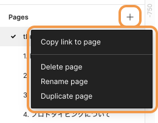
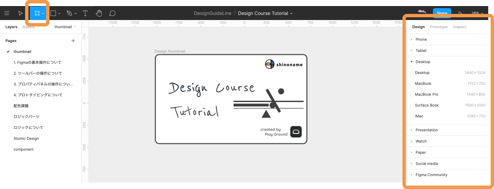
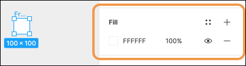
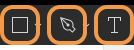
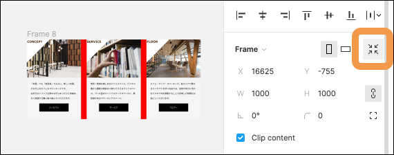
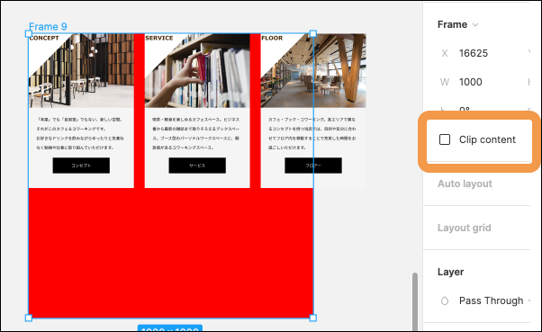

## ページ・フレーム・オブジェクトの作成

### ページを作成する

[[right | 左サイドバーの Pages の`+`ボタンからページを新規作成できます。<br/>`Page○○`のままでもいいですが、ページ名は適した名前に変えることが望ましいです。<br/>ページを右クリックすることで以下のことができます。(英語ヨンデネ)<br/>名前の変更はページ名をダブルクリックでも変更することができます。]]
| 

### フレームを作成する

[[right | ページを作成したらフレームを作りましょう。<br/>ツールバーの`#`のようなアイコンからフレームを作成することができます。<br/>選択すると、右側のメニューから端末に合わせたサイズを提供してくれるので適切なものを選びましょう。<br/>自分の好みのサイズで自由に作成することもできます。<br/>フレームの名前もページと同じ方法で変更することができます。]]
| 

#### フレームの色を設定する

[[right | フレームの色はデフォルトで白(FFFFFF)が設定されています。<br/>フレームを選択し、右サイドバーの`Fill`から変更することができます。<br/>`FFFFFF`の左の四角をクリックしてパレットを出して変更してみましょう、直接カラーコードを入れて変更することもできます。]]
| 

### オブジェクトを作成する

[[right | ページ・フレームが作成できればあとはデザインの中身を作るだけです。<br/>オブジェクト作成に使うのは]]
|

```
・ ペンツール
・ シェイプツール
・ テキストツール
```

**ペンツール**  
ベクターで線を書くツールです。 直線や曲線を書くことができます。

**シェイプツール**  
以下の図形を作ることができます。

```
・ Rectangle
・ Line
・ Arrow
・ Ellipse
・ Polygon
・ Star
・ Place Image
```

**テキストツール**  
文字を入れるツールです。

### オブジェクトに対してフレームをフィットさせる

フレームの中にオブジェクトを入れている場合は、フレームのサイズを自動で調節してくれる機能が使えます。  
右サイドバーの矢印が４つ中心に向いているアイコンをクリックすると、オブジェクトに対してフレームの大きさをフィットさせることが可能です。  
これは`resize to fit`と呼ばれています。  
下の画像をは、フレームの中にカードを 3 枚並べて、フレームの fill は赤色に設定しています。  
before はカード 3 枚が見切れていたり、下に余分な余白があることがわかると思いますが、resize to fit した後ではそれが調節されており、違いがわかると思います。

| before                      | resize to fit                             |
| --------------------------- | ----------------------------------------- |
|  |  |

### フレーム外のオブジェクトを表示する

デフォルトでは、フレームに入れ子(ネスト)になっているものの、フレームの範囲外に配置されているものは表示されないように`Clip content`という機能にチェックが入っています。  
範囲外にあるものも表示したい場合は Clip content のチェックを外しましょう。

| before                      | Clip content                    |
| --------------------------- | ------------------------------- |
|  |  |

### 参考

- [公式ドキュメント ~Page~](https://help.figma.com/hc/en-us/articles/360038511293-Create-and-Manage-Pages)
- [公式ドキュメント ~Frame~](https://help.figma.com/hc/en-us/articles/360041539473-Frames-in-Figma)
- [公式ドキュメント ~Object~](https://help.figma.com/hc/en-us/articles/360041064174-Access-tools-in-the-Editor-with-the-toolbar#Shape_tools)

### 個人シートに学んだことを記入しましょう！


#### 今回やったこと

- ページ・フレーム・オブジェクトの作成
- フレームの resize to fit
- フレーム外のオブジェクトの表示 Clip content

できたら次に進みましょう。
