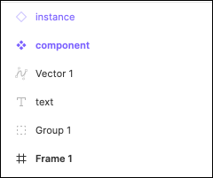
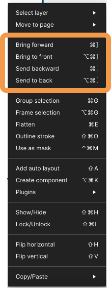

## レイヤーを管理する

### 左サイドバー

左サイドバーは以下の項目から成り立っています。

```
・ Pages
・ Layer
・ Assets
```

Pages は前の段階で学びましたね、今回は Layer について学びましょう。

### レイヤーパネルを操作する

#### レイヤーの種類

キャンバスに追加したフレームやグループ・オブジェクトはレイヤーパネルで管理します。  
レイヤーはグループやフレームを含め入れ子にすることができます。  
レイヤーの種類はアイコンで判断できます。  
instance,component は後述します。



#### レイヤーの重なり

レイヤーパネルでキャンバスでの重なり順を操作することができます。
ドラック＆ドロップで変更しましょう。  
直接オブジェクトを右クリックでメニューを出して変更することもできます。  
他にもどんなことが右クリックでできるかみておくとこの後少し楽になります。  


#### レイヤーの管理

レイヤーをホバーすることで表示される

- 目のアイコンで表示・非表示
- 鍵のアイコンでロック

ができます。  
ロックすることで、キャンバスで操作をできない状態にします。  
本当に不要な場合は、非表示にするのではなく削除しましょう。  


### 参考

- [公式ドキュメント](https://help.figma.com/hc/en-us/articles/360039831974-View-layers-and-assets-in-the-Layers-Panel)

### Study Diary を書きましょう！

#### 今回やったこと

- レイヤーの種類
- レイヤーの重なり
- レイヤーの管理

できたら次に進みましょう。
