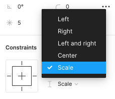

## フレームセレクションとグループセレクション

グループ化には 2 種類あります。場合に応じて、使い分けましょう。

### フレームセレクション

フレームを入れ子状のグループにすることです。  
フレームのグループの場合、親フレームのサイズを変更すると、ネストされたものは右サイドバーの`Constraints`(後述します)の設定に合わせて変化します。  
また`Auto layout`(後述します)などの制約もつけられます。
そのため配置に意味があったりするなど、機能を使いたい時はフレームセレクションにしましょう。  

### グループセレクション

ただ単にグルーピングをしたい時はグループセレクションを使いましょう。  
複数のオブジェクトを１つのレイヤーとして扱うことができます。

### 切り替える

フレームセレクションとグループセレクションを切り替えることができます。  
下の画像は frame を選択している時の右サイドバーの様子です。  
frame と書かれているプルダウンから group に変更することができます。  
逆も同様です。

### Study Diary を書きましょう！

#### 今回やったこと

- フレームセレクション
- グループセレクション

できたら次に進みましょう。
