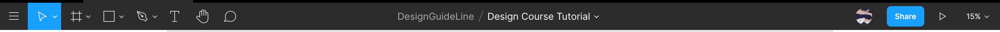
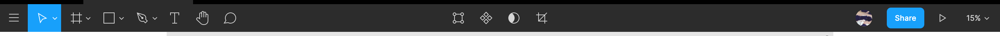
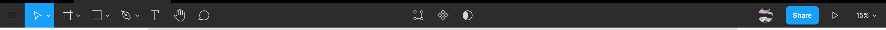
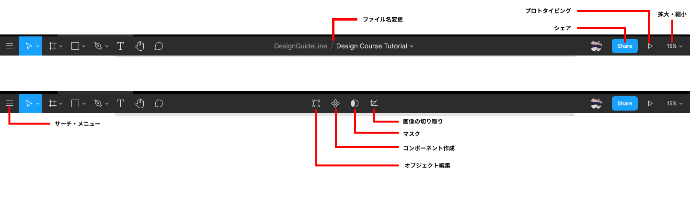
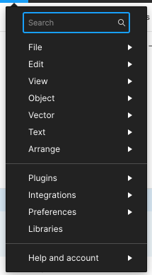

## ツールバーの操作・概要

### ツールバーの基本操作

ツールバーはレイヤーリストやプロパティパネルとは違い、数値や文字を入力することは、ほぼありません。  
Figma のツールバーは、選択しているレイヤーにより変化します。

| 何も選択していない場合      |
| --------------------------- |
|  |

| 画像を選択している場合   |
| ------------------------ |
|  |

| シェイプを選択している場合 |
| -------------------------- |
|  |

### ツールバーの機能

各ツールバーのツールの名称は下の画像のようになっています。  
先述したツールについては割愛し、その他１つ１つのツールの詳細な使い方については、この後説明します。

#### サーチ・メニュー

Figma 上で行える様々なコマンドが階層式のメニューとして表示されます。  
検索窓にキーワードを入力することでコマンドをすぐに呼び出すことも出来ます。  
クリックすると、メニューの選択項目と検索窓が出てきます。  

**メニューを選択する**  
メニューはいくつかに分類されていて、階層式になっています。行いたい作業を探して選択しましょう。

**検索窓**  
メニューの項目名を覚えている場合は検索窓に実行したい項目を入力すると、すぐに探して実行することができます。

検索機能を活用して作業効率を上げていきましょう。

#### オブジェクト編集

オブジェクトをベクター編集することができます。

#### コンポーネント作成

再利用可能なコンポーネントを作成することができます。

#### マスク

特定の部分のマスキングすることができます。

#### 画像の切り取り

画像を切り取りするこができます。

#### ファイル名変更

プロジェクトのファイル名を変更することができます。

#### シェア

ファイルを外部にシェアすることができます。

#### プロトタイピング

作成したプロトタイピングの再生を行うことができます。

#### 拡大・縮小

キャンバスを拡大縮小して表示します。

### Study Diary を書きましょう！

#### 今回やったこと

- ツールバーの基本操作
- ツールバーの概要

できたら次に進みましょう。
