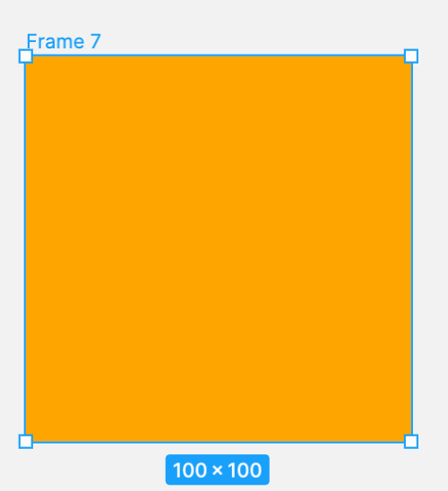
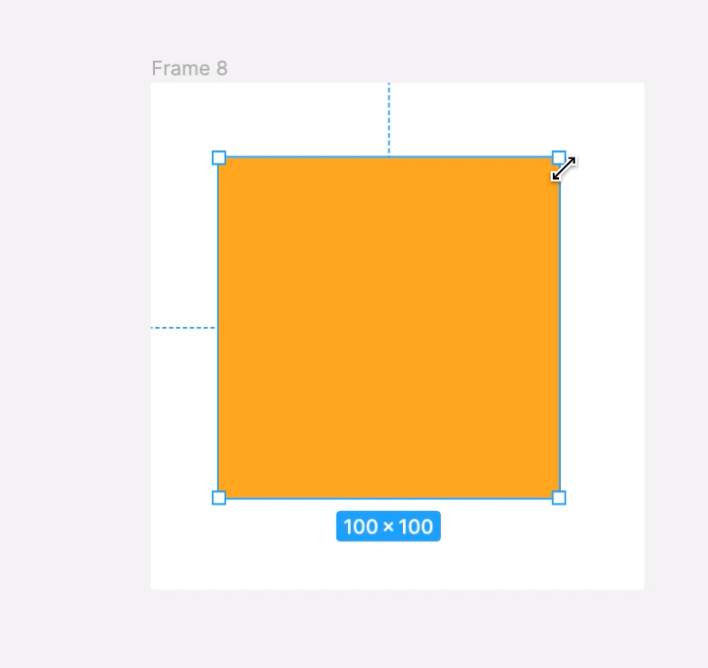
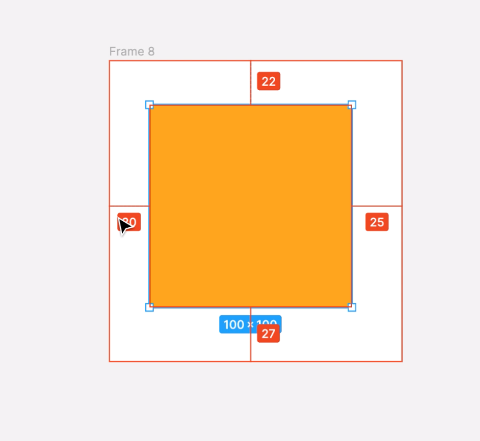

## オブジェクトとキャンバスの操作

### キャンバスの移動

Space を押しながらドラッグをすることで`ハンドモード`になり、キャンバスを移動する事ができます。  
また、トラックパッドの場合は、二本指で縦横にスクロールする事で、キャンバスを移動する事ができます。  
ツールバーの手のアイコンからハンドモードにすることも可能です。

### キャンバスの拡大・縮小

ツールバー右上の％が書いてある箇所からも拡大・縮小を行うことが出来ます。  
キーボードから数値を入力することで指定の大きさにすることも出来ます。  
トラックパッドの場合は、ピンチ・アウトを行うこととで、拡大・縮小を行うことが出来ます。

その他のキーボードショートカットは以下のとおりです。

```
拡大： ^
縮小： -
選択部分の拡大：Space + Z + click
選択部分の縮小：Space + Option + Z + click
全体表示：Shift + 1
100%表示：Shift + 0
```

キャンバスの移動・拡大・縮小はよく使う手順になります。  
キーボードとマウスの組み合わせをしっかりと手に馴染ませると、効率よくデザイン作業をすすめることができます。

### オブジェクト・アートボードのサイズ変更

[[right | オブジェクトのサイズを変更するには、対象となる図形を選択し、上下左右にある白い四角をドラッグします。<br/>`+ Option キー`は中心を起点にサイズが拡大・縮小します。<br/>`+ Shift キー`は縦横の比率を固定したまま拡大・縮小を行うことが出来ます。<br/>`+ Optionキー + Shift キー`は中心を起点に比率を固定したまま拡大・縮小を行うことが出来ます。]]
| 

サイズの変更はマウスを使わずにキーボードだけでも行なえます。

```
1px ずつ拡大・縮小：Command + [↑↓→←]
10px ずつ拡大・縮小：Command + Shift + [↑↓→←]
```

### オブジェクト・アートボードの移動

オブジェクト・アートボードを選択した状態で、ドラッグを行うと位置を移動することが出来ます。

`+ Shift キー`で水平・垂直に限定した移動を行うことが出来ます。  
`+ Option キー`で複製した上で移動することが可能です。  
`+ Shiftキー + Option キー` で水平・垂直に複製した移動ができます。

### オブジェクト・アートボードの複製

オブジェクトやアートボードも普段のテキストと同じように `Command + C` でコピー、`Command + V`でペーストすることができます。

それ以外にもいくつかオプションがあります。

- コピー元を消去しコピー＆ペースト  
  `Command + X / Command + V`
- 直前の操作を繰り返すコピー＆ペースト  
  `Command + C / Command + D`

この操作を行うには、まず参照する操作が必要となるため、複製操作が必要となります。  
何もしていない場合は、同じ位置に複製されたオブジェクトが生成されます。

### オブジェクトのグループ化

複数のオブジェクトをグループ化すると、1 つのオブジェクトとして扱うことができます。  
グループ化されたレイヤーは`グループレイヤー`へと変化します。  
グループ化されたオブジェクトは入れ子の状態となるため、階層構造を形成します。

グループ化を行うにはグループ化したいものを複数選択する必要があります。  
`Command`を押しながらオブジェクトをクリック、または、ドラッグした範囲内のもの、レイヤーパネルで `Command`を押しながらなど様々な方法があります。  
グループ化を行うショートカットは、複数選択している状態から、`Command + G` です。  
グループを解除したい場合のショートカットは、解除したいグループセレクションを選択し、`Command + Shift + G`です。

**※グループ化するとレイヤーのアイコンが変化します。**

### オブジェクトの回転

[[right | オブジェクトの回転を行うには、回転させたいオブジェクトを選択し、角にマウスを合わせると回転矢印が出てくるので、ドラッグを行うことで、回転を行うことが出来ます。<br/>`Shift キー`を押しながらドラッグするとで 15 度ずつの回転ができます。]]
| 

### オブジェクト・アートボードの消去

オブジェクト・アートボードの消去
作成したオブジェクト・アートボードの消去を行うには、消去したいオブジェクト・アートボードを選択し、`Delete キー`で消去することが出来ます。  
**※アートボードを消去するとアートボード内のオブジェクトも一括消去されるので注意しましょう。**

### 操作の取り消し・やり直し

直前の操作を間違えた場合は`Command + Z`で戻ることができます。  
また取り消しをやり直したい時は`Command + Shift + Z`でできます。

### 余白を計測する

[[right | 余白（オブジェクトとオブジェクトの距離）を見たい場合は、オブジェクトを選択した状態で、Option キーを押しながらアートボードもしくはオブジェクトにホバーすると、間に赤い線が表示され、px で数値が表示されます。]]
| 

### 参考

- [公式ドキュメント ~canvas~](https://help.figma.com/hc/en-us/articles/360041064814-Explore-the-Canvas)
- [公式ドキュメント ~余白の計測~](https://help.figma.com/hc/en-us/articles/360039956974-Measure-distances-between-objects)

### Study Diary を書きましょう！

#### 今回やったこと

- オブジェクトとキャンバスの移動・拡大・縮小
- オブジェクト・アートボードのサイズ変更・移動・複製・消去
- オブジェクトのグループ化・回転
- 操作の取り消し・やり直し
- 余白の計測

できたら次に進みましょう。
