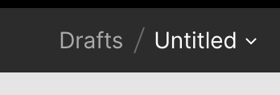
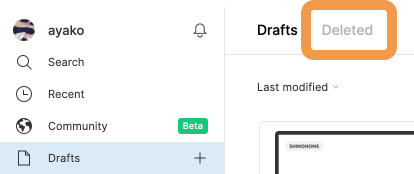
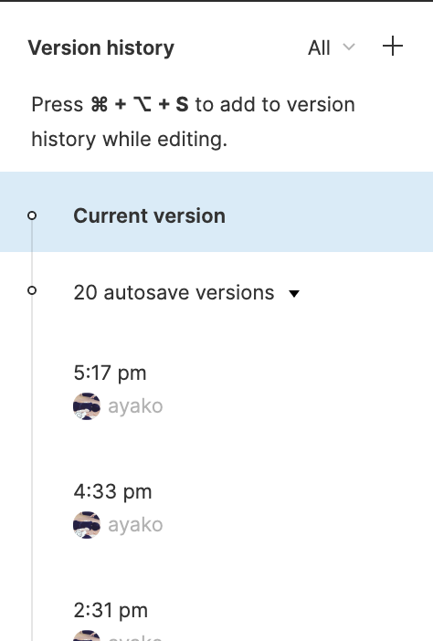
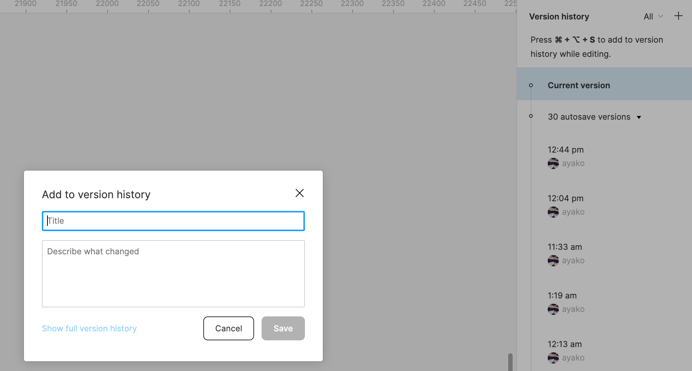

## ファイル名の編集・削除・複製・移動

### ファイル名を編集する

ファイルを作成するとデフォルトでは`Untitled`という名前が付いています。  
このファイル名を変更するには、画像の`Untitled`と表示されているテキスト部分をクリックすると編集することができます。

または、画像の`Untitled`の右のプルダウンメニューの`Rename`から編集を行うことができます。

| untitled                        | rename                            |
| ------------------------------- | --------------------------------- |
|  |  |

### ファイルを複製する

ファイルを複製するには、プルダウンメニューの`Duplicate`からファイルを複製することが出来ます。  
複製されたファイルは、現在のプロジェクト内に複製されます。

### ファイルを削除する

[[right | ファイルを消去するには、プルダウンメニューの`Delete`からファイルを消去することが出来ます。 消去されたファイルを復元したい場合は、下の画像のように Figma のダッシュボードの Drafts の`Deleted`から復元することが出来ます。]]
| 

### ファイルを移動する

ファイルを移動するには、ツールバー中央のプロジェクト名をクリックするか、ファイル名の右にあるプルダウンメニューの`Move to Project`からファイルを別のプロジェクトへ移動する事ができます。

### ファイルのバージョン履歴の確認

[[right | ファイルのバージョン履歴（作業の記録）を見たい場合は、プルダウンメニューから、`Show Version History`を選択します。 `Show Version History`クリックすると下の画像のように右サイドバーにプロパティパネルが表示され、選択した履歴をクリックすると、その時のバージョンに戻すことが出来ます。 間違いに気づいてまとめて戻したい時などに便利ですが、最新の 20 件までし保存されないので少し注意が必要です。]]
| 

[[right | バージョンは自動で保存されますが、キリの良いタイミングで追加することもできます。 その際はどこまで作業が終わったのか明記しておくとわかりやすいですね。 `+ボタン`からバージョンを保存しましょう。 次回以降の確認問題が終わったごとにバージョンを保存してもらいます。 バージョンの追加方法を必ず覚えましょう。]]
| 

### ファイルの書き出し

ファイルの書き出しを行いたい場合はプルダウンメニューの`Export`から選択すると書き出したいファイルを書き出すことが出来ます。  
作ったオブジェクトをまとめて出力したい時などに使いますが、あまり使う機会はありません。

### 参考

- [公式ドキュメント ~file~](https://help.figma.com/hc/en-us/articles/360038006474-Interact-with-files#Access_the_file_menu)
- [公式ドキュメント ~version history~](https://help.figma.com/hc/en-us/articles/360038006754-View-a-file-s-version-history)

### PGwebで課題を完了しましょう！

PGwebで "課題を完了済みにする" ボタンを押してこの課題は完了です。

#### 今回やったこと

- ファイル名の編集・削除・複製・移動
- ファイルのバージョン確認
- ファイルの書き出し

次の課題へ進みましょう！
