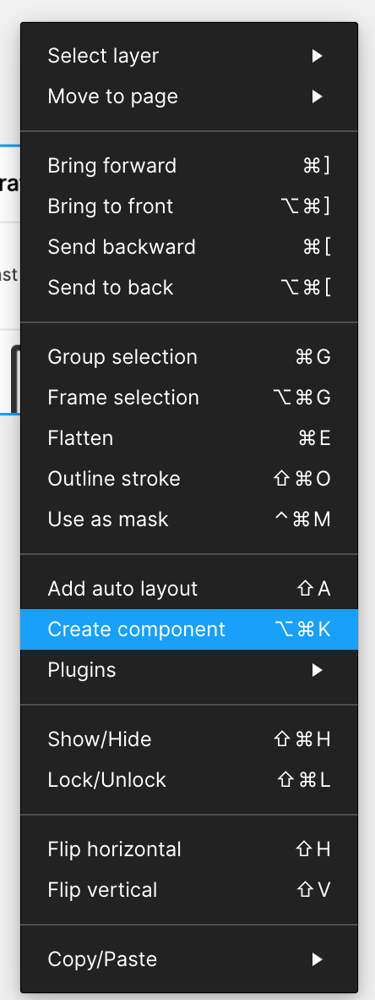
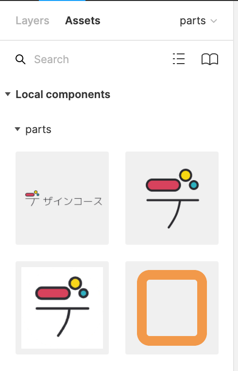
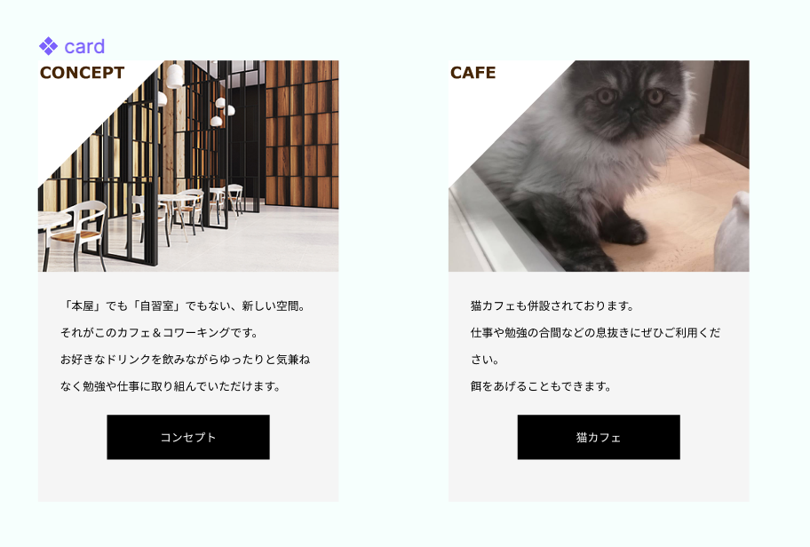
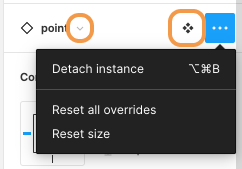

## コンポーネント化

### コンポーネントとは

コンポーネントとは、デザイン全体で再利用できる UI の部品のことを言います。  
例えば、ボタン、アイコン、モーダルなどです。

複数の画面に渡って同じ UI 部品があるとき、元となるコンポーネントを編集すると、全ての UI 部品に修正内容を反映することができるため、作業の効率化とアプリ全体の統一性を保つことができます。  
コンポーネントをいかに作るかによってエンジニアの実装のしやすさに差が出るのでとても重要な部分です。

### コンポーネントを作成する

Figma のコンポーネントを作成する方法は、選択しているオブジェクトから、ツールーバー中央に位置するアイコンをクリックすることで、コンポーネントを作成することが出来ます。  
(どこかわからない場合はツールバー操作 1 で説明しているので確認してください。)  
ショートカットキー：`(Command+Option+K)`  
または、コンポーネント化したいオブジェクトを選択し、右クリックをし表示されるメニューから、`Create Component`をクリックするとコンポーネントを作ることができます。

コンポーネント名は、コンポーネント化を行う前の名前でコンポーネント化されるため、元のオブジェクトにしっかりとした名前を付けておきましょう。  
コンポーネントを作成すると、レイヤーパネルで見るとオブジェクトのアイコンがひし形が４つに変化します。このアイコンが表示されているものが、マスターコンポーネントになります。  
コンポーネントの再利用を行うには、マスターコンポーネントをを複製すると、簡単に再利用する用のオブジェクトが用意されます。  
これを `instance`(インスタンス)と呼びます。
instance はアイコンはひし形１つです。

### Assets からインスタンスを追加する

インスタンスはマスターコンポーネントをコピーする以外にも、一覧から追加する方法があります。  
左サイドバーから、`Assets タブ`をクリックし、マスターコンポーネントの一覧を表示します。

表示された一覧から、追加したいコンポーネントをドラッグ＆ドロップすると、instance が追加されます。

### インスタンスの内容を変更する

インスタンスは色やテキスト、画像を直接上書き(オーバーライド)を行うことが出来ます。  
インスタンスの変更は、継承元であるマスターコンポーネントには反映されないため、インスタンス部分を調整しながらデザイン作業を進めましょう。

### インスタンスを解除する

インスタンスはテキストの内容や塗りの色を変更したりすることはできますが、インスタンス内に配置された要素の位置やサイズを変更することはできません。  
そのため元のコンポーネントとはパターンが異なるものを作らなければならないときは、インスタンスを解除する必要があります。
インスタンスの解除は、選択したインスタンスを右クリックし、表示されたメニューから`Detach Instance`を選択します。  
**※このとき解除してしまったインスタンスは、マスターコンポーネントの変更を行っても変更が反映されないので、注意しましょう。**  
ショートカットキー：`Command + Option + B`

### コンポーネントを置き換える

コンポーネントの置き換えを行うことで、既存のインスタンスを他のマスターコンポーネントのインスタンスに変更することが出来ます。  
下の画像は point というコンポーネントのインスタンスを選択している時に、右サイドバーに表示されるものです。

- `▽`から別のコンポーネントをインスタンスを選ぶことで変更することができます。
- その横のひし形 4 つのコンポーネントのアイコンをクリックすることで今のインスタンスはどのコンポーネントを継承しているのか確認することができます。
- 三点リーダーを押して表示されるメニューからも`Detach instance`,`Reset all overrides`,`Reset size`ができます。

このように、コンポーネント化は簡単に UI の部品を変更することができます。  

### コンポーネント化することのメリット

マスターコンポーネントを変更すると、複製されたインスタンスはマスターコンポーネントの変更に追従します。  
**一括変更を行うことが出来る**のが、最大のメリットとなります。  
同じようなパーツを複数使う場合はコンポーネントすることが必要不可欠です。

### 参考

- [公式ドキュメント](https://help.figma.com/hc/en-us/articles/360038662654-Guide-to-Components-in-Figma)

### Study Diary を書きましょう！

#### 今回やったこと

- コンポーネント
- インスタンスの追加・変更・解除
- コンポーネントの置き換え

このセクションはとても重要なので理解できるまでしっかりと復習しましょう。  
できたら次に進みましょう。
