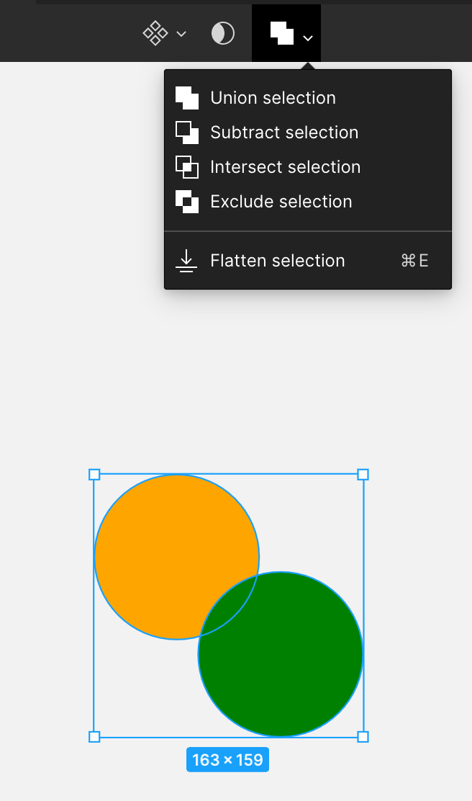
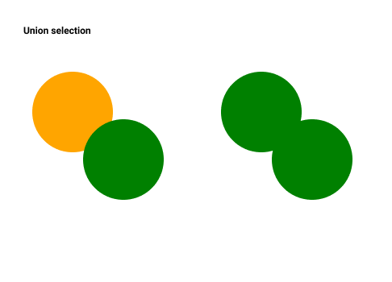
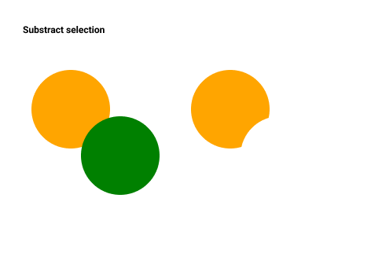
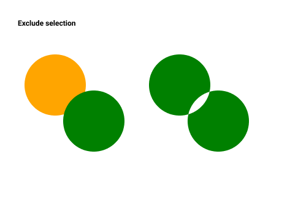
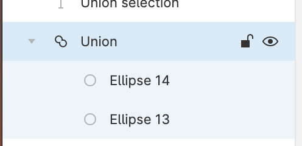

## オブジェクトのパスの結合・合成

複雑なオブジェクトを作成したい場合に役立つのがオブジェクトの結合・合成です。  
結合・合成の特徴や操作を覚えていきましょう。

### オブジェクトやパスを結合・合成する

結合・合成する方法は大きく分けて 4 つあります。  
結合・合成ができるのはグループ化やマスクが適応されていない、シェイプレイヤーに限られます。

この操作を行うには、下の画像のように、適応させたい複数のオブジェクトを選択します。  
ツールバーにの中央に四角が重なったアイコンが表示されるので、ここから適応させたい結合・合成の種類を選択します。

#### Union Slection

重なっているシェイプを合体した形状にします。  
色が違う場合は、前面のオブジェクトの色が適用されます。  

#### Subtract Slection

前面のシェイプで背面のシェイプを型抜きした形状にします。  
Union Slection の反対の操作です。  

#### Intersect Slection

前面と背面の交差した部分の形状にします。  

#### Exclude Slection

前面と背面の交差した部分を型抜きした形状にします。
intersect Selection の反対の操作です。  
色が違う場合は、前面のオブジェクトの色が適用されます。  

### 結合・合成したパスを一つのパスに変換する

ショートカットキー：`Command + E`

結合・合成したオブジェクトをレイヤーリストで確認すると、下の画像のように結合・合成前の情報が残っており、1 つのパスに変換はされていません。  

ここで 1 つのパスに変換させる操作を`Flatten Selection`と言います。  
Flatten Selection は、適応させたい結合・合成したオブジェクトを選択します。  
メニューバー中央から Flatten Selection を選択することで適応させることが出来ます。

#### メリット

おそらくオブジェクトの合成・結合をして作るオブジェクトはロゴなどでしょう。  
ロゴは svg などのデータ形式に出力するわけですが、`Flatten Selection`にすることによってデータの中身が単純化されて同じ見た目でも容量を軽くすることができます。  
そのようなことまで考えられるといいですね。

### Study Diary を書きましょう！

#### 今回やったこと

- オブジェクトのパスの結合・合成
- 結合・合成したパスのマージ

できたら次に進みましょう。
