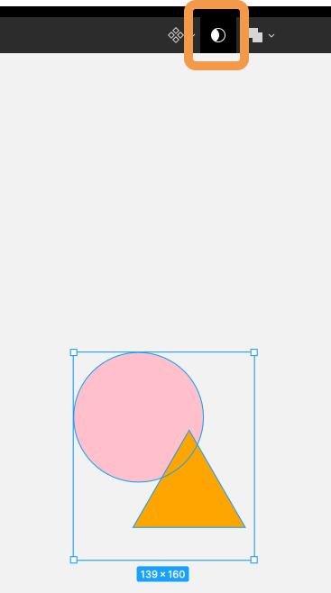
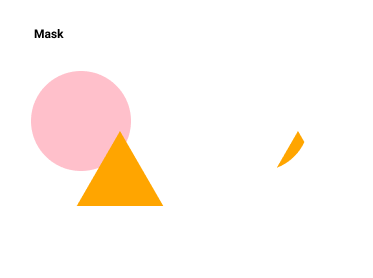
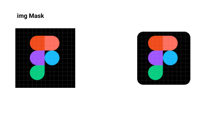

## オブジェクトのマスク

### シェイプを使用したマスクの適応

[[right | マスクは背面のレイヤーの形に前面のレイヤーを切り取る事ができます。 複数のオブジェクトを選択した状態でツールバー中央の`Use as mask`をクリックすると、マスクが適用されます。]]
| 

[[right | マスクを適応させると画像のようになります。 ショートカットキー : `^ + Command(ctrl) + M`]]
| 

### 画像単体にマスクを適応する

[[right | 画像にマスクを適応させるには、背面レイヤーに切り抜きたい大きさのシェイプを配置し、 前面レイヤーに切り抜きたい画像を配置しマスクを適応すると、 画像のように画像を切り抜くことが出来ます。]]
| 

### 参考

- [公式ドキュメント](https://help.figma.com/hc/en-us/articles/360040450253-Masks)

### PGwebで課題を完了しましょう！

PGwebで "課題を完了済みにする" ボタンを押してこの課題は完了です。

#### 今回やったこと

- シェイプのマスク
- 画像のマスク

次の課題へ進みましょう！
