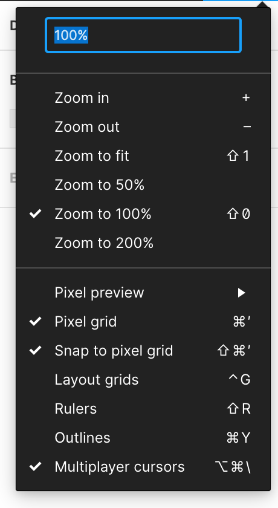
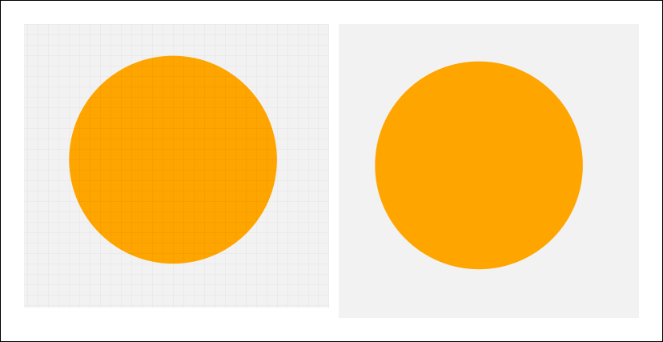
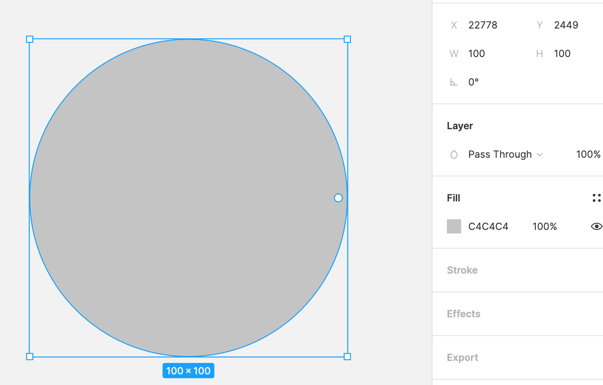
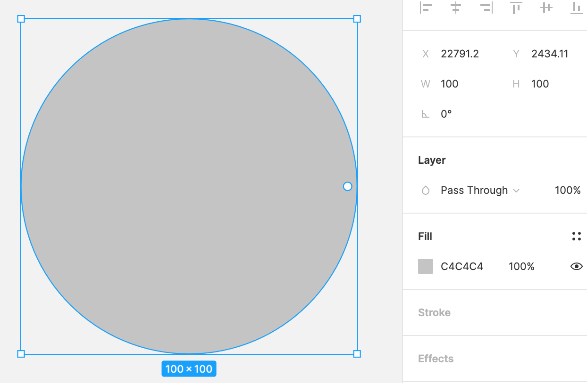
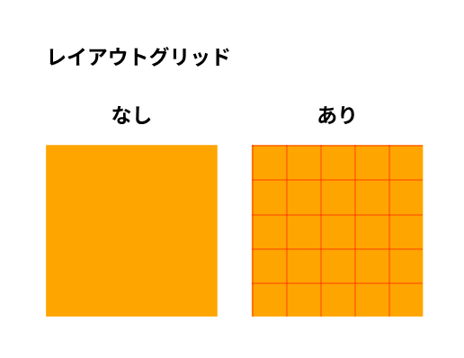
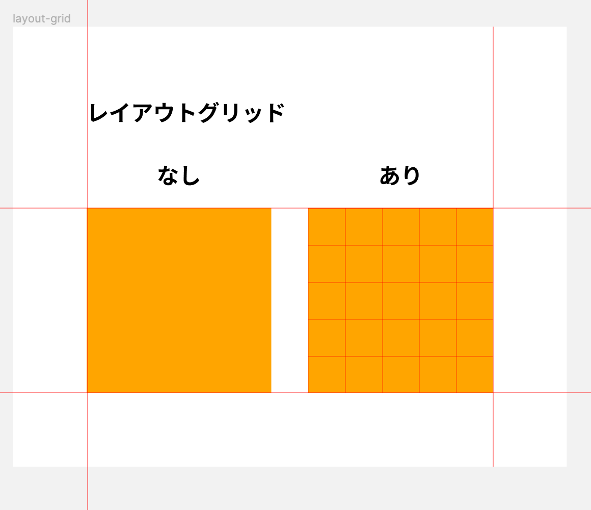
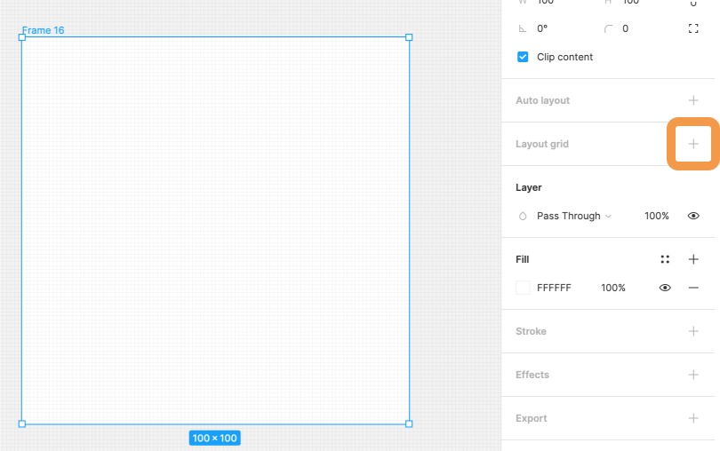
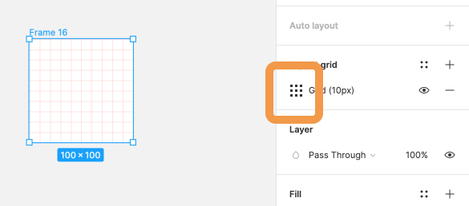
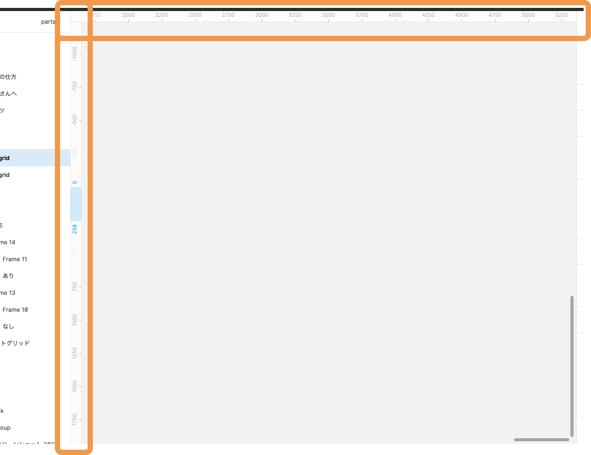

## ビューの設定とルーラーレイアウトの設定

`View`(ビュー)は、フレーム・キャンバスの表示に関する設定をする機能です。(あまり使う場面はありません笑)  
このページではビューに関する機能と、ルーラー・レイアウトに関する機能を学んでいきましょう。

### ビューの設定をする

ビュー機能を使うにはツールバー右上の`%`をクリックするとプルダウンメニューが表示され、選択することが出来ます。  
それぞれ見ていきましょう。  
Zoom については先述した通りなので割愛します。  


#### Pixel Preview

ピクセルプレビューはベクター表示とピクセル表示を切り替えることが出来ます。  
ベクター表示では UI の細かい調整などの場合に使い、ピクセル表示は実際に画面でどのように表示されるのかをチェックを行う場合に使用されます。  
ピクセル表示の倍率を 1x か 2x を選択できます。

### Pixel Grid

フレーム上に表示されるグリッド(格子線)を表示/非表示を選択することで切り替えることが出来ます。  
グリッド表示をすることで、1px 単位の作業が必要なアイコンなどを作る際に役立ちます。  
Web デザインを作る上でも 1px 単位の作業は不可欠で、デフォルトでグリッド表示になっているのであまり非表示にする機会はありません。

ショートカットキー : `Shift + Command + '`  


### Snap to Pixel Grid

`Snap to Pixel Grid`を使用することで、1px ごとにスナップするかしないかを選択することが出来ます。  
基本的に UI デザインを制作する際はデフォルトで ON になっているのでそのままにしておきましょう。  
Web も 1px が最小の単位(小数点もできますが)なので OFF にすると実装するエンジニアが大変になってしまいます。

X 座標・Y 座標に注目して ON・OFF の違いを見てみましょう。

| ON                  | OFF                   |
| ------------------- | --------------------- |
|  |  |

### Layout Grid

フレーム上に表示されるレイアウトの表示・非表示を切り替える事ができます。  
例えば Web デザインする際のガイドとして役立ちますが、基本的には後述するルーラーを使用すれば解決します。  
Layout Grid の設定は後ほど説明します。  


### Rulers

Rulers はキャンバス表示されている定規の表示・非表示を切り替えることが出来ます。  
本当に不要な場合は削除しましょう。  
後ほど Rulers の使い方を説明します。



### Multiplayer cursors

`Multiplayer Cursors`はチームメンバーのカーソルを表示・非表示の選択をすることが出来ます。  
リアルタイムで共同作業できることが Figma のメリットなので、デフォルトの ON のままにしておきましょう。

### レイアウトグリッドの設定

レイアウトグリッドは、複数のプラットフォーム間での一貫性を保つために、オブジェクトを整列するのに役立ちます。  
またレイアウトグリッドは、ピクセルグリッドに依存しません。レイアウトグリッドグリッドはフレームにのみ適応することができます。

#### レイアウトグリッドの適応方法

レイアウトグリッドを適応するにはフレームを選択し、右サイドバーのプロパティパネル`Layout Grid`から`+`でレイアウトグリッドを追加することが出来ます。



レイアウトグリッドを追加したら、横のアイコンをクリックしてレイアウトグリッドの設定を行いましょう。


アイコンを押して表示されるプルダウンメニューから`Grid`,`Columns`,`Rows`の 3 種類のグリッドを選択することが出来ます。  
その他の設定は以下です。

```
Count: カラム数
Color: カラムの色
Type: Left,Right,Stretch,Center
Width: カラムの幅
Gutter: マージン
```

### Rulers の使い方

ルーラーは UI を制作する上で、便利な機能の一つです。ルーラーを使用することでオブジェクトの配置作業時に設定したガイドに対して補助機能が働きます。  
ガイドを作成するには、下の画像のように、ルーラー上でドラッグすることで補助線が表示されます。  
ガイドを置きたい位置でドロップすることでガイドを引くことが可能です。


ガイドを消去・移動したい場合は、ドラッグすること移動することができ、ルーラー外までガイドをドラッグ＆ドロップ、または、`Deleteキー`でガイドを消去することが可能です。
