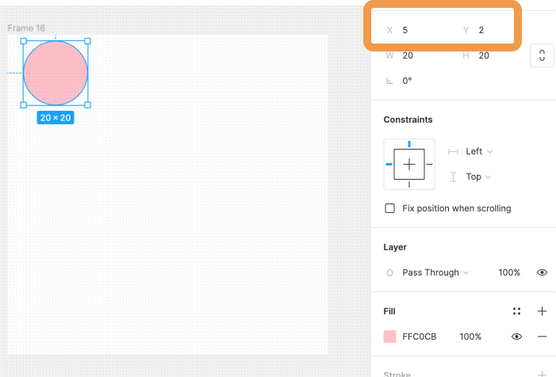
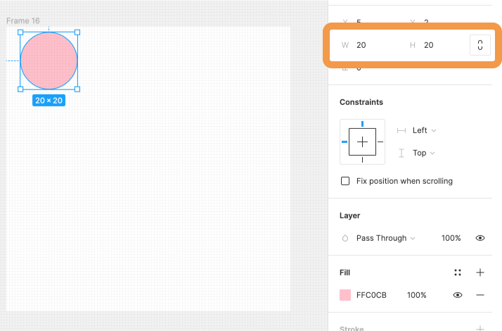
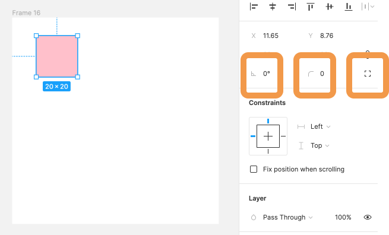
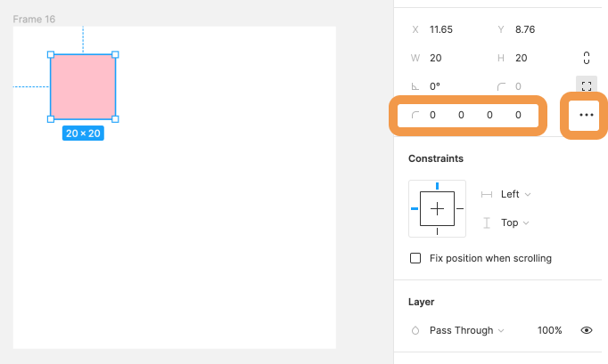

## 位置・サイズを変更する

右サイドバーのプロパティパネルの上部には、キャンバス上のオブジェクトの位置・サイズを変更するためのツールがあります。  
幅・高さ。回転の角度。角の半径を変更したり、x 座標と y 座標を変更することができます。  
このページでこれらの操作方法を学んでいきましょう。

### 数値入力とスクラブ入力

```
数値入力: 自分で数値を決められた場所に入力または矢印キーで調整して数値を変更するやり方
スクラブ入力: ドラッグ操作によって数値を変更するやり方
```

どちらの方法も覚えておきましょう。

### 位置を変更する

[[right | プロパティパネル上部に位置する下の画像の指している部分から x 座標・y 座標が表示されていることがわかると思います。<br/>オブジェクトを選択すると、左上を(0, 0)として x・y 座標をプロパティパネルに表示されます。<br/>プロパティパネルから数値を入力することで、位置を変更することが可能です。<br/>もちろん、スクラブ入力も可能です。]]
| 

### サイズを変更する

[[right | プロパティパネル上部に位置する下の画像の指している部分からサイズを変更することができます。<br/>W は`Width`、H は`Height`の略です。<br/>右側のクリップのようなアイコンがアクティブになっていると縦横の比率を保ったままサイズ変更することができます。<br/>用途に応じて使い分けましょう。<br/>もちろん、スクラブ入力も可能です。]]
| 

### 回転の角度と角の半径を変更する

これらはスクラブ入力することはできません。

#### 回転の角度を変更する

下の画像の左枠の部分で回転の角度を変更することができます。

#### 角の半径

[[right | 下の画像の中央枠の部分で角の半径を変更することができます。<br/>ここでオブジェクトに丸みをつけることが可能になります。]]
| 

[[right | また、４角の半径を個別に設定したい場合は、下の画像の右枠の部分から設定できます。<br/>3 点リーダーを押すと、コーナーの滑らかさを設定できます。]]
| 

### 参考

- [公式ドキュメント](https://help.figma.com/hc/en-us/articles/360039956914-Adjust-alignment-dimensions-rotation-and-position)

### 個人シートに学んだことを記入しましょう！


#### 今回やったこと

- 数値入力とスクラブ入力
- 位置とサイズの変更
- 回転の角度と角の半径

できたら次に進みましょう。
