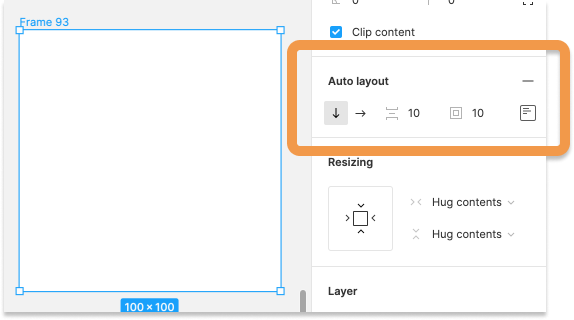
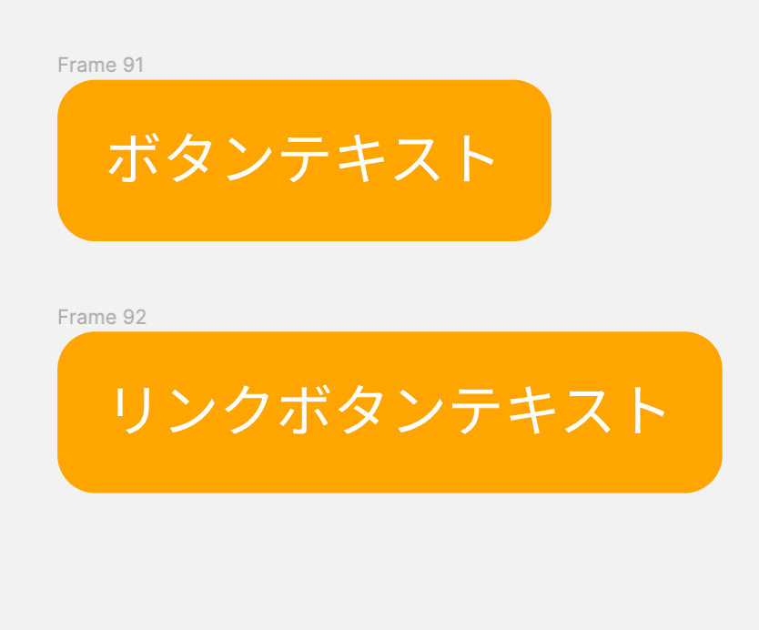
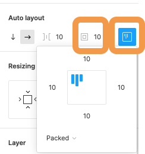
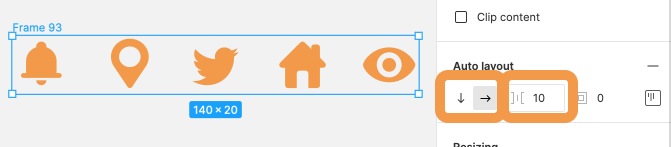
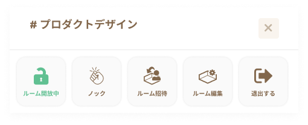
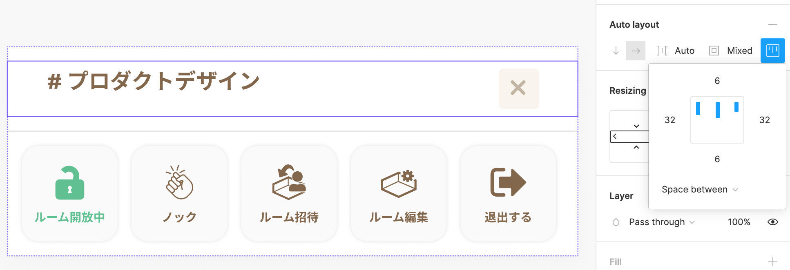
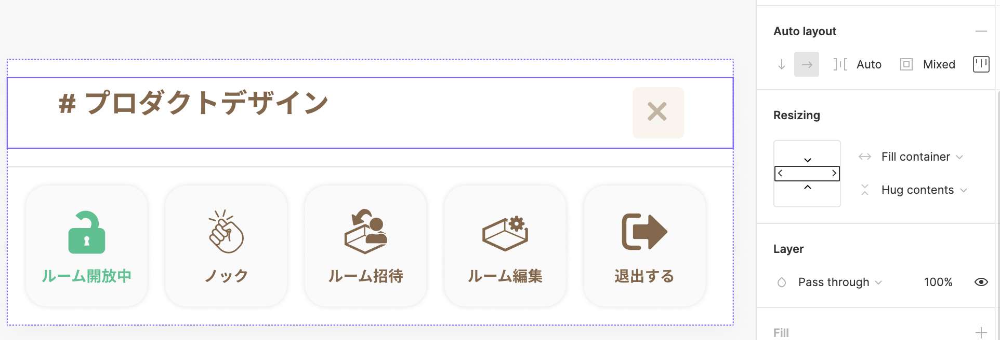

## Auto Layout

Auto Layout 機能とは padding を自動で調整してくれたり、要素をリストのように等間隔で並べたい時などに重宝する機能です。

### Auto Layout を適用する

Auto Layout 機能を使いたいオブジェクトを選択して右サイドバーのプロパティパネルから Auto Layout をつけましょう。  
グループまたはフレームセレクションにつけることが可能です。  


### padding をつける

ボタンを例に見てみましょう。  
Auto Layout 機能ができるまでは中身のテキストに合わせて何種類ものパーツを作る必要がありました。
下の画像は Auto Layout 機能の`padding 10px`を適用したものです。  
中身のテキスト関係なく余白を 10px 自動でつけてくれます。


枠線の部分で padding 調整ができ、右側のアイコンをクリックすることで表示されるウィンドウから上下左右別々の値を設定することができます。


### リストの Auto Layout

リストを作る際も Auto Layout が役立ちます。  
要素を等間隔で並べ、要素の追加・削除はもちろん、並び替えもとても簡単にできるようになります。  
下の画像はアイコンをリストで表示しているものです。  
左側の枠線の矢印で横向きまたは縦向きに並べるのか設定でき、右側の数値を変えることで間隔を調整することができます。


### 高度な Auto Layout

下の画像を見てみましょう。  
  
これはあるプロジェクトで使ったチャットウィンドウのヘッダー部分です。
ボタンリストもチャンネル・クローズボタン の部分も Auto Layout を使っています。  
上部のチャンネル名であるプロダクトデザインは名前がチャンネルごとに違いますが、クローズボタンは常に右に位置していて欲しいですね。  
このような場合には Resizing と padding の詳細ウィンドウから可変要素もデザイン崩れしないように設定できます。  
実現したいことは以下です。

```
・チャンネル名とクローズボタンは左右の端固定
・上寄せ
```

下の画像の padding 詳細ウィンドウを見てみましょう。  
青い３本線が等間隔に設置され、枠線の中で上寄せになっていることがわかると思います。  
枠線の中をクリックすることで、中央寄せ、下寄せに変更することもできます。  
また、ウィンドウ下部をみるとわかる通り、`space-between`を設定しています。  
これによって各アイテムを均等に配置し最初のアイテムは先頭に寄せ、最後のアイテムは末尾に寄せることができます。  
しかし、このままだと幅が自動で子要素に合わせる設定になっているので、Resizing を`Hug contents`から`Fill container`にしましょう。  
Resizing には以下の３種類があります。

```
・Hug contents: 子要素の幅に合わせて可変
・Fill container: 親要素いっぱいに広げる
・Fixed width/height: 幅/高さ固定
```

| space-between                                                     | fill container                                          |
| ----------------------------------------------------------------- | ------------------------------------------------------- |
|  |  |

この辺りは慣れが必要なので、サイトでよく使われるパーツはどういう風に作れるか考え、手を動かすなどの努力が必要です。  
[参考リンク](https://bagelee.com/design/figma-auto-layout-update/)

### 参考

- [公式ドキュメント](https://help.figma.com/hc/en-us/articles/360040451373-Create-dynamic-designs-with-Auto-layout)

### Study Diary を書きましょう！

#### 今回やったこと

- Auto Layout 機能

できたら次に進みましょう。
