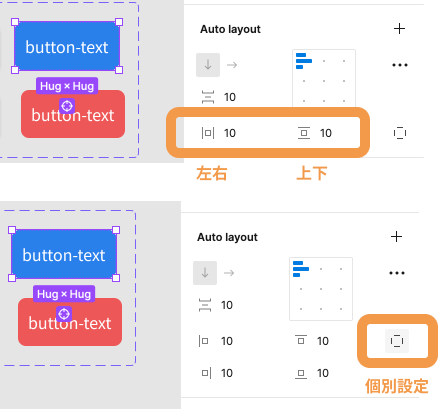
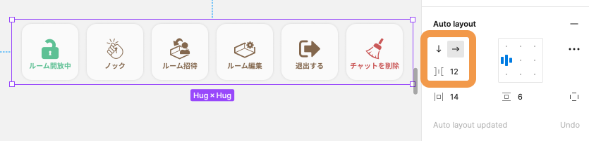
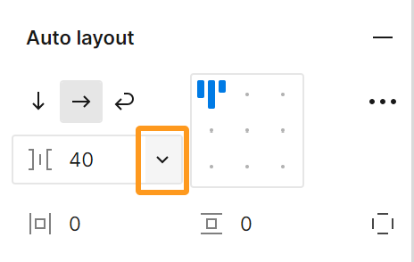
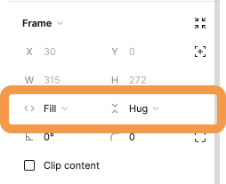
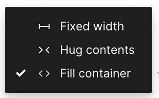
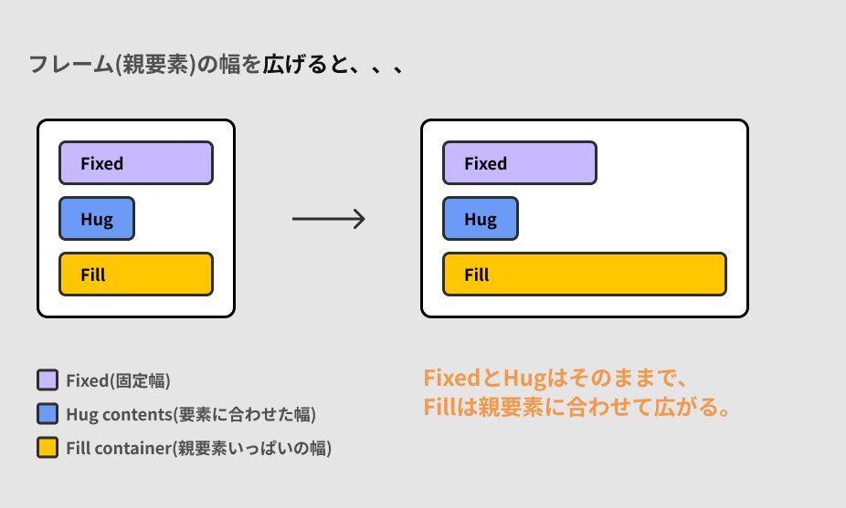
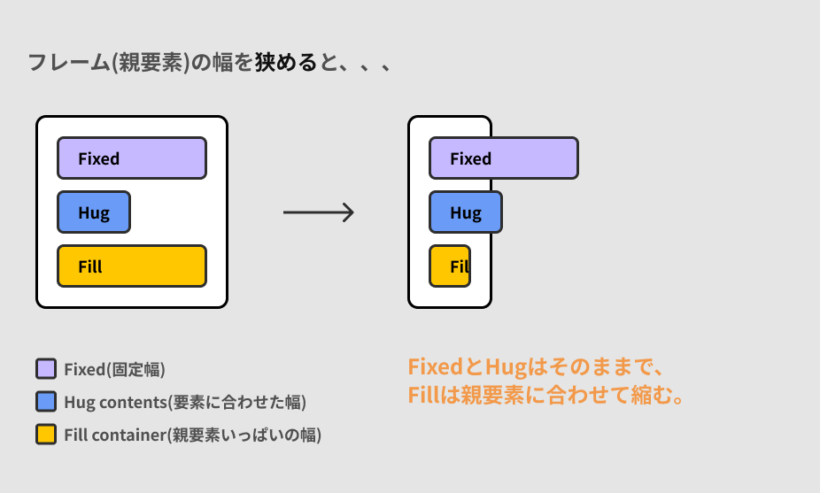
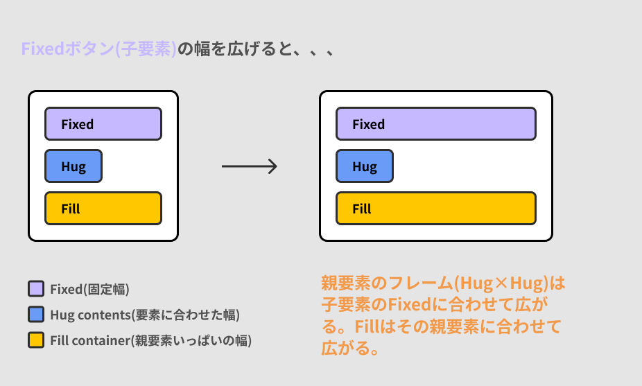
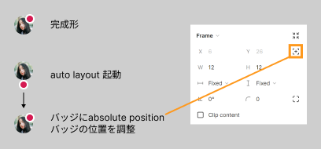

## Auto layout

Auto layout 機能とは padding(余白) を自動で調整してくれたり、要素をリストのように等間隔で並べたい時などに重宝する機能です。  
Auto layout には主に4つの機能があります。

- padding(余白)をつける
- 等間隔に並べる
- Resizing
- Absolute position

順番に見ていきましょう。

### Auto layout を適用する

[[right | Auto layout 機能を使いたいオブジェクトを選択して右サイドバーのプロパティパネルから Auto layout をつけましょう。 グループまたはフレームセレクションにつけることが可能です。]]
| 

### 1.padding(余白) をつける

[[right | ボタンを例に見てみましょう。 Auto layout 機能ができるまでは中身のテキストに合わせて何種類ものパーツを作る必要がありました。 下の画像は Auto layout 機能の`padding 10px`を適用したものです。]]
| 

[[right | 枠線の部分で padding が左右・上下設定できます。 2枚目右側のアイコンをクリックすることで入力欄が分かれ、上下左右別々の値を設定することもできます。 入力欄を`Command + クリック`で上下左右まとめて設定することもできます。]]
| 

### 2.等間隔で並べる

[[right | 要素を等間隔で並べる際も Auto layout が役立ちます。 要素の追加・削除はもちろん、並び替えもとても簡単にできるようになります。 画像はボタンを等間隔に並べています。 左側の枠線で囲われている部分の矢印で横向きまたは縦向きに並べるのか設定でき、数値を変えることで間隔を調整することができます。]]
| 

[[right | 右の画像で示している部分をクリックすると、Autoという選択がでてきます このAutoを設定すると、親フレームに対して複数の子要素がいっぱいに広がります。]]
| 

### 3.Resizing

Auto layout で重要なものの 1 つが Resizing です。

Auto layout を適用している frame の幅や高さがどのように振る舞うべきか設定できる機能です。

Resizing には以下の３種類があります。

- Fixed width/height: 幅/高さ固定。Fixedは固定という意味です。親要素・子要素に関係なく、サイズを固定します。
- Hug contents: 子要素の幅に合わせて可変。Hugとは抱きつくのハグです。子要素に抱きつくイメージです。
- Fill container: 子要素にのみ使用できる。Fillはいっぱいに埋めるという意味です。親要素に対していっぱいに広がるイメージです。

| resizing                        | 種類                                      |
| ------------------------------- | ----------------------------------------- |
|  |  |

 　 　 
### 4.Absolute position

[[right | auto layoutで組むとすべての要素が、設定した並び順やpadding、間隔幅に従って並んでしまいます。 absolute positionを使うことで、要素ごとに位置を固定で指定できます。 absolute positionはauto layoutを起動しないとプロパティパネル上に出てこないので注意しましょう。]]
| 

この辺りは慣れが必要なので、サイトでよく使われるパーツはどういう風に作れるか考え、手を動かすなどの努力が必要です。  
[参考リンク](https://bagelee.com/design/figma-auto-layout-update/)

### 参考

- [公式ドキュメント](https://help.figma.com/hc/en-us/articles/360040451373-Create-dynamic-designs-with-Auto-layout)

### 個人シートに学んだことを記入しましょう！

#### 今回やったこと

- Auto layout
- Advanced layout
- Resizing

できたら次に進みましょう。
