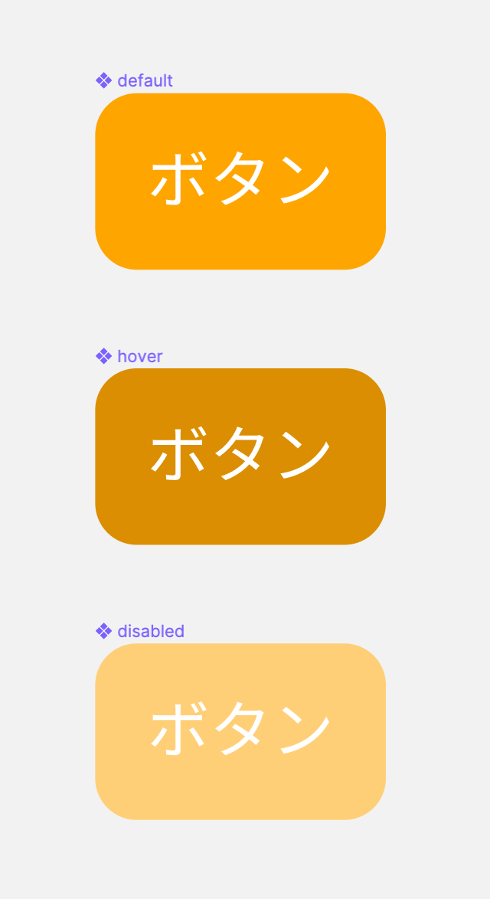
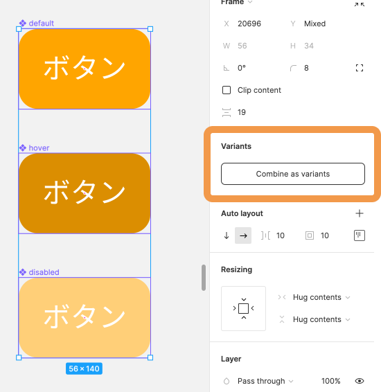
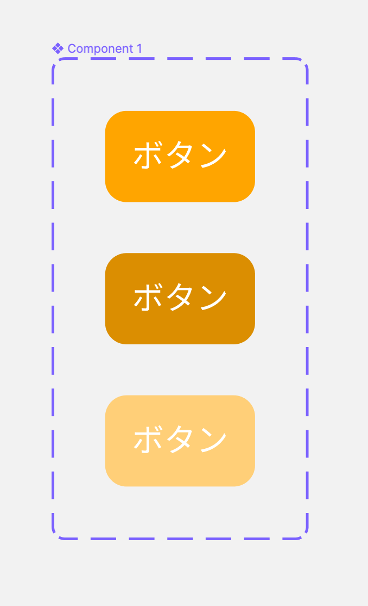
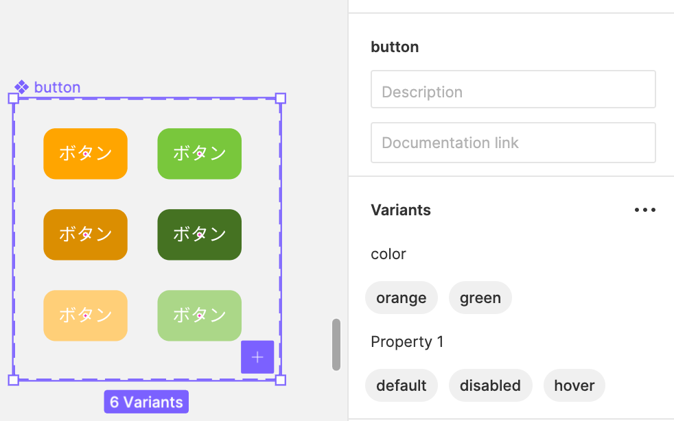

## Variants 機能

Variants 機能はコンポーネントの管理をよりわかりやすくできる機能です。  
類似している複数のコンポーネントの関係性を明らかにしたり、パーツは同じでも状態によってデザインが変わる場合などに有効な手段です。

### 使い方

このようにボタンは以下の状態を少なくとも用意する必要があります。

```
・通常の状態: default
・ホバーしている状態: hover
・使えない状態のボタン(フォーム送信に必要な情報が入ってない時など): disabled
・ボタンを押し込んでいる状態: active
```

下の画像は３つの状態を用意し、コンポーネント化したものです。  


ボタンを全て選択し、右サイドバーのプロパティパネル`Combine as variants`から Variants 機能を適用させましょう。

| Combine as variants                               | 適用後                                          |
| ------------------------------------------------- | ----------------------------------------------- |
|  |  |

このように状態が違う同じパーツもまとめられ、実装するエンジニアにもわかりやすいデザインシステムになります。

### Variants のインスタンス

[[right | Variants を適用させてもインスタンスの生成方法は変わりません。<br/>コンポーネントをコピー＋ペーストするか、左サイドバーのプロパティパネルのAssetsから生成しましょう。<br/>生成したらインスタンスの右サイドバーのプロパティパネルを見てみましょう。<br/>プルダウンに`default`と書いてあるのがわかると思います。<br/>ここから他の variants の `hover` や `disabled` に変更することが可能です。]]
| 

### 複数枝分かれする Variants

[[right | Variants を使えば画像のようにカラーなど他のプロパティを増やすのも簡単です。<br/>Variants 右上の 3 点リーダーから増やすことが可能で、プロパティの並び替えや、名前の変更もできます。<br/>default や hover のプロパティ名は`status`が適切ですね。<br/>**また、combine する前に、コンポーネント名を`コンポーネント名/プロパティ1/プロパティ2/...`とすることで、このように自動で設定してくれます。**  <br/>コンポーネント名を考える癖をつけましょう。]]
| 

### 参考

- [公式ドキュメント](https://help.figma.com/hc/en-us/articles/360055471353-Prepare-for-variants)

### Study Diary を書きましょう！

#### 今回やったこと

- Variants 機能

できたら次に進みましょう。
