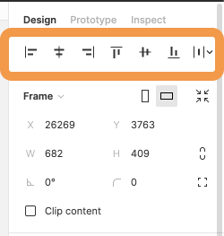
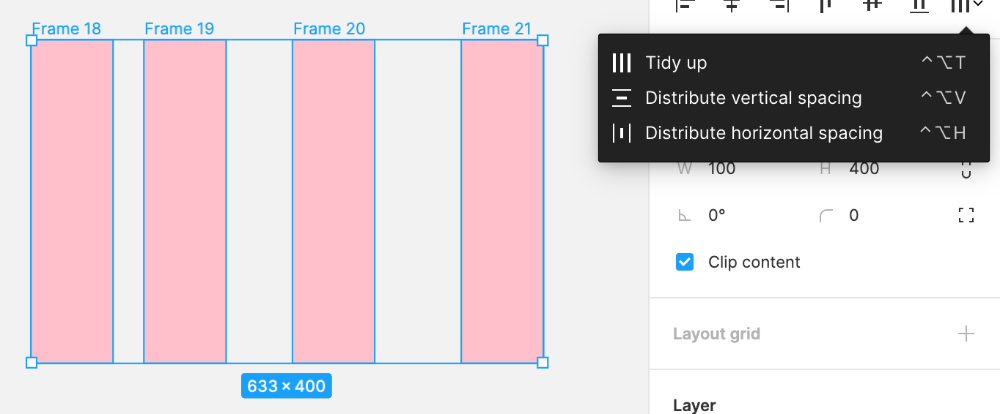
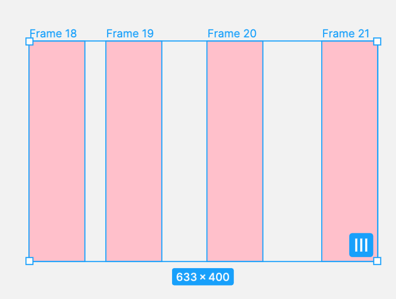
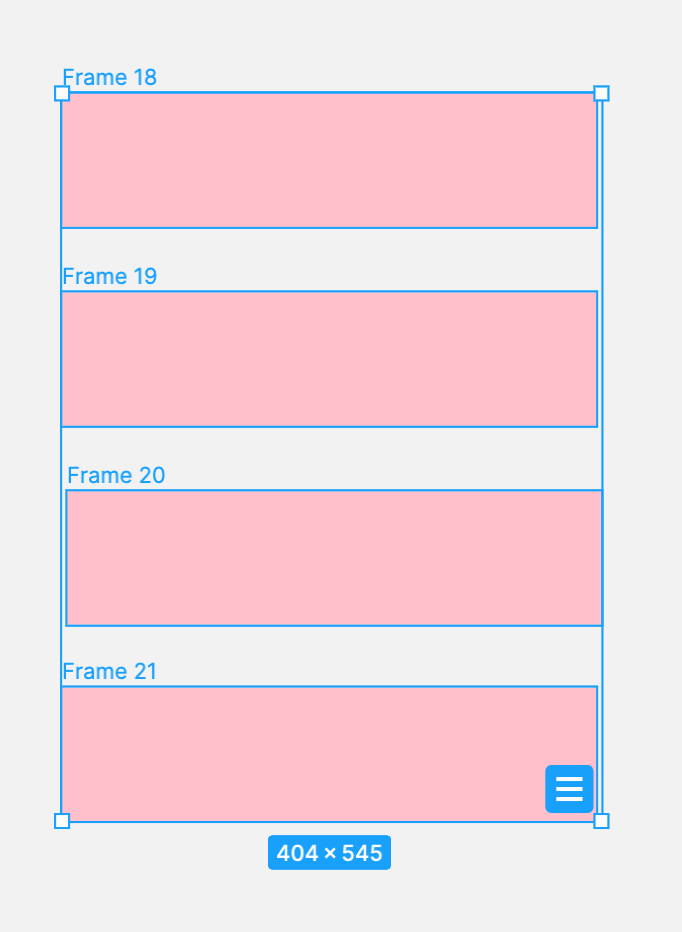
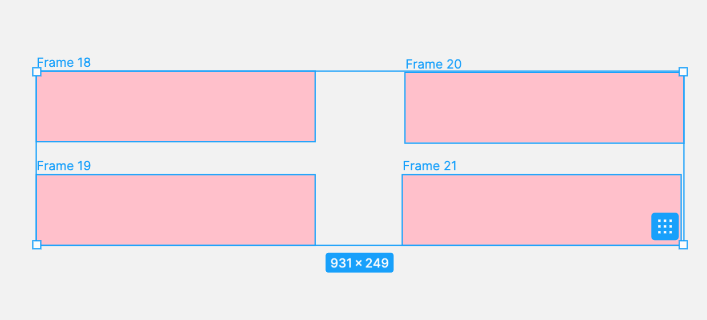
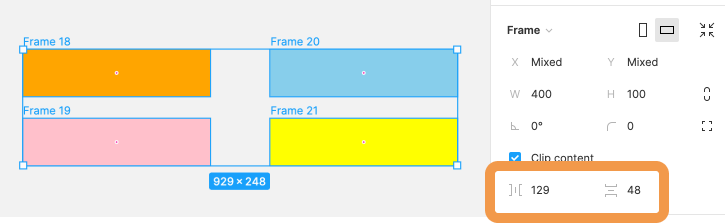
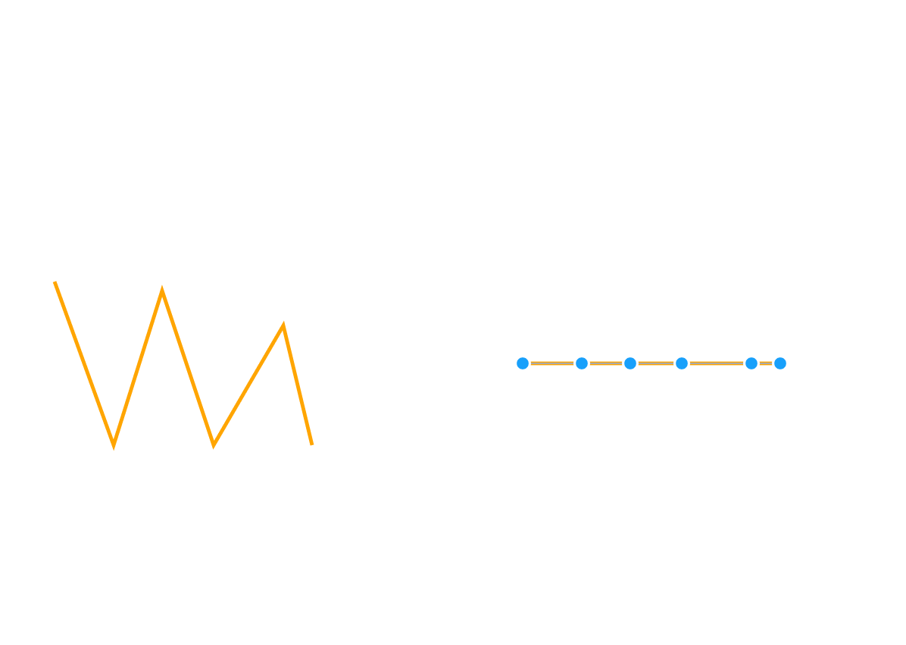
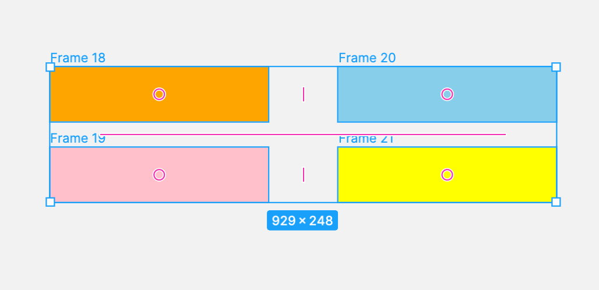

## オブジェクトの整列

複数のオブジェクトやフレームを整列させるときに使う機能です。

### オブジェクトを整列する

[[right | オブジェクトを整理するには左サイドバーのプロパティパネル上部から操作することができます。<br/>自分で手を動かしてどのようなパターンで整列されるのかそれぞれ試してみましょう。]]
| 

### 等間隔で整列させる

1 番右のプルダウンメニューから３種類の等間隔に並べることができます。

#### Tidy up

下の画像のように２種類の場所から Tidy up 機能を使うことができます。  
この機能を使うことによって等間隔にないオブジェクト同士を自動で等間隔に並べてくれます。

| プロパティパネルから          | オブジェクトのホバーから                    |
| ----------------------------- | ------------------------------------------- |
|  |  |

また、オブジェクトホバーは選択したオブジェクトの位置によって３種類のアイコン表示になります。

| Vertical                                    | Horizontal                                  |
| ------------------------------------------- | ------------------------------------------- |
|  |  |

| Grid                                          |
| --------------------------------------------- |
|  |

その他のプルダウンメニューの仕様は以下の通りです。

```
Distribute Vertical Spacing: 垂直方向に等間隔
Distribute Horizontal Spacing: 水平方向に等間隔
```

[[right | Tidy up がされると、プロパティパネルに間隔が何 px なのか表示され、<br/>ここから間隔を変更することもできます。]]
| 

#### パスに適用

[[right | これらはパスにも適用できます。<br/>オブジェクトをダブルクリックしてパス編集モードにし、<br/>パスポイントを複数選択してから整列機能を使いましょう。]]
| 

### スマートセレクション

[[right | Tidy up 機能を使えばスマートセレクション機能を用いて順番を変更することもできます。<br/>Tidy up ができていると、下の画像のように、ピンク色のドットやラインが出現します。<br/>これらをドラッグすることで、間隔や並びの変更が簡単にできます。]]
| 

### 参考

- [公式ドキュメント ~alignment~](https://help.figma.com/hc/en-us/articles/360039956914-Adjust-alignment-dimensions-rotation-and-position)
- [公式ドキュメント ~smart selection~](https://help.figma.com/hc/en-us/articles/360040450233-Arrange-objects-with-Smart-Selection)

### Study Diary を書きましょう！

#### 今回やったこと

- オブジェクトの整列
- 等間隔に整列
- スマートセレクション

できたら次に進みましょう。
