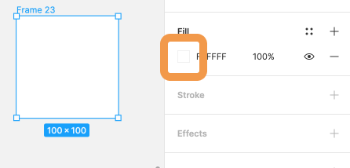
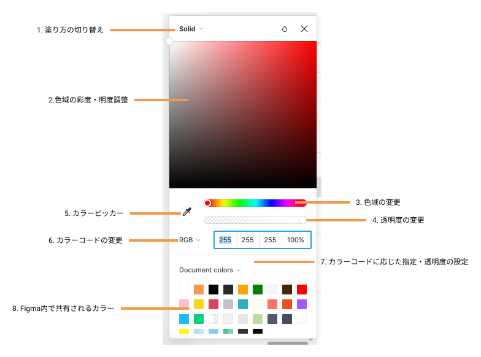
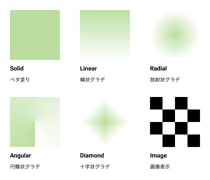
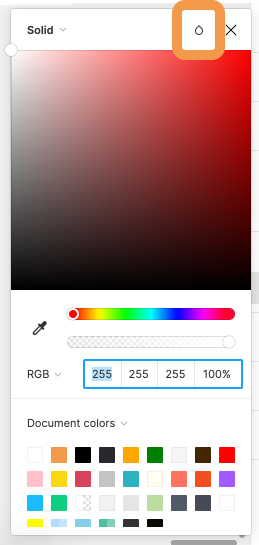
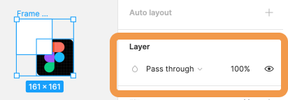

## オブジェクトに色を塗る

### オブジェクトに色を塗る方法と塗り方のパターン

[[right | 右サイドバーのプロパティパネルにある`Fill`または`Stroke`の横にある`+`をクリックすることで選択中のオブジェクトに塗りを適用することができます。 色が明確に決まっている場合はカラーコードを直接入力しましょう。 色々試したい場合は色がついている四角をクリックしてカラーピッカーを表示しましょう。]]
| 

[[right | カラーピッカーの機能は以下のものがあります。   どのような機能があるか見ていきましょう。]]
| 

#### 1.塗りの切り替え

[[right | このようにグラデーションのパターンなどが選択できます。 注意すべき点は画像での塗りです。 画像を使う方法はオブジェクトに画像を塗るか、そのままインポートするかの２つがありましたね。 どちらが適切か考えながらデザインしていきましょう。]]
| 

#### 2~4. 色々な変更

これらはドラッグまたはクリックで変更することが可能です。

#### 5. カラーピッカー

画面上の色を選択することができます。

#### 6. カラーコードの形式変更

`Hex`, `RGB`,`CSS`,`HSB`,`HSL`の形式でカラーコードを指定することができます。  
Hex または RGB が無難でしょう。  
どのような違いがあるのか気になる人は調べてみてください。

**7,8 はそのままの意味なので割愛します。**

### ブレンドモード

画像やオブジェクトを加工する機能がブレンドモードです。
16 種類あり、 ブレンドモードを適用するには以下の２通りの方法があります。  
1 はオブジェクト単体に適用させる場合、2 は異なるレイヤー間に適用させたい場合に使います。

| 1. カラーピッカーの雫から | 2. プロパティパネルの Layer から      |
| ------------------------- | ------------------------------------- |
|    |  |

複数レイヤーに適用させた場合にそれぞれどのようか加工がされるか以下のサイトや自分で手を動かして確認してみてください。  
[参考リンク](https://designcode.io/figma-handbook-blending-modes)

### 参考

- [公式ドキュメント ~colors~](https://help.figma.com/hc/en-us/articles/360041003774-Apply-paints-with-the-color-picker)
- [公式ドキュメント ~smart selection~](https://help.figma.com/hc/en-us/articles/360040667874-Create-unique-effects-with-Blend-modes)
- [色彩基本](https://www.swtoo.com/support/cube/tech-cube/10-1/)

### 個人シートに学んだことを記入しましょう！

#### 今回やったこと

- オブジェクトに色を塗る方法と塗り方のパターン
- ブレンドモード

できたら次に進みましょう。
