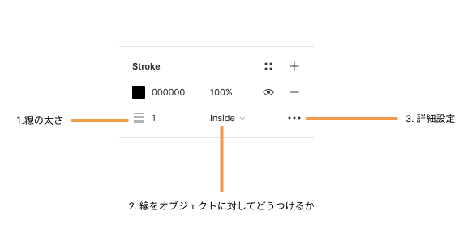
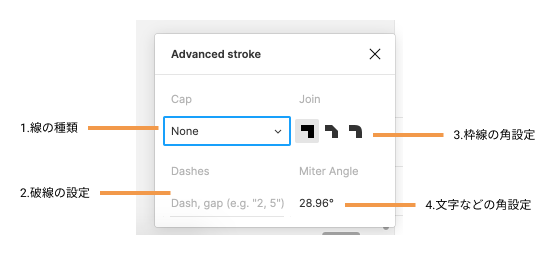

## ストローク

ストロークは単純な線だけでなく、破線・矢印など様々な表現ができます。  
使い方を学んでいきましょう。

### 使い方

[[right | 右サイドバーのプロパティパネル`Stroke`からストロークを選択しましょう。]]
| 

#### 1.線の太さ

線の太さを変えられます。

#### 2.線の位置

線をオブジェクトに対して`Inside`・`Outside`・`Center`のどこの位置につけるか設定することができます。  
しかし、フロントエンド で stroke の実装をする際には`Inside`が一般的で、中央や外側につけることもできますが、少し面倒です。  
なので、出来るだけ inside でデザインを作ってあげると親切でしょう。

#### 3.詳細設定

[[right | 3 点リーダーから詳細設定のウィンドウが開きます。 どのように設定できるか手を動かして確認しておきましょう。]]
| 

### 参考

- [公式ドキュメント](https://help.figma.com/hc/en-us/articles/360049283914-Apply-and-adjust-stroke-properties)

### Study Diary を書きましょう！

#### 今回やったこと

- ストロークの使い方
- ストロークの詳細設定

できたら次に進みましょう。
