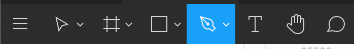
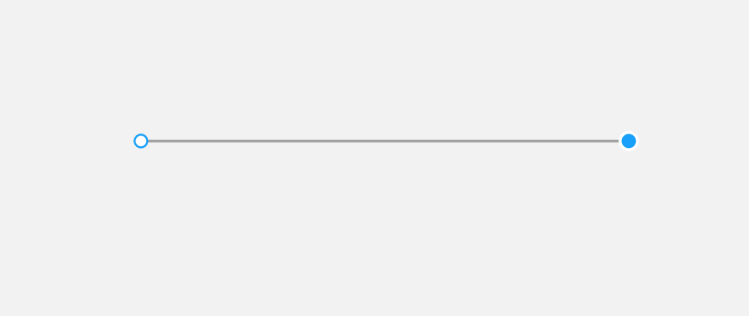
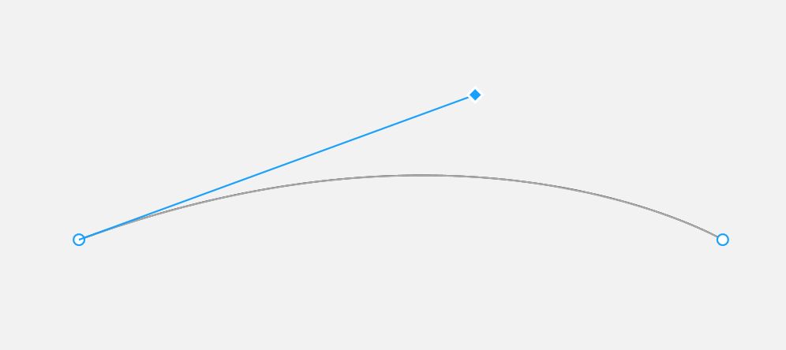
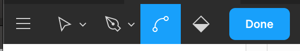
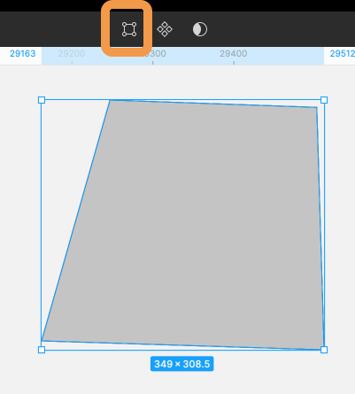
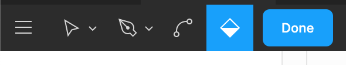
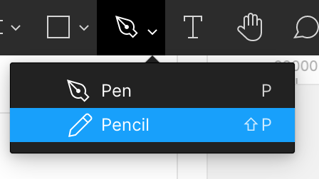

## ペンツールと鉛筆ツールの使い方

### ペンツールの使い方

ペンツールを使うことによって自由度の高いオブジェクトを作ることができます。  
ツールバーの万年筆アイコンをクリックすることでペンモードになります。


#### 直線を描く

下の画像はペンツールを使い直線を作成したものです。  
`アンカーポイント`(ドット)をクリックでどんどん打っていきオブジェクトを作成していきましょう。


#### 曲線を描く

アンカーポイントをドラッグして現れる`ハンドル`というものを操作することで自分の思い描くオブジェクトに近づけていきましょう。

```
・ハンドルの向き: 曲線の方向
・ハンドルの長さ: 曲線の強さ
```



`Bend tool`というものに切り替えることでハンドル操作でなくても曲線を調整することができます。


#### ペンモードの終わらせ方

パスを終了させたい時は`escキー`またはツールバーの`Done`ボタンをクリックして終了しましょう。

### ペンやシェイプで作ったオブジェクトの編集

編集したいオブジェクトをクリックしてもすぐ編集できません。  
選択した時にツールバー中央に現れるオブジェクト編集ボタンをクリックするか、オブジェクトをダブルクリックすることでアンカーポイントが表示され、編集できるモードになります。


### ペイントバケット

パスを始点と重ねて閉じると`クローズドパス`、重ねない場合は`オープンパス`が生成されます。  
クローズドパスの場合のみ、ペイントバケットツールを用いて中を塗りつぶすことができます。


### 鉛筆ツールの使い方

鉛筆ツールはキャンバス上でドラッグ操作によるフリーハンドパスを描くことが可能です。  
万年筆アイコン横三角からのプルダウンメニューを表示して選択できます。  
鉛筆ツールもクローズドパスを作成することができます。


### Study Diary を書きましょう！

ペンツールを使いこなすには練習あるのみ！  
様々なオブジェクトを自分でたくさん作って慣れていきましょう。

### 参考

- [公式ドキュメント 1](https://help.figma.com/hc/en-us/articles/360040450213-Vector-Networks)
- [公式ドキュメント 2](https://help.figma.com/hc/en-us/articles/360039957634-Edit-Object)

#### 今回やったこと

- ペンツールの使い方
- ペンやシェイプで作ったオブジェクトの編集
- 鉛筆ツールの使い方

できたら次に進みましょう。
