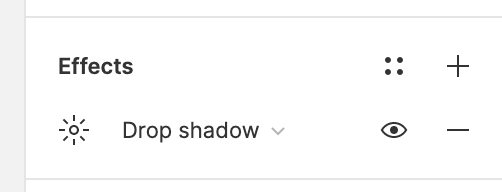
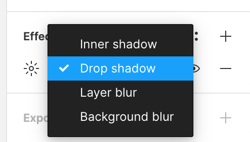
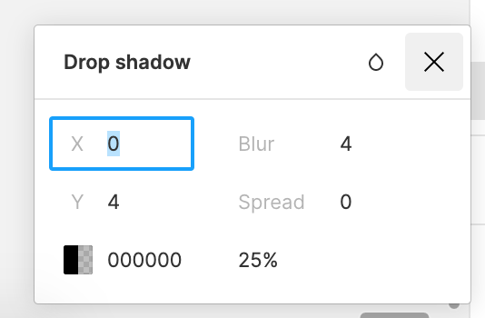

## オブジェクトにエフェクトをつける

カードなどによく使われるシャドウや背景に使われるぼかしなど、様々なエフェクトをつける方法を学んでいきましょう。

### エフェクトのつけかた

エフェクトをつけたいオブジェクトを選択し、右サイドバーのプロパティパネルにある`Effects`からつけることができます。

エフェクトには以下の４種類があります。

- Inner shadow: オブジェクトの内側に影をつける
- Drop shadow: オブジェクトの外側に影をつける
- Layer blur: オブジェクトをぼかす
- Background blur: オブジェクトの背面レイヤーをぼかす

いずれも太陽のアイコンから詳細に設定することができます。

- X: 影の X 座標
- Y: 影の Y 座標
- Blur: ぼかしの強さ
- Spread: 影の広がり具合
- カラーピッカー
- カラーの透明度

### 参考

- [公式ドキュメント](https://help.figma.com/hc/en-us/articles/360041488473-Apply-shadow-or-blur-effects)

### Study Diary を書きましょう！

#### 今回やったこと

- エフェクトのつけかた

できたら次に進みましょう。
