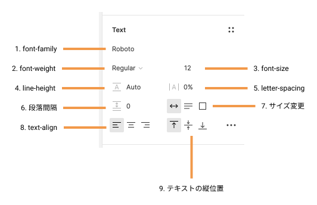
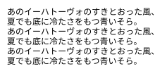
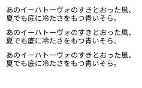
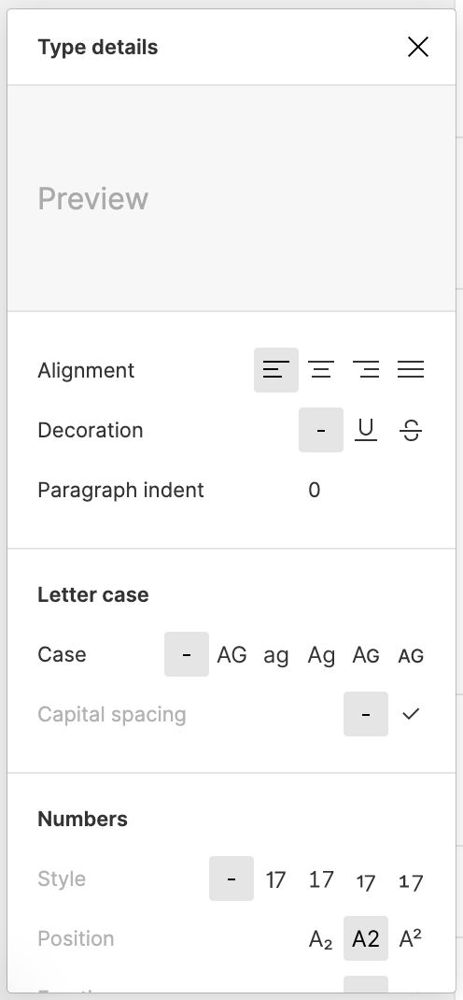

## テキストを編集する

テキストを選択して、右サイドバーのプロパティパネル`Text`から編集することができます。

## 一般設定

テキストの一般設定には以下のものがあります。

```
1. font-family
2. font-weight
3. font-size
4. line-height
5. letter-spacing
6. 段落間隔
7. resize
8. text-align
9. テキストの縦位置
```

[[right | 日本語で表現しているものは、フロントエンド の実装をする際に適していないものです。<br/>一応説明しますが避けましょう。<br/>その機能を使いたい場合の適した方法も一緒に説明します。]]
| 

### font-family

デフォルトでは`Roboto`というフォントに設定されています。  
プルダウンまたは直接フォントを入力して適用させましょう。  
[Google fonts](https://fonts.google.com/)にあるものが適用できます。  
基本的には Google fonts から選ぶようにしましょう。  
もし適用しても反映されたように感じない場合は、日本語に対応していないフォントの可能性があります。

### font-weight

font-weight(文字の太さ)を指定できます。  
全てのフォントは独自のスタイルセットがあるので対応していないものは表示されません。  
プルダウンから指定しましょう。

### font-size

フォントのサイズを px の単位で指定できます。  
小数点は避けましょう。  
Web の基準の大きさは`16px`です。 そこから大きく外れてしまうと、大きすぎたり、可読性が落ちる原因になります。  
また、`10px以下`は Google Chrome ブラウザは可読性が落ちると考え、全て 10px とみなします。  
10px 未満は極力設定しないようにしましょう。

### line-height

line-height(行の高さ)を指定できます。  
段落内の行間隔を空けるのに役立ちます。  
デフォルトでは自動で適した大きさにしてくれていますが、調整したい場合は数値を%または px で入力しましょう。

### letter-spacing

letter-spacing(文字間隔)を指定できます。  
文字が詰まっているように感じた場合はここで調整しましょう。

### 段落間隔(編集は避けましょう！)

段落を自動で感知して間隔を空けてくれますがこの方法はフロントエンドの実装都合上避けましょう。  
段落ごとに余白を設けたい時は後述する `Auto layout` を使用しましょう。

| 適用前                            | 適用後                               |
| --------------------------------- | ------------------------------------ |
|  |  |

### resize(サイズ変更)

３種類があります。左から、

```
・Auto width
・Auto Height
・Fixed Size
```

ですが、  
配置される文字によって確保する領域が固定なのか固定じゃないのかで使い分けましょう。

### text-align

水平方向の文字の配置方法を指定できます。

```
・左寄せ
・中央寄せ
・右寄せ
```

### テキストの縦位置(編集は避けましょう！)

テキストの垂直方向の配置方法を指定できます。

```
・上端揃え
・中央揃え
・下端揃え
```

## 詳細設定

[[right | Text の 3 点リーダーからウィンドウを開きましょう。<br/>たくさんの機能がありますが、フォントによっては使えない機能もあります。<br/>ホバーすると Preview が表示されるのでここでは特に説明しません。<br/>色々試してみてわかったことを個人シートに書いてみましょう！]]
| 

### 参考

- [公式ドキュメント](https://help.figma.com/hc/en-us/articles/360039956634-Explore-text-properties)

### 個人シートに学んだことを記入しましょう！


Word のような感覚ですね！どんどん覚えましょう〜〜

#### 今回やったこと

- テキストの設定

できたら次に進みましょう。
