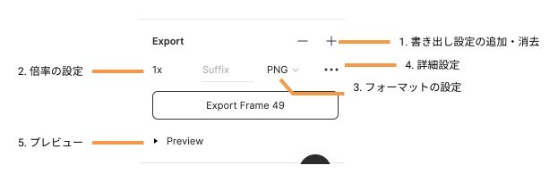

## 画像のエクスポート

エクスポート機能を利用することで `PNG`/`JPG`/`SVG`/`PDF` 形式でエクスポートすることができます。

### エクスポートの手順

エクスポートはオブジェクト、グループ、フレームを選択している時に現れる右サイドバーのプロパティパネルからできます。

1. エクスポートしたいオブジェクト、グループ、フレームを選択
2. エクスポートの詳細設定を行う
3. エクスポートを行う

### エクスポートの詳細設定

これらの設定が済んだら`Export ~~~`と書かれたボタンからエクスポートをしましょう。

### Study Diary を書きましょう！

#### 今回やったこと

- export 機能

できたら次に進みましょう。
