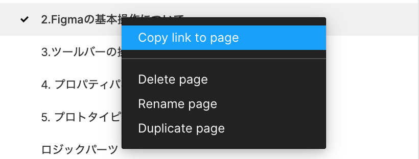

**[chot design](https://chot.design/figma-beginner/)**の`4.プロトタイピング`の章を読みながら実際に手を動かしてみましょう。  
前のページで複製した Design Course Tutorial (Username) の`4.プロトタイピングについて`と書かれたページに今回の課題が用意されています。

### 解答ができたら

1. この章で学んだことを Study Diary に書き、今回学んだ部分にチェックをつける。
2. 提出するページを右クリック、`Copy Link To Page`をクリックし、自分のプロジェクト URL をコピーする。
3. 自分の times でページのリンクを提出し、`:dev_design`のスタンプを押してレビューをお願いしましょう。
4. レビューで指摘されたことがあれば修正し、再び 1 から繰り返す。

| Copy Link To Page                                     | レビュー依頼サンプル                            |
| ----------------------------------------------------- | ----------------------------------------------- |
|  |  |

**※shinonome チームの Design Course Tutorial を編集しないように気をつけてください！万が一してしまった場合は気づいたらすぐに教えてください！**
