## コミュニティのプラグインとファイル

`プラグイン`とは Figma 内で利用できる拡張機能のことです。  
Figma に提供されていない機能を有志の方が作成したもので、作業を効率的に進められるようになるものがたくさんあります。

`ファイル`は世界中のデザイナーや企業がデザインシステムを公開している宝庫のようなものです。  
コンポーネントをどのように管理しているのか、どのようなデザインが今流行っているかなど色々な作品をチェックして自分の知識を増やしましょう。

### 探す

Figma アプリトップの`Community`を押して見ていきましょう。  
中央の検索フォームに入力すると、該当する File,Plugin,Creators,Widgets がタブごとに表示されます。  
探している該当のタブに切り替えましょう。

| Community                         | 検索フォーム                   | 検索結果                              |
| --------------------------------- | ------------------------------ | ------------------------------------- |
| 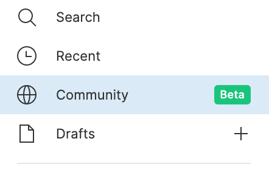 | 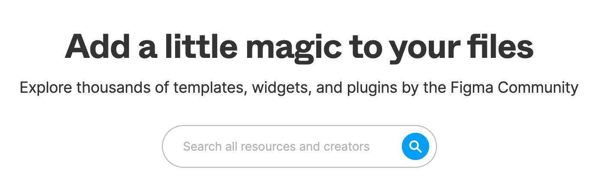 |  |

### プラグインを使用する

[[right | プラグインのタブに切り替えると、検索結果に該当するプラグインの一覧が表示されます。 画像左の枠線を押すとプラグイン詳細ページに遷移し、使い方など説明を見ることができます。 試したいと思ったらプラグインの右側の`Try it out`ボタンを押してみましょう。(詳細ページにも`Try it out`ボタンはあります。)]]
| 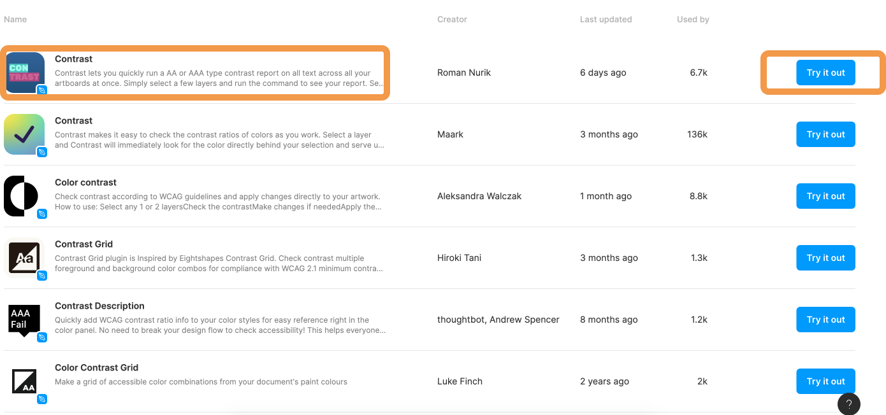

[[right | Try it outボタンを押すとそのプラグインを試す専用のデザインファイルが作成されます。 `Run`ボタンを押して試すことができます。 より詳細に試したかったりよかった場合は3点リーダーを押し、installしておきましょう。 良かったプラグインはリンクをコピーしPGritなどで共有してください。)]]
| 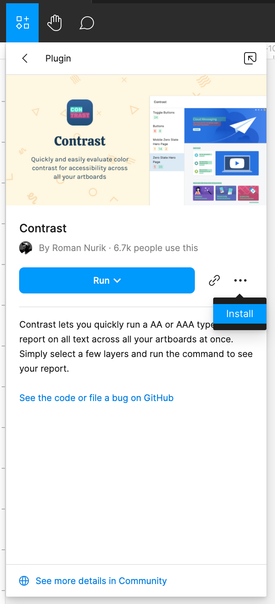

[[right | Communityからだけでなく、ツールバーから検索することもできます。]]
| 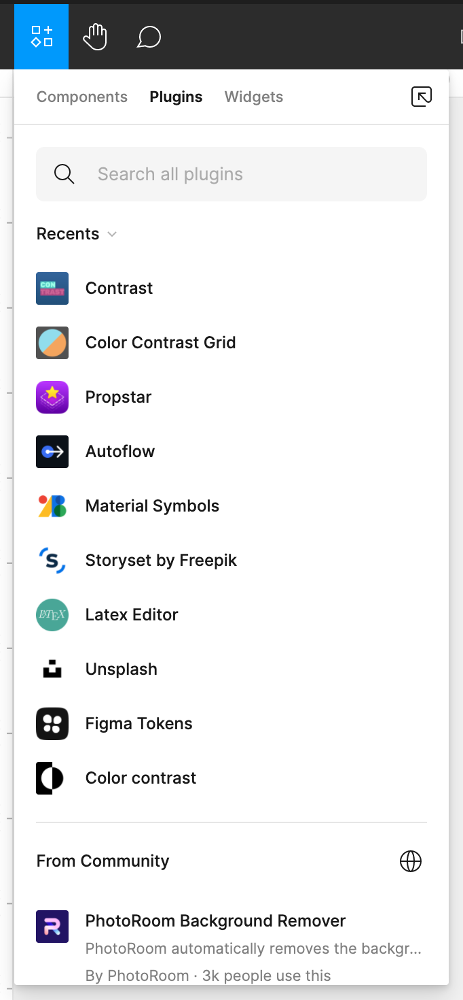

[[right | インストールすることでツールバー左のFigmaアイコンのプラグイン一覧に登録されるので便利になります。]]
| 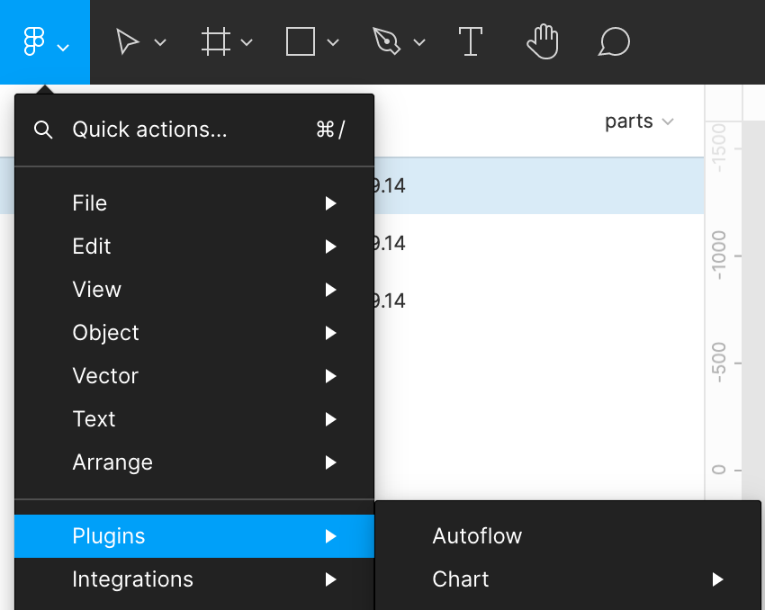

### ファイルを複製する

[[right | 参考になりそうだと思ったファイルは複製して自分のところに保存して、いつでも参照できるようにしておくといいでしょう。 検索結果から、複製したいファイルを選択すると画像のようなページに遷移します。 右上の`Duplicate`ボタンを押すと複製され、Draftsから参照できるようになります。]]
| 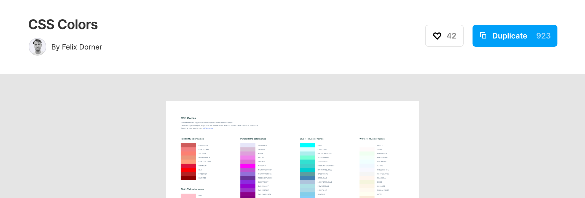

## インストール必須プラグイン

ここでは案件で使っているプラグインをいくつか紹介します。  
必ずインストールしておいてください。

### Material Symbols

[[left | 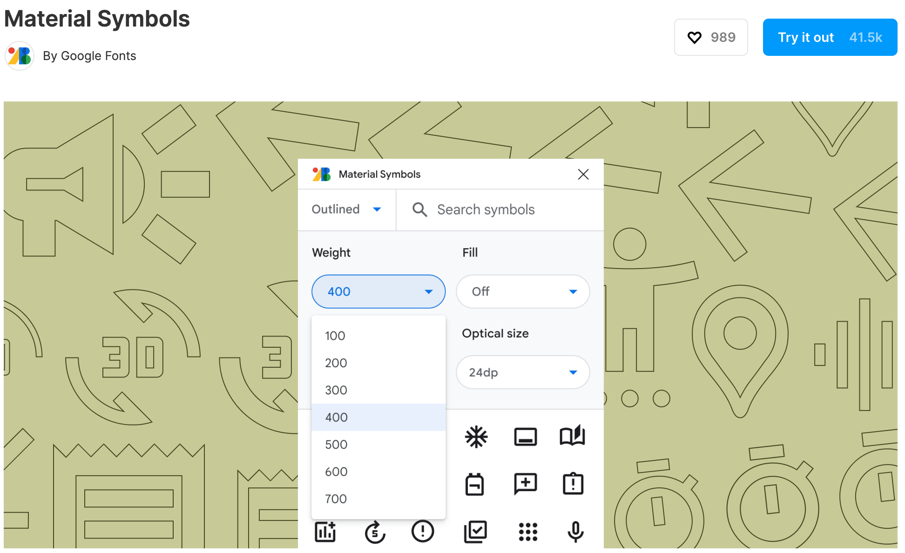]]
| こちらは Google Fonts が提供している Material Icon のライブラリプラグインです。 ワイヤーフレーム・デザインカンプ制作時に重宝します。 基本的に Google font の icon で揃えるのでとても便利です。 https://www.figma.com/community/plugin/1088610476491668236/Material-Symbols

### Instance Finder

[[left | 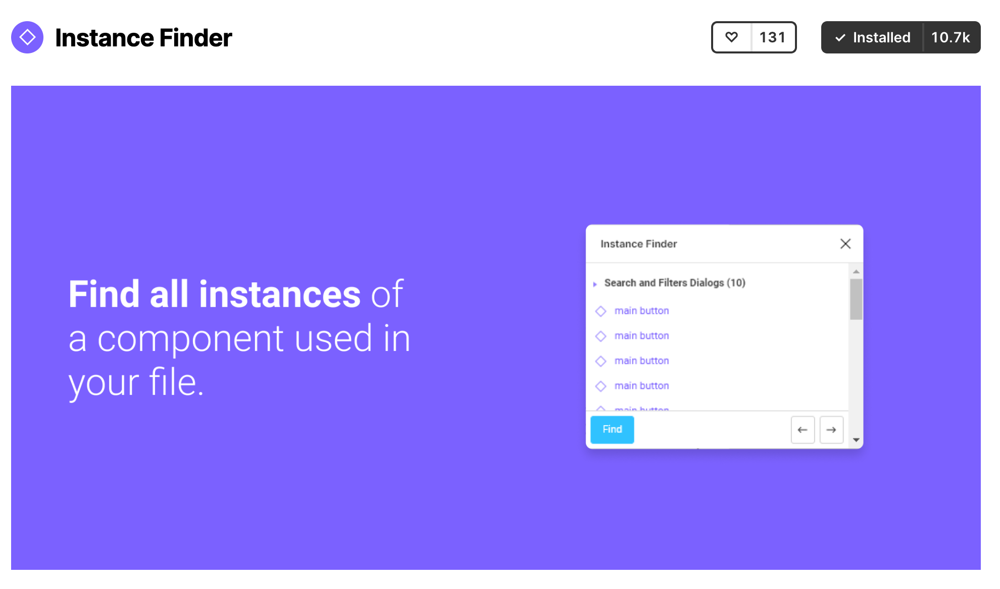]]
| インスタンスからコンポーネントはどこにあるのか、どんなものか確認することはできますが、その逆はできません。  それを解決してくれるのが`Instance Finder`です。  コンポーネントからインスタンスがどこでどのくらい使われているのか確認することができます。 これによって、使わなくなったパーツを削除することができるなど、プロジェクトの整理整頓に役立ちます。 あるとないとでは全く違います。 https://www.figma.com/community/plugin/741895659787979282/Instance-Finder

### Auto flow

[[left | 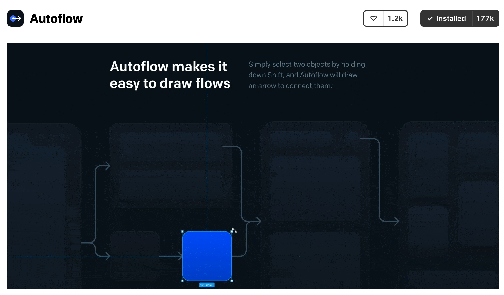]]
| 要素と要素を繋げたい時に自動で矢印・点線などを結んでくれるプラグインです。 この後学ぶ画面遷移図で重宝します。 利点はその時説明します。 https://www.figma.com/community/plugin/733902567457592893/Autoflow

### Japanese Font Picker

[[left | 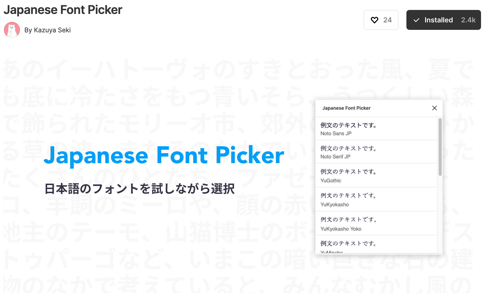]]
| Figma は海外で開発されているツールですので、日本語フォントは全てダウンロードしなければいけないのが難点でした。 それを解決してくれるのが、このプラグインです。 日本語フォントを Figma 上で試すことができるようになります。 https://www.figma.com/community/plugin/948851319619581556/Japanese-Font-Picker

### Unsplash・Iconscout

| Unsplash                        | Iconscout                         |
| ------------------------------- | --------------------------------- |
| 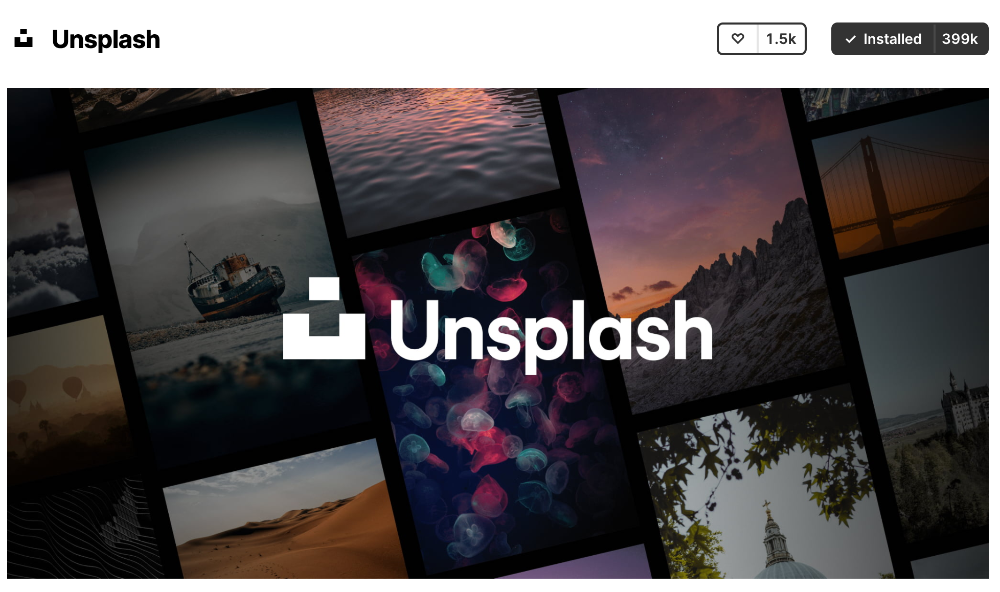 | 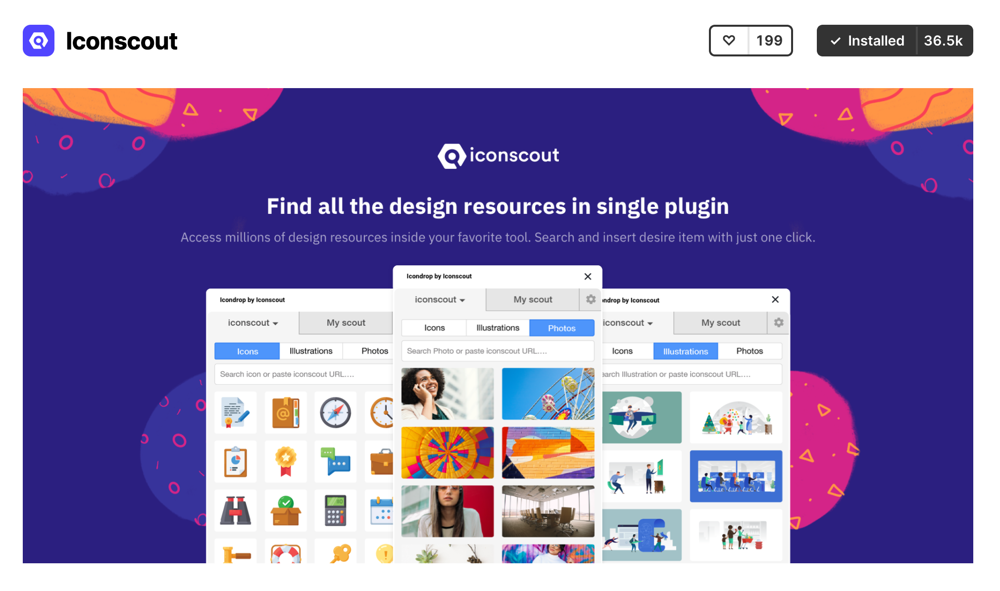 |

画像を検索・挿入できるプラグインです。  
例えば、アイコンなどで適当な人物の画像を挿入したい場合、フリー画像を検索して、ダウンロード、挿入の手順を踏む必要がありました。  
このプラグインを使えば、写真を挿入したいオブジェクトに選択するだけなのでとても簡単です。  
https://www.figma.com/community/plugin/738454987945972471/Unsplash

### Wireframe

[[left | 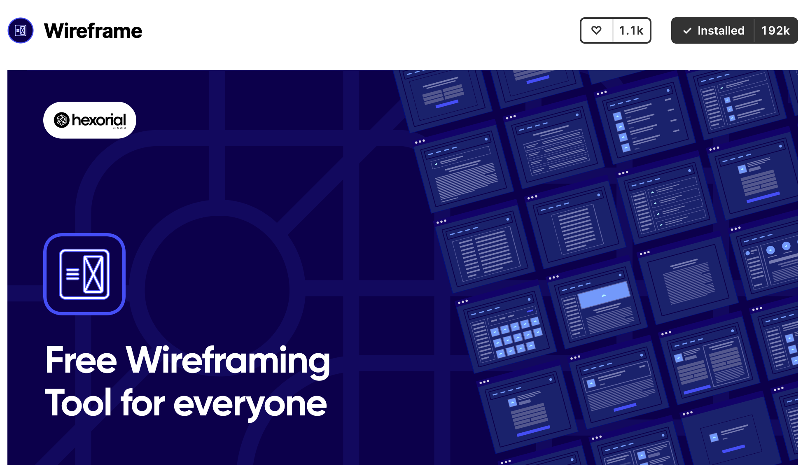]]
| 名前の通り、ワイヤーフレーム制作の効率を上げてくれるプラグインです。 ヘッダー・フッター・記事など一般的に使う要素のパーツを用意してくれています。 このプラグインを活用すれば、手作業で作るパーツがぐんと減ると思います。 https://www.figma.com/community/plugin/742764242781786818/Wireframe

### Color Contrast Grid

[[left | 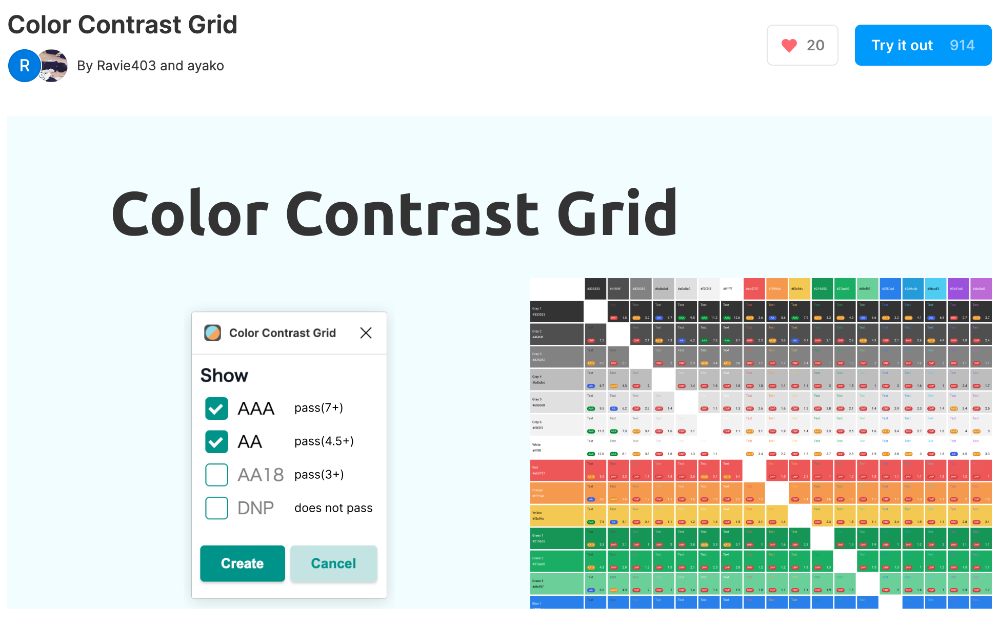]]
| Color Styles に登録しているカラーのコントラスト比を全てチェックすることのできるプラグインです。 カンプ作成時に視認性が良いかを一瞬で調べることができます。 https://www.figma.com/community/plugin/1039910246084959068/Color-Contrast-Grid

## あると便利？プラグイン

ここからは必須ではありませんがあなたのデザイン制作を効率化してくれたりデザインの幅を広げてくれるプラグインを紹介します。

### Chart

[[left | 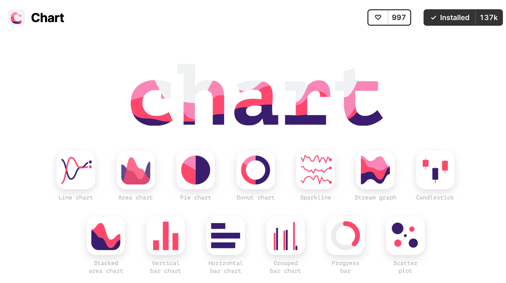]]
| 名前の通り、グラフを作成してくれるプラグインです。 デザインでグラフを作りたい場合は、ベクターなどを駆使して作らなければいけませんが、 実際 WEB サービスとして実装する場合は、動的にデータが入ってくるはずです。 ダミーデータを入れたグラフ制作に時間はかけたくないはずです。 このプラグインはグラフのタイプや値の数などを指定するだけでランダムに表を制作してくれます。 ただし、折れ線グラフ、エリアグラフしか無料枠では作れないので注意が必要です。

### Wave & Curve

[[left | 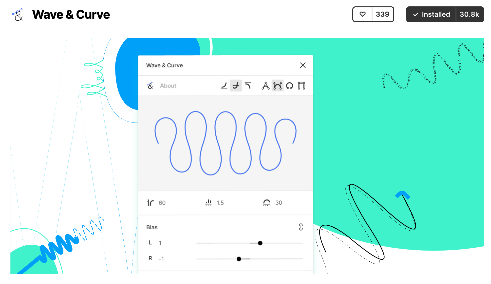]]
| 波線を作る時に便利なプラグインです。 波の数、高さ、傾き具合などを視覚的に設定するだけでベクターデータとして挿入することができます。

他にも[参考サイト](https://makikosakamoto.design/blog/20220118)で様々な面白いプラグインが紹介されています。  
デザイン制作の際にプラグイン活用することを頭に入れておいてください。

### 参考

- [公式ドキュメント ~plugin~](https://help.figma.com/hc/en-us/articles/360040450413-Find-and-install-plugins)
- [公式ドキュメント ~file~](https://help.figma.com/hc/en-us/articles/360038510693-Guide-to-Figma-Community)

### Study Diary を書きましょう！

#### 今回やったこと

- プラグイン
- ファイル

これで Figma の基本的な操作は以上です！！  
お疲れ様でした！！  
できたら次に進みましょう。
