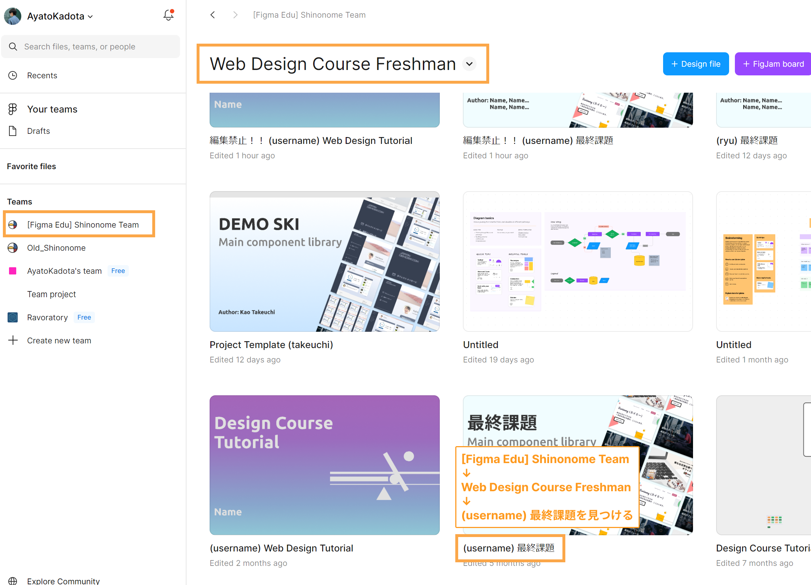
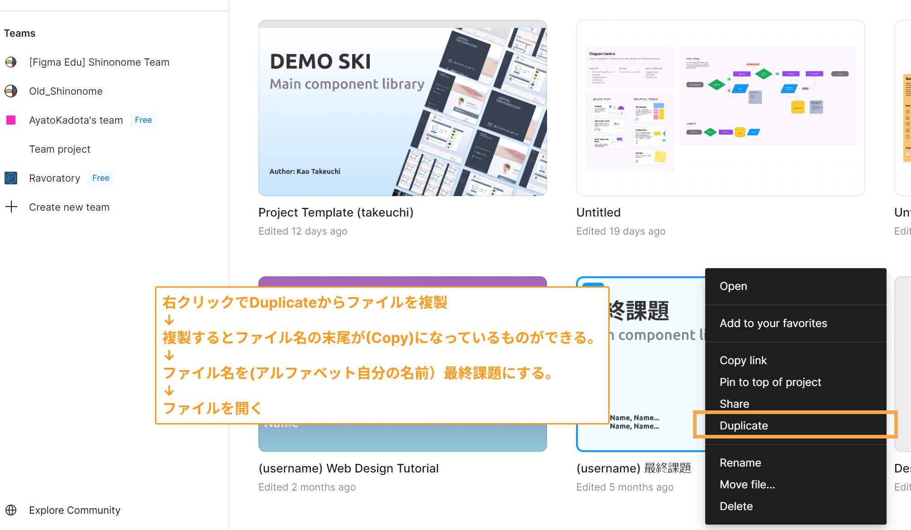
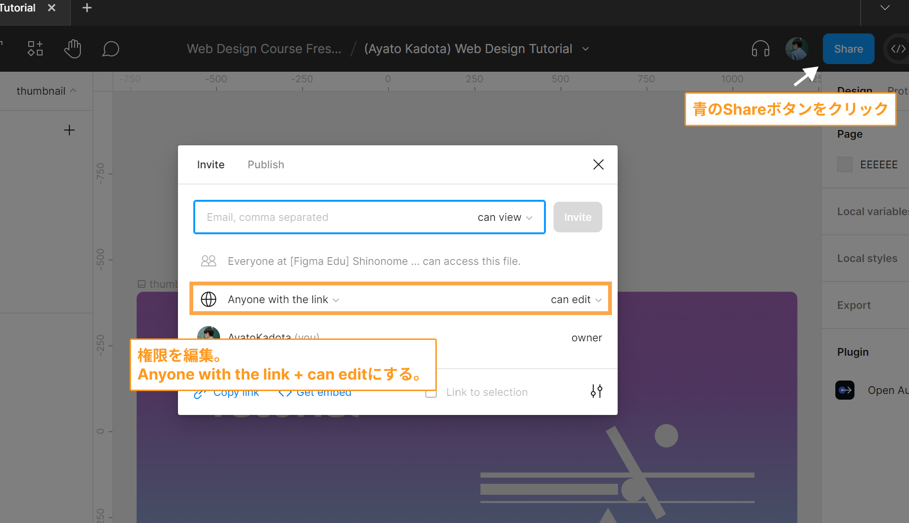

### 概要

最終課題は Shinonome で実際に請け負ったプロジェクトを使った模擬案件(2 つのうち 1 つを選択)に取り組んでもらいます。  
コース修了者が 1 人、学生メンターとしてサポートに入ります。

- 期間: 2 ヶ月
- 製作するもの: ワイヤーフレーム・エンジニア向け説明ページ・コンセプト・デザインカンプ 1 枚
- 流れ: 1 ヶ月目に中間発表、2 ヶ月目に最終発表を行い合否の判断を行う
- 中間発表: コンセプト・デザインカンプの草案を発表しアドバイスを受け、最終発表に向けデザインカンプの完成・合格を目指す
- 最終発表: デザインカンプを発表し合格基準を満たしている場合はコース修了、満たしていないと判断された場合は再度修正

あまり難しく考える必要はありません。自分の作るデザインに説得力やメッセージを持たせられる力を身につけることが目的です。  
**最終課題に入るために以下の準備を行ってください**

### 準備 1. 最終課題に入ることを報告する
- Discordの[#コース全体](https://discordapp.com/channels/598545479860748288/1245591416403660881)チャンネルで最終課題に入ることを報告してください。メンターの手配を行います。
- また、以下4つのファイルのアクセス権限を付与してもらってください。4nonomeのメールアドレスの記載もお願いします。
  - [ski 要件定義書](https://docs.google.com/document/d/1EWbLhFxiUNIF38WkLQWhJY18SL3OuDxeT6-NE3yrt9I/edit#heading=h.30j0zll)
  - [ski　機能仕様書](https://docs.google.com/document/d/1J-IS4ZAQcl91rUKKjJNXLZf44gyblkY-WneLKy4HpN4/edit#heading=h.gjdgxs)
  - [Swimmy　要件定義書](https://docs.google.com/document/d/16CAvIvFSg-im7AZe02Wae7tBs9XicBvrZJLzw3VCZK4/edit#heading=h.30j0zll)
  - [Swimmy　機能仕様書](https://docs.google.com/document/d/1NoOVgS-BqW0Ettp0dQcbaPsVN8Bj4FbNIjFM4Zl6TyI/edit#heading=h.30j0zll)

### 準備 2. 最終課題用のデザインファイル を用意する

### 準備 3. 大まかな製作の流れを把握する

#### 画面遷移図を元にワイヤーフレームを作る

最終課題のデザインファイルの`ワイヤーフレーム`と書かれたページに  
Swimmy を選んだ人は、[4−7−1−2.メンター(会員)スレッド詳細画面](https://docs.google.com/document/d/1NoOVgS-BqW0Ettp0dQcbaPsVN8Bj4FbNIjFM4Zl6TyI/edit#heading=h.ynv0811otxag)を、  
ski を選んだ人は、[4−5−8.受講者マイページ](https://docs.google.com/document/d/1J-IS4ZAQcl91rUKKjJNXLZf44gyblkY-WneLKy4HpN4/edit#heading=h.6z89dblh1vhz)のワイヤーフレームを制作しましょう。  
例も載せているので参考にしてください。

#### エンジニア向け説明ページを作る

ワイヤーフレームが完成したら複製したプロジェクトの`エンジニア向け説明ページ`を見てみましょう。  
対象ページのパーツ、ワイヤーフレーム(デザインカンプができたら置き換える)、そのページ周辺の画面遷移図、説明を 1 つのフレームにまとめて説明します。  
説明とは、そのページにはどのような機能があるのか、アクションに対してどのような反応をするのか仕様書を読み、わかりやすくまとめたものです。  
これをすることによってエンジニアがデザインと見比べながら作るものを把握することができるので親切です。  
選んだプロジェクトのページのエンジニア向け説明ページを作りましょう。

#### コンセプトを定め、カラー・フォントなどを決める

[Web デザインの流れ](/final/)の`4. クライアント・ターゲットを分析する`を参照してください。  
どのような意図を持ってカラーやフォントを決めたのか Figma 上でメモを残しておきましょう。

#### デザインカンプを作る

こだわりを持ってデザインしましょう。職人魂があるかないかでデザインの完成度は雲泥の差となります。  
フォントはこれでいいのか、カラーはもっとしっくりくるものがないか、丁寧にデザインを考えましょう。  
デザインカンプ作成の際には、Atomic Design 化はしません。  
デザインを固める -> レビュー で ok が出た後に、パーツを分解するのが効率的だからです。  
[Web デザインの流れ](/final/)の`5. デザインカンプを作成する`を参照してください。  
**この課題でレスポンシブに対応したデザインを作る必要はありません。PC 版デザインのみ制作してください**

#### Atomic Designをする

デザインカンプが確定したら、atomic designをしましょう。
[Web デザインの流れ](/final/)の`7. Atomic Design`を参照してください。

### 準備 3. 発表までの流れを把握する

最終課題について詳しい情報は[こちら](https://www.notion.so/2a02f37a9fa2462da989822f10155cd1)に載せています。  
メンターとの顔合わせまでにここまで読んでおいてください。  
疑問点や不安なことを洗い出し、メンターに相談してみましょう。
