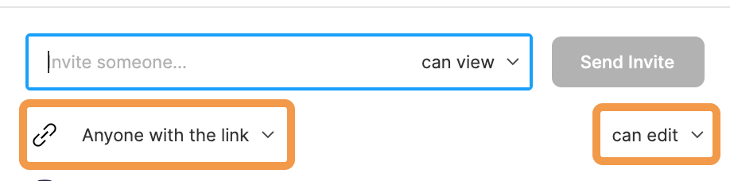

### 課題

最終課題は Shinonome で実際に請け負ったプロジェクトを使った模擬案件形式です。  
Swimmy・ski からどちらか好きな方を選びましょう。(ドキュメントを見てからどっちを作りたいか決めましょう！)

- ワイヤーフレーム制作
- メインページのデザインカンプ制作
  の２段階で最終課題は構成されています。  
  デザイン面からのレビューが加わるので大変ですが、最後の壁なので辛抱強く頑張りましょう！

### 準備 1 ドキュメントを閲覧できるようにする

プロジェクトごとに要件定義書・機能仕様書があり、Google Drive で管理をしています。  
ドライブに招待をするので@Ayako に DM で google アカウントのメールアドレスを教えてください。  
招待されると、以下のリンクが開けるようになります。

- [Swimmy](https://drive.google.com/drive/folders/1cZRBsXoFe0IwGv44C1Ny-VRJYQpLQjxy)
- [ski](https://drive.google.com/drive/folders/11grJR3yejOCuy4ITBDC8s5d-oYAyOCKT)

### 準備 2 Project Template を複製する

実際に Shinonome が Web デザインを作る際に使っている Project Template を使って制作しましょう。

1. Figma を開いて左側のサイドバーから Shinonome をクリック
2. Design Course をクリック
3. 最終課題 を右クリックして複製
4. 複製したものを `(username)最終課題`の username を自分の名前に変える
5. 複製したものをダブルクリックして中身を見る
6. 画像のように ▽ をクリックして Move to Project から Drafts を選択
7. ツールバー右上の`Share`ボタンから`Anyone with link`、隣のドロップダウンメニューから`can edit`を選択

| Move to Project                                    | Anyone with link                         |
| -------------------------------------------------- | ---------------------------------------- |
|  |  |

### ポイント

1. 今までのレビューでされてきたことができているか
2. コーディングをするエンジニアに伝わりやすい説明やデザインの作り方がされているか
3. Atomic Design で実装できているか

### ゴール

講師がデザインに点数をつけ、90 点以上取った時点でデザインコース修了となります。
