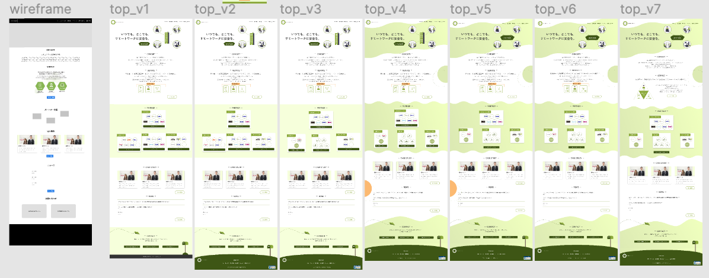

仕様書・ワイヤーフレームを見ながらデザインカンプを制作しましょう。  
デザインカンプ作成 -> レビュー -> Atomic Design 化の流れです。

Swimmy を選んだ人は、[4−7−1−2.メンター(会員)スレッド詳細画面](https://docs.google.com/document/d/1NoOVgS-BqW0Ettp0dQcbaPsVN8Bj4FbNIjFM4Zl6TyI/edit#heading=h.ynv0811otxag)を、  
ski を選んだ人は、[4−5−8.受講者マイページ](https://docs.google.com/document/d/1J-IS4ZAQcl91rUKKjJNXLZf44gyblkY-WneLKy4HpN4/edit#heading=h.6z89dblh1vhz)を制作しましょう。

### コンセプトからカラー・フォントなどを決める

[Web デザインの流れ](/final/)の`4. クライアント・ターゲットを分析する`を参照してください。  
どのような意図を持ってカラーやフォントを決めたのか Figma 上でメモを残しておきましょう。

### エンジニア向け説明ページを作る

複製したプロジェクトの`エンジニア向け説明ページ`を見てみましょう。  
対象ページのパーツ、ワイヤーフレーム(デザインカンプができたら置き換える)、そのページ周辺の画面遷移図、説明を 1 つのフレームにまとめて説明します。  
説明とは、そのページにはどのような機能があるのか、アクションに対してどのような反応をするのか仕様書を読み、わかりやすくまとめたものです。  
これをすることによってエンジニアがデザインと見比べながら作るものを把握することができるので親切です。  
選んだプロジェクトのページのエンジニア向け説明ページを作りましょう。  
できているか不安な場合はここで一度レビュー依頼をしても構いません。

### デザインカンプを作る

こだわりを持ってデザインしましょう。職人魂があるかないかでデザインの完成度は雲泥の差となります。  
フォントはこれでいいのか、カラーはもっとしっくりくるものがないか、丁寧にデザインを考えましょう。  
デザインカンプ作成の際には、Atomic Design 化はしません。  
デザインを固める -> レビュー で ok が出た後に、パーツを分解するのが効率的だからです。  
[Web デザインの流れ](/final/)の`5. デザインカンプを作成する`を参照してください。

### レビュー依頼をする

エンジニア向け説明ページ、デザインカンプのレビュー依頼を出しましょう。

**デザインカンプのレビューのみやり方が今までと異なります！**  
デザインのレビューは実際のプロジェクトと同じようにデザインチーム(講師、運営メンバー、コース修了者)で行います。  
複数人で多角的にデザインを見る必要があるため、Slack でレビュー依頼をお願いします。

1. この章で学んだことを Study Diary に書き、今回学んだ部分にチェックをつける。
2. 提出するページのリンクをコピーする。
3. Slack の`#dev_design`チャンネルでページのリンクと、デザインカンプの画像を添付し、レビューを依頼する。
4. レビューで指摘されたことがあれば修正・バージョンの保存をし再び 1 から繰り返す。

レビューは基本的にコメントで行います。  
レビューされたら Figma 上で確認、コメントの意味がわからなければスレッドでどんどん質問してください。

**レビューされたら現在のカンプを上書きするのではなく複製して修正してください。**  
デザインが良くなっていく過程を見ることは知識の蓄積にもなりますし、モチベーション向上にもつながります。  
このようにデザイン過程を残しておきましょう。画像は実際のプロジェクトのカンプ制作過程です。

### デザインカンプのレビュー ok が出たら

完成したデザインカンプの Atomic Design 化をしましょう。  
今までの総復習です。あと少し！

### 解答ができたら

レビュー依頼をする前にチェックしましょう！

- 階層ごと(asset,atoms,molecules,...)にわかりやすく分けてまとめられているか
- 全てのパーツが[命名規則](/web/atomic-design)を守り、component,variants 機能を使えているか
- 全てのテキストが Shinonome の text-wrap を使っているか
- カラーやテキストは全てスタイル登録されているか
- マウスアクションごとにパーツを全て用意し variants 機能でわかりやすく表示されているか
- デザインの変わり目ごとにデザインを用意しているか
- アイコンやロゴにベクターデータを使っている場合、アウトライン化をしているか
- エンジニアに伝わるように Description を書いているか
- **バージョンを保存したか** [参考](/figma/section2-3/)

**これらができていない場合、レビューはしません。**
