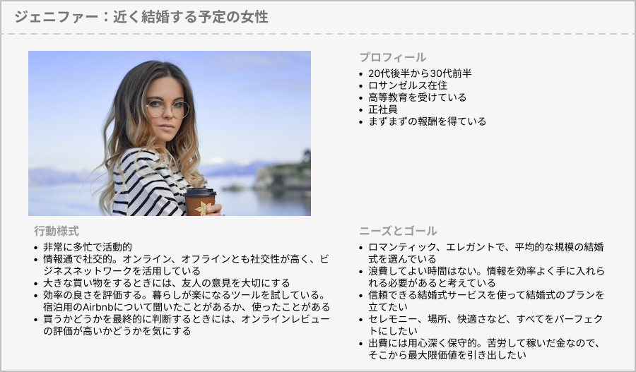
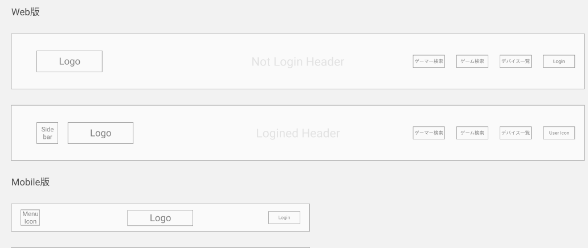
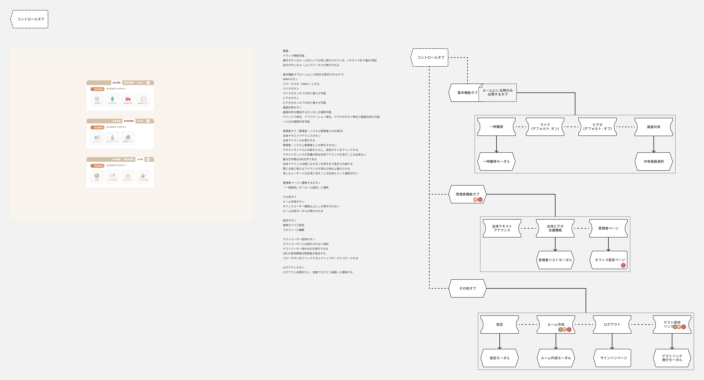
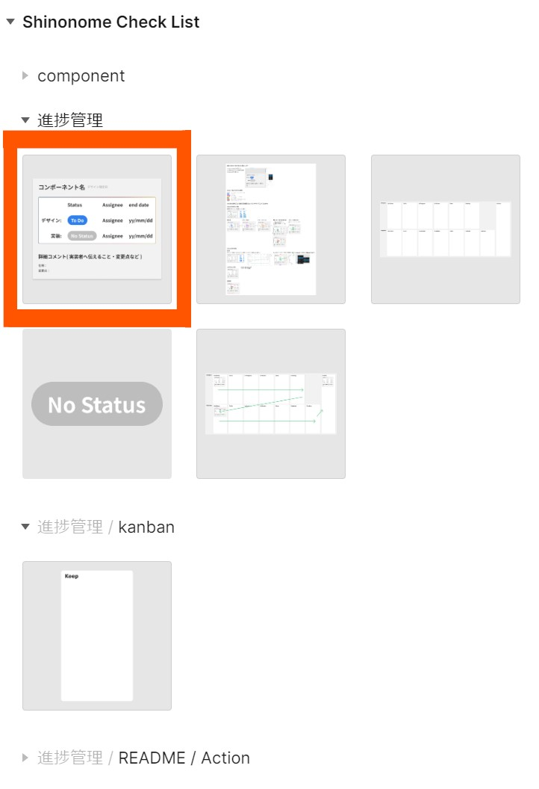

既に出来上がっているサイトから逆算し、画面遷移図、パーツのトレースができるようになりました。  
この最終セクションでは、Web デザインができるまで実際にどのようなフローがあるのか学んでいきましょう。

## Web デザイン完成までの流れ

### 1. サービスの価値提案を明確にする

UI/UXデザイナーが必ずしも担当する工程ではありませんが、サービスを作るうえで知っておくべき工程です。

1.1　バリュープロポジションを立てる
バリュー(価値)プロポジション(提案)です。
バリュープロポジションを考える目的
- 誰もが自社の製品やサービスがなぜ良いのかをすぐに理解できるようにする。
- 競合他社との差別化
- 社内で共通認識を形成
テンプレートを置いておくので参考にしてみてください。
[テンプレート](https://docs.google.com/presentation/d/1t5tXFQPu56zu1EHTMYCTkIJKlt_pJcwTYMLVO8beRPc/edit?usp=sharing)

1.2 競合調査
[テンプレート](https://docs.google.com/spreadsheets/d/179gwpxOsAyXWgv7SubG_aJjzWt5CQYwDE0SbbF9d2wE/edit?usp=sharing)
テンプレートの項目を埋めていき、以下を整理します。
- 同じようなバリュープロポジションの中で最も近いところにいる競合は何か。その製品は成功しているか、失敗しているか。それはなぜか。それとも大成功を収めており、入り込む余地はないか。
- ブルー、レッド、パープルオーシャンのどれにいるのか

1.3 ニーズを調査するためにペルソナを立てる
サービスのニーズがあるのかを確認するために、ペルソナを考えます。
ペルソナとは、商品やサービスを利用する架空の人物像です。
ペルソナという1人の代表的な人格を設定することで、異なる分野の担当者とも共通の人物像をイメージすることができます。
ペルソナを想定してペルソナのような人物を見つけだし、どんな悩みをもっているのかをヒアリングをすることでニーズがあるのか確認します。
ヒアリングで「欲しいと思うか？」「はい、欲しいです」というフィードバックをもとにした「困っている」と、「お金を払ってでも解決したいほど困っていてかつ、社内で決裁が取得できるほどビジネスインパクトが見込める」は違います。
画像がペルソナの例です。

以下を仮定していきます。

- 名前と顔写真
- プロフィール
年齢、住む場所、仕事、お金のゆとり
- 行動様式
顧客が現在、課題をどのように解決しようとしているのか
インターネットをどのくらい使えるか
課題解決のためにSNSを使っているか
顧客は信じやすいか、懐疑的か
- ニーズとゴール
判断する際に優先するのは合理性か感情か
課題に遭遇する頻度はどのくらいか、月に1回か毎日か、ペインの深さはどのくらいか
現在の課題解決の方法に欠けているものは何か
妥協点は何か

1.4 ユーザーストーリーを作成する
ユーザーストーリーでは、ユーザーが何を思ってどう行動するのかを時系列で整理し、また、整理したユーザー行動をもとに必要な機能を洗い出します。

### 2. 要件定義・機能仕様書を作成する

UI/UXデザイナーが必ずしも担当する工程ではありませんが、サービスを作るうえで知っておくべき工程です。

ここからシステム開発が始まります。
システム開発には「要件定義、デザイン、実装、テスト、リリース」の5つの工程があります。
まずはこの段階で「要件定義」をします。
要件定義とは、システム開発にあたりサービスの目的や必要な機能、制約、スケジュールなどを明確にすることです。
要件定義書や機能仕様書を作成します。
要件定義書とは、何を達成するためのシステムなのか（WHY）、そしてその背景や目的は何かを明確にする文書です。要求や期待値を記述するため、技術的な詳細は少ないことが一般的です。
機能仕様書とは、要求やニーズをどのように技術的に実現するのか（HOW）を詳述する文書です。技術者やデベロッパーがシステムを設計・実装する際に利用されるため、技術的な詳細が豊富に含まれます。

### 3. 仕様書を元に画面遷移図を作成する

「要件定義」の続きに、画面遷移図を作成します。
画面遷移図は、１の工程で作成したユーザーストーリーをもとに必要な画面を洗い出し、画面どうしのつながりを定義します。
画面遷移図の目的は以下です。
- クライアントとサービスの全体像を共有するために使う。
- ユーザーが目的を達成するためのステップや遷移の流れを明確にする。
画面遷移図の作り方は[ここ](/web/chart)を見て復習してください。

### 4. ワイヤーフレームを作成する

[[right | 「デザイン」の工程に入ります。 デザインによってレイアウトや装飾に工夫を凝らし、サービスをユーザーにとってより分かりやすく使いやすいものします。 デザインにあたり、注意すべき点があります。 それは、要件定義書や機能仕様書だけでは製品の展望の背景にある根拠を洗い出すことができないことがあるということです。要件定義書や機能仕様書は、システムを作るための情報がまとまっていますが、1の工程での、どんな顧客に向けたサービスなのか、ユーザーがシステムを使うときの「現場」の雰囲気までは網羅しきれていないことがあります。サービスが目指す展望について共有できていないときは、クライアントに現場の様子などをヒアリングします。 画面遷移図で洗い出した画面を作成していくために、まずワイヤーフレームを作成します。 以下のポイントを押さえます。 ・ユーザーがしたいことは何か。 ・ユーザーが操作するときに知りたい情報は何か。 ・ユーザーが知りたい情報を知れて、かつ、クリック数を少なくできるレイアウトは何か これらを整理することで、サービスのUI/UXを大きく向上することができます。 この画像はあるプロジェクトのヘッダーのワイヤーフレーム です。]]
| 

### 5. ワイヤーフレームにクライアントやエンジニア向けの説明を付ける

[[right |ワイヤーフレーム ができたらエンジニア向けのページを作成します。 ページまたはパーツの単位で説明を作成します。 この画像はあるプロジェクトのエンジニア向けの説明です。 (左上)説明するロジックパーツ (左)ワイヤーフレーム　※画像はデザインカンプ (中央)仕様書の文言 (右)周辺の画面遷移図 クライアントやエンジニアチームにワイヤーフレームを共有することで、別視点からの課題解決方法・アウトプットが得られることがあります。]]
| 

### 6. デザインコンセプトを決める

１の工程で明確にしたサービスの価値提案をデザインへ落とし込みます。

webサイトや雑誌、芸術作品を参考にしつつ、サービスの価値提案に沿ったデザインコンセプトを考えます。ムードボードを作成すると、デザインイメージを共有しやすくなります。
ワイヤーフレームからどのパーツを表示するのか決まっていれば、コンセプトに合った参考パーツを探します。参考パーツを見つけたら、実際にFigma上でパーツを作成し、違和感がないか確認します。

参考 1: [ムードボードについて](https://photoshopvip.net/87871)
参考 2: [色相環で考える](https://sevendex.com/post/7275/)  
参考 3: [デザイナーじゃなくても知っておきたい色と配色の基礎知識](https://baigie.me/officialblog/2021/01/27/color_theory/)

フォントは、[Google font](https://fonts.google.com/)から選ぶことが多いです。  
日本語に対応しているフォントか確認を忘れずにしましょう。  
デザインカンプを作りながらフォントを考えるのでも構いません。  
Figma 上で試す場合は[おすすめプラグイン](/figma/section5/)の Japanese Font Picker が役立つと思います。  
実際に使う場合はダウンロードすると Figma 上で使えるようになります。

### 7. デザインカンプを作成する

デザインコンセプトをワイヤーフレームに反映させ、デザインカンプへと落とし込みましょう。
ワイヤーフレームから使用するパーツを決め、pinterestなどで参考となるパーツデザインを探しましょう。
参考パーツを見つけたら、実際にFigma上でパーツを作成し、画面上で違和感がないか確認します。

1. コンセプトにあったデザイン例を探す
   [dribbble](https://dribbble.com/)などでパーツ名を検索しイメージを膨らませましょう。

2. どのパーツを用いて表現するか考える
   [https://csslayout.io/](https://csslayout.io/)があらかたのパーツを網羅しています。  
   参考にしてください。

適宜参考にしてください。 [素材集](/wisdom/tips/)

### 8. UX 検証

ユーザビリティ（使いやすさ）・UX（心地よさ）を検証します。
プロトタイプを作成することで検証しやすくなります。
ユーザーがしたいことが実現できるか、ユーザーが操作するときに知りたい情報がすぐに見つかるか、クリック数を減らすことはできないか、余白がとれているかなどを確認します。
これらの検証は 1 人で行うのではなく、大人数の意見を聞くことが大切です。

### 9. Atomic Design

[[right |デザインカンプのUX検証が終わると、いよいよatomic designです。 使いまわしができる（汎用的な）パーツを見つけコンポーネント化しましょう！ CheckCard（右画像）を使ってホバーアクションなどの仕様を記載しましょう。 CheckCardの使い方はassetsでCheckCardの隣に置いているので確認してください。]]
| 

### まとめ

これらの順番は固定ではありません。  
プロジェクトによっても変わりますし、同時進行で作業を進めたり、戻ったりもします。  
時と場合によってこのフローをプロジェクトに合った形に変えていきましょう。

### 個人シートに学んだことを記入しましょう！

#### 今回やったこと

- Web デザインの流れ

できたら次に進みましょう。
