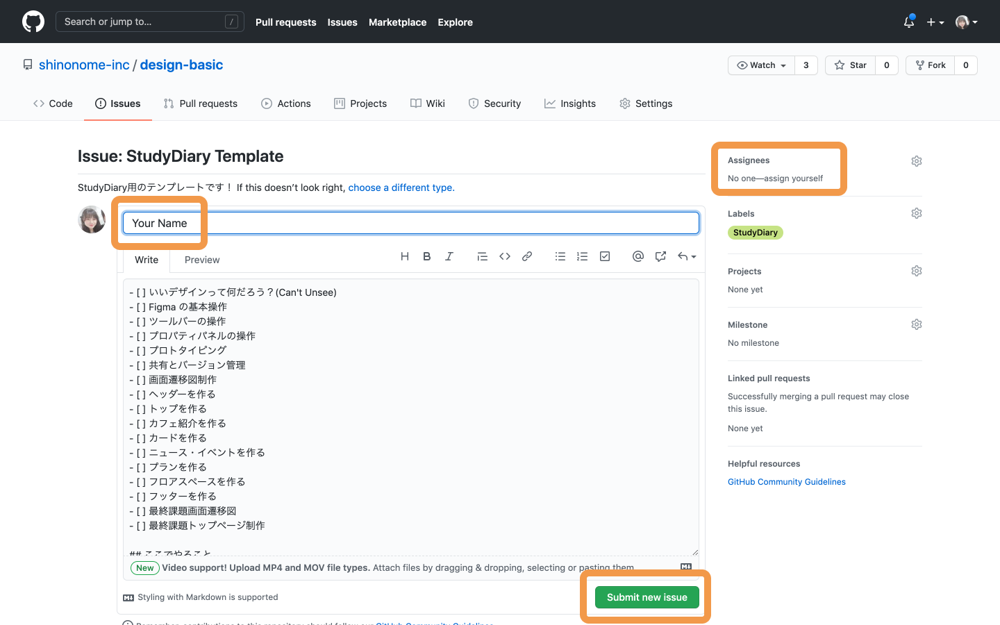

## 課題の始め方

デザインコースではデザインするとはどういうことなのかというところから Web デザインをある程度できるようになるまでをカバーするコースになっています。  
課題を始めるために以下の準備をしましょう！

### Figma アカウントを作る

デザインコースで使うデザインツールは Figma です。  
アカウント登録をしましょう。

1. [Figma オフィシャルサイト](https://www.figma.com/)にアクセスし、`Try Figma for free`からアカウント登録をしましょう。
2. メールアドレスとパスワードを入力するとアンケートが表示されるので、名前と役職を回答しましょう。これらの情報は後から変更もできます。
3. `Create Account`をクリックして、アカウントの作成は完了です。編集画面が表示され、チュートリアルが始まるので`Next`をクリックします。2 枚目でチームを作成するよう推奨されますが、個人利用の場合は必要ありませんので、左上の`Cancel`ボタンで離脱しましょう。
4. **Shinonome のチームに招待をするので@akane さんに Figma の登録メールアドレスを伝えて、招待してもらいましょう。**

### Study Diary を作る

1 人 1 人に Study Diary を書いてもらい、日々の知識を蓄積するノートとしてもらいます。  
[issue ページ](https://github.com/shinonome-inc/design-basic/issues)にアクセスしましょう。  
アクセスできない場合は[Shinonome org に参加していない](https://playground.wraptas.site/200d92e8848c4c71b00ffab42a06b8f8)や Github にログインしていない状態でアクセスしていることが考えられます。  
Study Diary の作り方は、

1. 右上の`New issue`をクリック
2. `StudyDiary Template`の`Get started`をクリック
3. title の`Your name`を自分の`Slack名`に変更、Assignees に自分を選択する
4. 右下の`Submit new issue`をクリックする

| New issue                        | Get started                          |
| -------------------------------- | ------------------------------------ |
|  |  |

| Study Diary の書き方                 |
| ------------------------------------ |
|  |

### Study Diary にチェックを入れましょう！

#### 今回やったこと

- Figma アカウントの作成
- Study Diary の作成

チェックを入れたら次に進みましょう。
