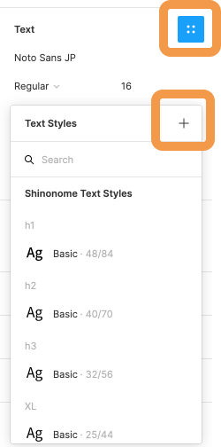

### Atomic Design とは？

Atomic Design(アトミックデザイン)とは、画面を構成する要素を、`Atoms(原子）`,`Molecules（分子）`,`Organisms(有機体）`,`Templates(テンプレート）`,`Pages(ページ）`の 5 つの階層に分け、最終的な UI と UI の基礎となるデザインシステムを同時に作成する設計方法です。

### 利点

- 機能やコンポーネント単位で考えることで、デバイスやページの概念に縛られず、動的にデザインできること。
- それぞれの階層でコンポーネント化をすることによって修正・変更しやすく、パーツの使い回しもできる。

### 例

以下の画像が instagram を Atomic Design 化 したものです。

### カラーやテキストの Atomic Design

パーツだけではなく、Figma を使えば、カラーやテキストのスタイルを登録することができます。  
登録することによって、使っているカラーとテキストが可視化され、サイト全体の統一感にも繋がります。  
以下の画像を見てみましょう。

| カラースタイル                     | テキストスタイル                 |
| ---------------------------------- | -------------------------------- |
|  |  |

カラーやテキストの指定をしている部分をホバーすると`４つのドット`が出現し、すでに登録されているスタイルを選択・適用したり、`+`ボタンから新しく登録することができます。

### Shinonome のテキスト

Shinonome ではテキストを`Atoms/Text`と位置付けてコンポーネントを統一して使っています。 右側のメニューの`Assets`の`Shinonome Text Styles`から`text-wrap`を持ってきて構造を見てみましょう。  
テキストが`margin`と`padding`という名前の Auto layout でラップされているのがわかると思います。

- `text-wrap--margin` は外側の余白で他の要素との余白を取る際に用います。
- `text-wrap--padding` は内側の余白で、自分の要素の余白を取る際に用います。  
  margin と padding の違いをしっかりと理解しましょう。

| text-wrap                     | margin と padding                   |
| ----------------------------- | ----------------------------------- |
|  |  |

### コンポーネントの登録

Atomic Design をする上でパーツは全て Figma のコンポーネント機能使う必要がありますが、命名には少し工夫が必要です。  
パーツをわかりやすいように rename することが当たり前ですが、コーディングをする際に日本語は一切使いません。  
エンジニアがそのままの命名を使えるよう、**コンポーネントの命名に日本語は使わない**ようにしましょう。

また、命名規則は以下です

- `階層名(Atoms,Moleculesなど)`/`パーツ名(--状態)`

例: `Atoms/Button`, `Atoms/Button--active`, `Atoms/Button--hover`  
`/`で区切ることによって、パーツの検索がしやすくなります。  
`active`や`hover`はマウスのアクションが起きた時のデザインです。  
ユーザーの動きも考えてデザインを作りましょう。

### 全て読んだら

今回学んだ Atomic Design はエンジニアに実装してもらう上でとても重要な知識です。  
理解できない部分は手を動かしたり調べたりしましょう。

1. この章で学んだことを Study Diary に書き、今回学んだ部分にチェックをつける。  
   ※この章に関する課題はありません。次に進みましょう！
