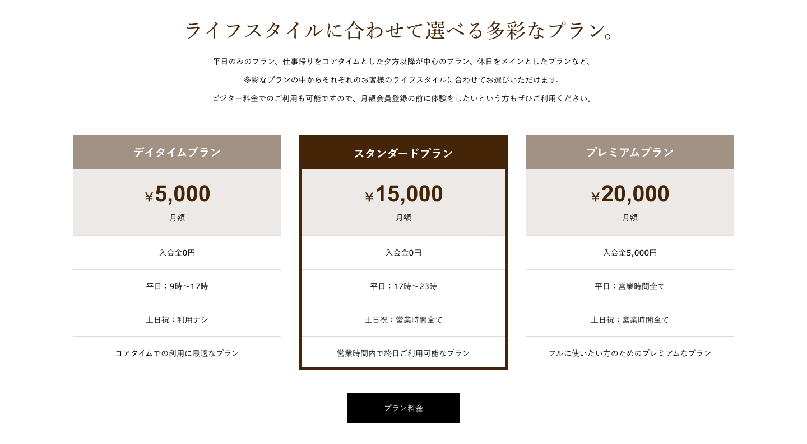

### Atomic Design トレース課題

Design Course Tutorial (Username) の`plans`と書かれたページで制作しましょう。  
このセクションではプラン部分を作ってもらいます。  
[デモサイト](https://demo.tcd-theme.com/tcd063/)

### 考慮すべき点・ヒント

- マウスアクションに注意しましょう。
- [デバイス対応](/web/section2-2)の container の値をうまく使っていますか？

### 解答ができたら

レビュー依頼をする前にチェックしましょう！

- 階層ごと(asset,atoms,molecules,...)にわかりやすく分けてまとめられているか
- 全てのパーツが[命名規則](/web/section2-1)を守り、component,variants 機能を使えているか
- 全てのテキストが Shinonome の text-wrap を使っているか
- カラーやテキストは全てスタイル登録されているか
- マウスアクションごとにパーツを全て用意し variants 機能でわかりやすく表示されているか
- デザインの変わり目ごとにデザインを用意しているか
- アイコンやロゴにベクターデータを使っている場合、アウトライン化をしているか
- エンジニアに伝わるように Description を書いているか
- バージョンを保存したか [参考](/figma/section2-3/)

**これらができていない場合、レビューはしません。**

1. この章で学んだことを Study Diary に書き、今回学んだ部分にチェックをつける。
2. 提出するページのリンクをコピーする。
3. PGrit でページのリンクと、`#design_review`のタグをつけてレビューを依頼する。
4. レビューで指摘されたことがあれば修正し、バージョンを保存し再び 1 から繰り返す。

レビューは基本的にコメントで行います。  
レビューされたら Figma 上で確認、コメントの意味がわからなければ reply をして`#design_review`のタグをつけて PGrit にその旨を投稿してください。

**※shinonome チームの Design Course Tutorial を編集しないように気をつけてください！万が一してしまった場合は気づいたらすぐに教えてください！**
