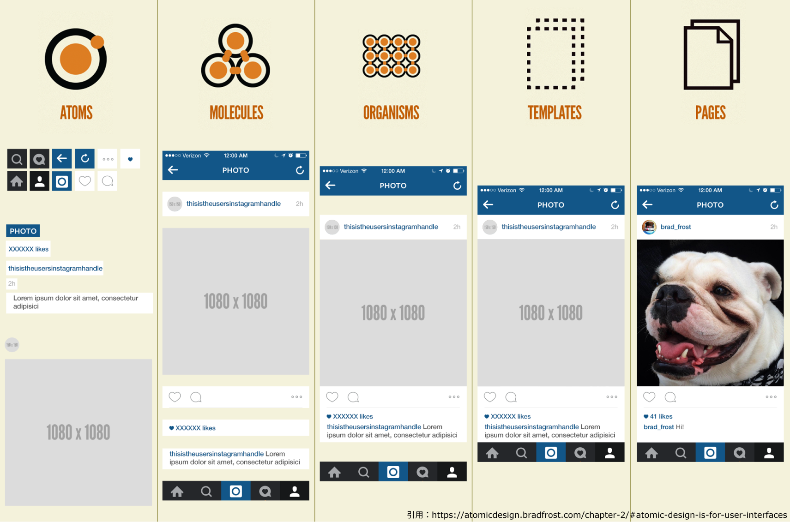

### Atomic Design とは？

Atomic Design(アトミックデザイン)とは、画面を構成する要素を、`atoms(原子）`,`molecules（分子）`,`organisms(有機体）`,`templates(テンプレート）`,`pages(ページ）`の 5 つの階層に分け、最終的な UI と UI の基礎となるデザインシステムを同時に作成する設計方法です。

### 利点

- 機能やコンポーネント単位で考えることで、デバイスやページの概念に縛られず、動的にデザインできること。
- それぞれの階層でコンポーネント化をすることによって修正・変更しやすく、パーツの使い回しもできる。

### 例

以下の画像が instagram を Atomic Design 化 したものです。

`atoms(原子）`,`molecules（分子）`,`organisms(有機体）`,`templates(テンプレート）`,`pages(ページ）`の階層の明確な分け方はありません。  
わかりやすく整理されており、他者から見てもわかりやすいようであれば`templates`の階層が存在しないなどもありえます。

`atoms`

定義：これ以上分解できないもの。iconはassetsに分類されるため、textとiconが合わさったものはatomsに含めません。

assetsについては、後で説明します。

パーツ例：text-link , button , icon（default , hover , selectedなど状態管理）, text-field , text-area , badge , avator , chat bubble , divider , dropdown（1項目でのdefault , hover , selectedなど状態管理）, toggle , tooltip

`molecules`

定義：独立して存在できるコンポーネントではなく、ほかのコンポーネントの機能を助けるヘルパーとしての存在意義が強いコンポーネント

パーツ例：breadcrumb , card , list , check-box（icon+textの状態） , modal , snack-bar , pagination , progerss-bar , slider , tab

`organisms`

定義：独立して存在できるスタンドアローンなコンポーネント

パーツ例：header , footer , cards , lists , calendar , carousel , chart , chat , table , 

`templates`

定義：実際にありうるテキストや画像を入れる前の状態。ここでレイアウトの確認をする。

`pages`

定義：完成した画面。実際にありうるテキストや画像を流し込む。

パーツ名がわからない場合は[ここ](https://csslayout.io/)をチェック

### 命名規則

コンポーネントは命名の仕方がとても大事です。  
命名をわかりやすくすることでエンジニアにとっても自分自身デザイナーにとっても管理のしやすいデザインシステムになります。

#### コンポーネントの命名

Atomic Design をする上でパーツは全て Figma のコンポーネント機能使う必要がありますが、命名には少し工夫が必要です。  
パーツをわかりやすいように rename することが当たり前ですが、コーディングをする際に日本語は一切使いません。  
エンジニアがそのままの命名を使えるよう、**コンポーネントの命名に日本語は使わない**ようにしましょう。

命名規則は以下です。

- `階層名(atoms,moleculesなど)`/`パーツ名/(状態)`
- user list など、２単語以上ある場合は`-`で単語を繋げるのがルールです。ケバブケースで調べてみましょう
- ケバブケースは UI を実装するフロントエンド でよく使うためです
- 小文字のみ使用

例: `atoms/button/default`, `atoms/button/active`, `atoms/button/hover`,`molecules/user-list`  
`/`で区切ることによって、パーツの検索・Variants 機能が使いやすくなります。  
`active`や`hover`などマウスのアクションが起きた時のデザインも考えましょう。

### Atomic Design に乗じたアセットの管理

[[right | WEB デザインにおけるアセットとは画像やイラスト、アイコンなどサイトで使う素材のことです。 上の例でわかるように、atoms でアイコンに背景を足したり、Templates で埋め込んだりしますね。 しかしエンジニアはブラウザ上でデザインを表現をするために、何も手を加えていないアセットが欲しいです。 そのため、アセットは`assets/素材名`としてまとめておきましょう。 そうしておけば、エンジニアはこれがデザインで使っている素材であることが一目でわかります。]]
| 

### 個人シートに学んだことを記入しましょう！

今回学んだ Atomic Design はエンジニアが実装する上でとても重要な知識です。  
理解できない部分は手を動かしたり調べたりしましょう。

### 参考

- [命名規則について](https://designsupply-web.com/media/development/4052/)

#### 今回やったこと

- Atomic Design
- コンポーネントの命名規則
- アセットの管理

できたら次に進みましょう。
