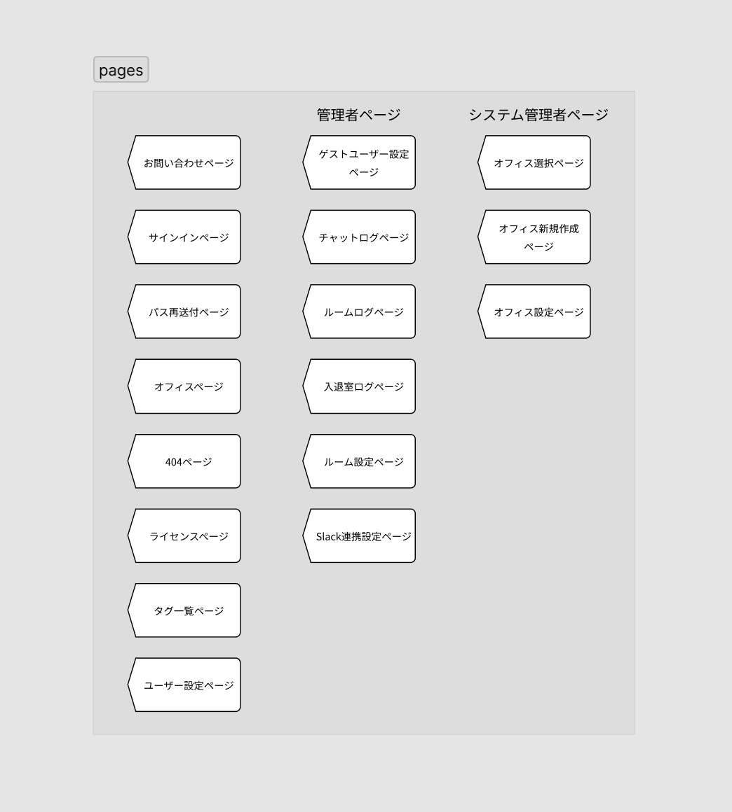
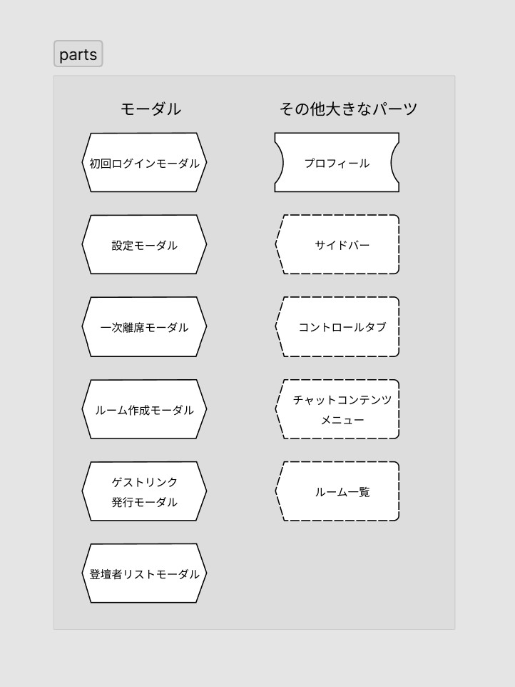

それでは実際にパーツを使って、画面遷移図を作ってみましょう。  
今回は要件を見て一から図を作るのではなく、既に完成している[デモサイト](https://demo.tcd-theme.com/tcd063/)から、設計段階の画面遷移図を逆算して作ります。  
(username) Design Course Tutorial の`ロジックについて`と書かれたページで制作していきましょう。  
以下の手順でこの課題に取り組んでください。

### 1. 全ページを一覧にする

[[right | まずは、デモサイトにいくつページがあるのか数えましょう。 そしてページ一覧としてまとめておくことでエンジニアが何ページ作成すればいいのか把握できます。 ロジックパーツを使ってページを一覧にし、セクション機能で囲いましょう。 この画像はある案件のページ一覧です。]]
| 

### 2. 共通パーツを一覧にする

[[right | 次に共通パーツを洗い出しましょう。 共通パーツとは、ヘッダーやフッター、サイドバーなど複数のページに配置されるパーツのことです。 ロジックパーツを使って共通パーツを一覧にし、セクション機能で囲いましょう。 この画像もある案件の共通パーツ一覧です。]]
| 

### 3. 画面遷移図を作る

ページ一覧と共通パーツ一覧が作成できたら、トップページの画面遷移図を早速作っていきましょう。(他のページは作る必要はありません。)  
どう表現したらわかりやすいか、自分なりに工夫して作ってみましょう。

### 解答ができたら

1. [模範解答](https://www.figma.com/file/ah0c0rbDLSfuDoKFnuS7sl/%E3%83%87%E3%82%B6%E3%82%A4%E3%83%B3%E3%82%B3%E3%83%BC%E3%82%B9%E8%AA%B2%E9%A1%8C%E6%A8%A1%E7%AF%84%E5%9B%9E%E7%AD%94?node-id=19688%3A3291&t=H4fQB8mWD6GC8g6k-0)を見て修正部分がないか自分で確認しましょう。
2. メモで注意点を 1 つ 1 つ確認し、直しましょう。(書き換えるのではなく別のエリアに作り直しましょう！)
3. PGwebで "課題を完了済みにする" ボタンを押す。
4. 次のチャプターに進む前に、つどいの場に参加しましょう。[つどいの場とは？](https://www.notion.so/shinonome-inc/92952612de464f22b3c5cde79d7211b5)

**※模範解答をコピペするのはやめましょう。（小声）レビュワーは Show version history で確認できます。**
パーツを完成し終えてから自分のファイルに模範パーツをコピペしてパーツの中身を確認するのは OK です。

分からないこと&考えたことは、[仕様メモ](https://www.figma.com/file/ah0c0rbDLSfuDoKFnuS7sl/%E3%83%87%E3%82%B6%E3%82%A4%E3%83%B3%E3%82%B3%E3%83%BC%E3%82%B9%E8%AA%B2%E9%A1%8C%E6%A8%A1%E7%AF%84%E5%9B%9E%E7%AD%94?node-id=20224%3A5123&t=LvFG8CqZSR0wz1bo-4)などを使って自分の考えを残すようにしましょう。

もし課題の仕上がりに不安があれば、Discord の[#課題レビュー](https://discord.com/channels/598545479860748288/1263076994430799943)チャンネルまでレビュー依頼を出してください。

**※Shinonome チームの Design Course Tutorial を編集しないように気をつけてください！万が一してしまった場合は気づいたらすぐに教えてください！**