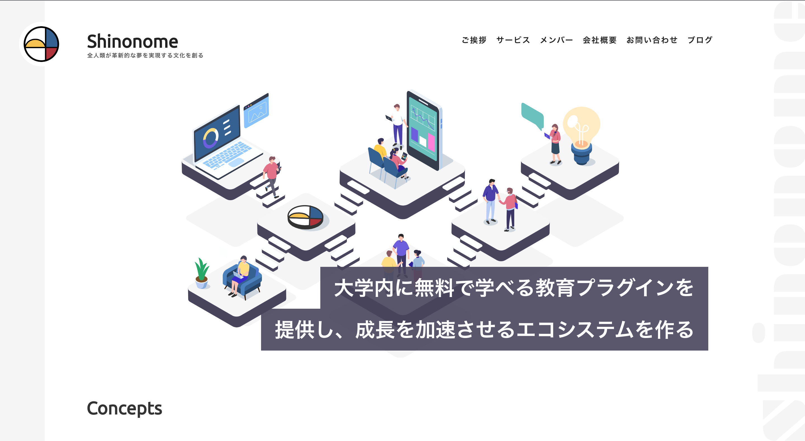
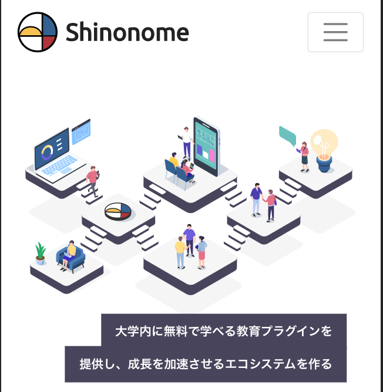
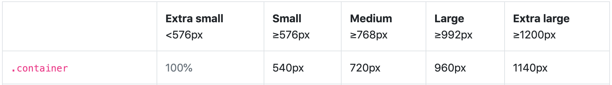
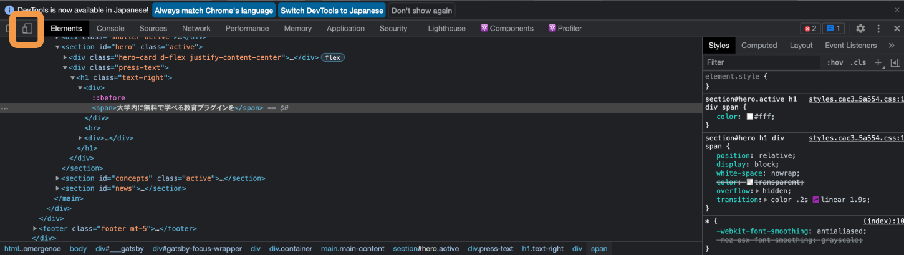
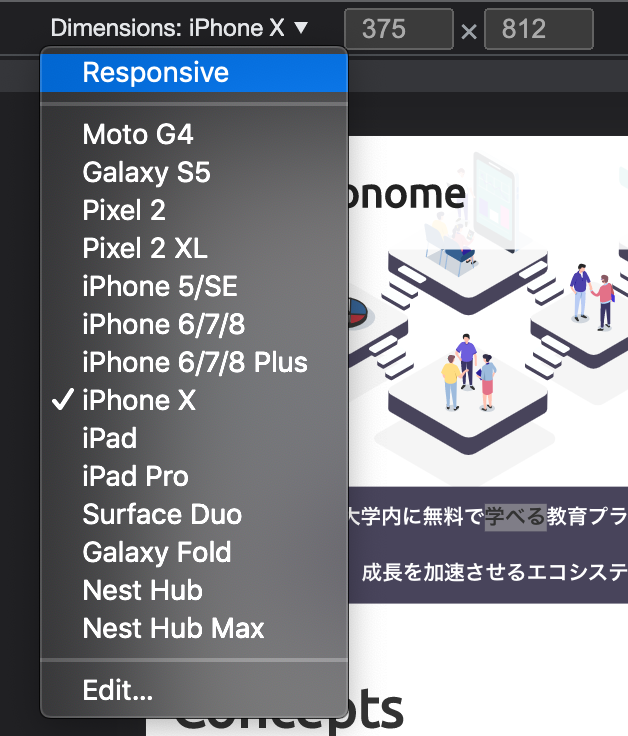

## デバイス対応とは

デバイス対応とは、スマホ・タブレット・PC など画面幅に合わせてデザインが崩れることがないようにすることです。  
まずはフロントエンド コースの[スマホ対応とレスポンシブ対応](https://basic-frontend.4nonome.com/bootstrapGit/350/)を一読しましょう。  
基本的にはレスポンシブ対応でデザインを作ることが多いです。

## ブレークポイントとは

例えば、あなたが[shinonome のサイト](https://shinonome.io/)に訪れたとしましょう。

| PC で見た場合       | スマートフォンで見た場合     |
| ------------------- | ---------------------------- |
|  |  |

すると、以下の点などいくつかの相違点に気づくはずです。

- ヘッダーのデザインが異なる
- ロゴの下の文がない
- フォントサイズが異なる

このようにユーザーが見る端末の画面幅に応じてデザインを調整し、どの環境でも違和感なく見せる必要があります。  
デザインをどの画面幅を境に調整するのか、この境目を`ブレークポイント`といいます。  
このブレークポイントをいい加減に定めてしまうと、実装側のコードが荒れたりするので慎重に決定しましょう。  
ブレークポイントは基本的に [bootstrap](https://getbootstrap.jp/) のブレークポイントに合わせましょう。  
`Extra small`,`Small`...の行がブレークポイントを表しています。  
これらは`xs`,`s`,`md`,`lg`,`xl`と省略して呼ばれますので覚えておいてください。  
`.container`の行の値は bootstrap が設定している余白をつけた際の中身のサイズを表しています。

`Username`--Design Course Tutorial の`ブレークポイント`と書かれたページにこの表をフレームで表しています。  
緑色の範囲が余白です。  
左右に余白が欲しいデザインの場合はこの値を使いましょう。

## 実際に見てみる

世の中のサイトがどのタイミングでデザインを切り替えているのか見てみましょう。  
好きなサイトを開き、画面内で右クリックをし、`検証`を押しましょう。

[[right | すると、右のように出てくると思います。 オレンジの枠線で囲まれているデバイスのアイコンを押しましょう。 仮想の様々なデバイスでサイトを見ることができます。]]
| 

[[right | Responsiveモードに切り替えをすれば1px単位で画面幅を変えることができます。 色々試して遊んでみてください。]]
| 

### Study Diary を書きましょう！

bootstrap とはフロントエンド でよく使う CSS フレームワークのことです。  
Twitter 社が作っており、幅広く使われています。  
ブレークポイントなどデザインシステムがよく考えられて設計されているので真似しましょう。

#### 今回やったこと

- デバイス対応
- ブレークポイントとは

できたら次に進みましょう。
