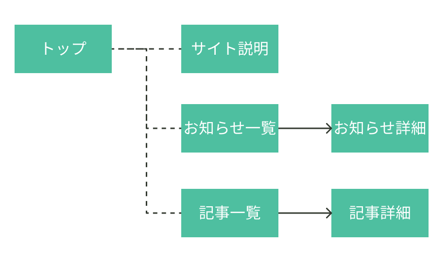
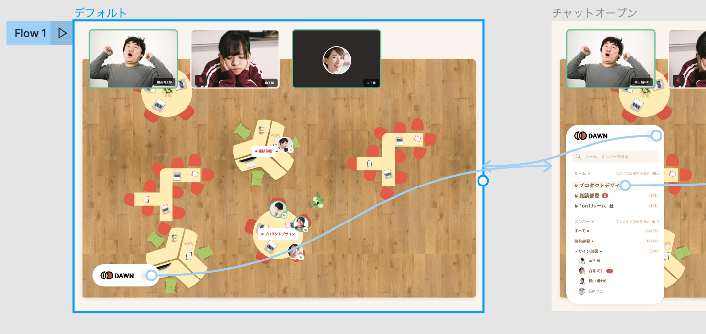

## 画面遷移図とロジックパーツ

プロジェクト進行において、要件を形にする際に、簡易なアイコンとラインを用いてシステムを設計したり整理します。  
そこで使うアイコンやラインのことを、`ロジックパーツ`と呼んでいます。  
このパーツを使って作る図を`フローチャート`、または`画面遷移図`と呼びます。

`フローチャート`とは、処理やユーザーが利用する際の流れを図にしたものです。  
`画面遷移図`とは、Web ページの遷移を図にしたもので、表示されるページを主体に操作などの注釈を加えたものが多いです。  
つまり、画面遷移図も 1 つのフローチャートです。  
これらはフレームワーク設計やコーディングの前に、目標物の共有やその後の設計をスムーズにするために制作します。  
書き方の形式やルールに一定の決まりはなく、目標物の性質や設計の段階、環境、誰に伝えるかによって、どういった形式が採用されるかが決まります。

### 画面遷移図の種類

画面遷移図の作り方には多くの手法がありますが、大きく分けて３種類存在します。

#### 1. 画面名で作る

[[right | 最もシンプルな画面遷移図が、画面名だけを線で結んで作成する方法です。 アイデア出しの段階でよく作られる画面遷移図です。 シンプルな反面、どこをどうしたらページが遷移するのかなどが伝わりづらいですね。]]
| 

#### 2. 画面デザインを繋げる

[[right | 画面を作ってから遷移図を作成する方法です。 この画面遷移図は、UIやUXについて検討を行うために作られたり、デザインの説明を行う場合に使用されることが多いです。 どこを押せばどうなるのかなどがわかりやすいのがメリットです。 しかし、デザインができないと遷移図が作れないため、デザインと実装を同時並行で行うのには向いていません。 これは写真を見るとわかるように、Figmaのプロトタイプ機能を使えばすぐに作成できます。 デザインをエンジニアに説明するときに使いましょう。]]
| 

#### 3. 様々なパーツで作る

この手法を Play Ground で採用していますが、デザイナーに一番優しくなく、エンジニアに一番優しい手法です(笑)。  
これから解説しますのでゆっくり慣れていきましょう。

### 実際に作ってみよう！

まずは元になっている[ロジックについて](http://www.cs.shinshu-u.ac.jp/Lecture/Prog2/Prog1/class04.pdf)を一読してから次に進みましょう。  
以下は、Playground の画面遷移図に使われるロジックパーツとその説明です。  
この画面遷移図を元にエンジニアは実装をします。一種の仕様書と言えるでしょう。

これらのロジックパーツはプロジェクト共通のものです。  
パーツを使う際は、Figma 左サイドバーの`Assets`→`Shinonome Logic parts` から使用しましょう。  
また、オリジナルのアイコン等を作る場合は、必ずコンポーネント化しましょう。  
**※Assets にローカルのパーツしかない場合は Assets の本のアイコンから、Shinonome Logic parts が適用されているか確認しましょう。**

### パーツ同士を繋げる

パーツ同士を繋げる際に、Shinonome Logic parts の矢印や破線を使っても問題ないですが、[前のセクション](https://design-basic.netlify.app/figma/section5/)で紹介したプラグイン`Auto flow`がとても役立ちます。  
ロジックパーツを移動すると矢印も追従してくれる、矢印の長さの調整が不要である点などがメリットです。

### Study Diary を書きましょう！

#### 今回やったこと

- 画面遷移図
- ロジックパーツ

できたら次に進みましょう。
