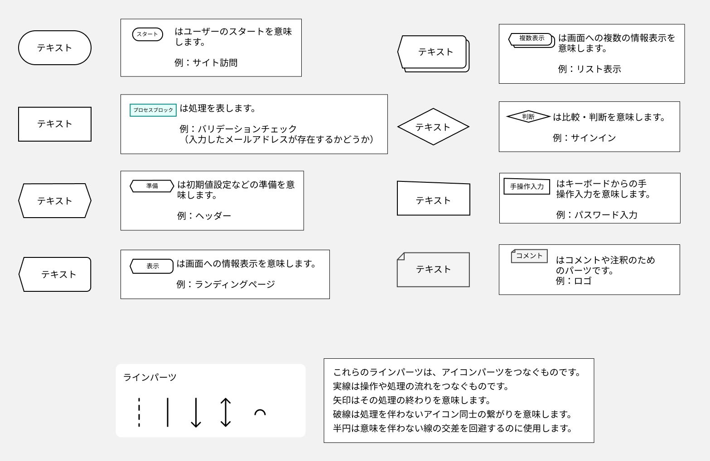
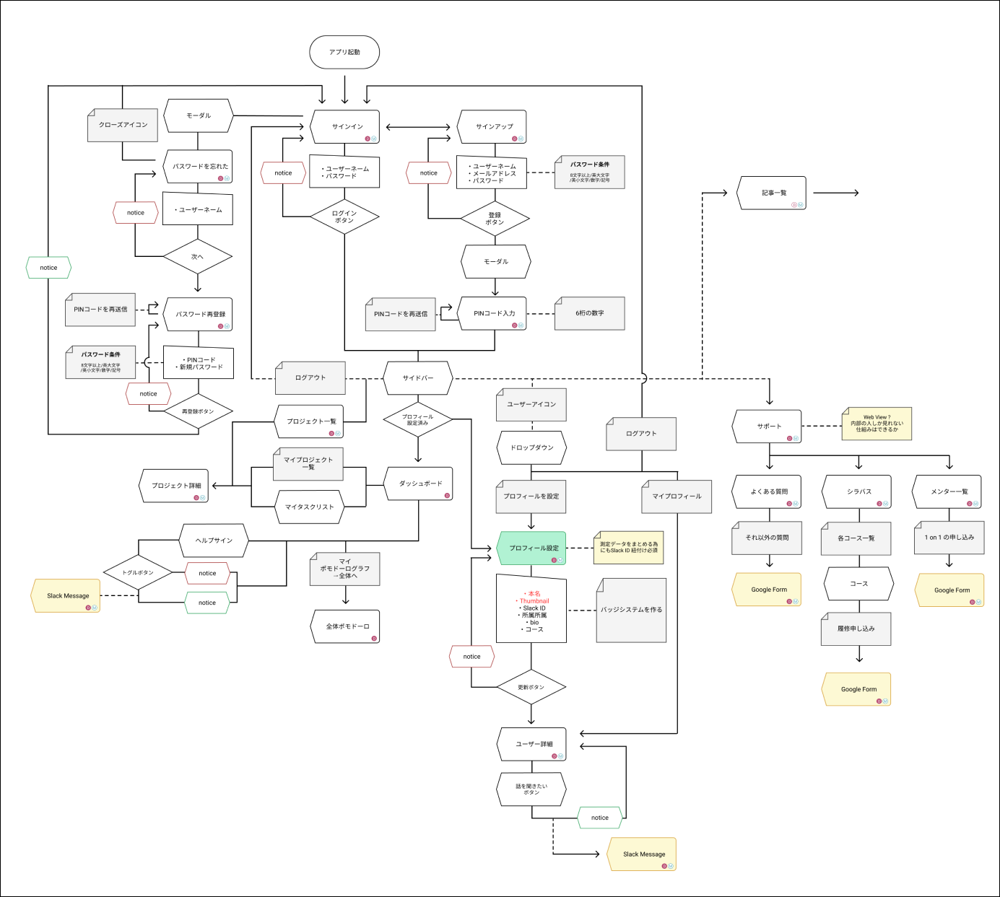

## 画面遷移図とロジックパーツ

プロジェクト進行において、要件を形にする際に、簡易なアイコンとラインを用いてシステムを設計したり整理します。  
そこで使うアイコンやラインのことを、`ロジックパーツ`と呼んでいます。  
このパーツを使って作る図を、`フローチャート`、あるいは`画面遷移図`と呼びます。

`フローチャート`とは、処理やユーザーが利用する際の流れを図にしたものです。  
`画面遷移図`とは、Web ページの遷移を図にしたもので、表示されるページを主体に操作などの注釈を加えたものが多いです。  
つまり、画面遷移図も 1 つのフローチャートです。  
これらはフレームワーク設計やコーディングの前に、目標物の共有やその後の設計をスムーズにするために制作します。  
書き方の形式やルールに一定の決まりはなく、目標物の性質や設計の段階、環境、誰に伝えるかによって、どういった形式が採用されるかが決まります。

### 例

フローチャートの書き方には色々なものがありますが、ここでは Playground で使われている形式のフローチャートについて学びます。  
まずは元になっている[ロジックについて](http://www.cs.shinshu-u.ac.jp/Lecture/Prog2/Prog1/class04.pdf)を一読してから次に進みましょう。

以下は、Playground のフローチャートに使われるロジックパーツとその説明です。



Play Ground のプロジェクトでは、これらのパーツを使ったフローチャートを制作します。
Web サイト制作する際にページのイメージをする前の段階で、これらのパーツを使って画面遷移図を制作します。  
これらのロジックを元にエンジニアは実装をします。  
一種の仕様書と言えるでしょう。

下図は、これらのパーツを使い、実際に作られた Playground Desktop App のフローチャートです。



### パーツの使い方

これらのロジックパーツはプロジェクト共通のものです。  
パーツを使う際は、Figma 左サイドバーの`Assets`→`Shinonome Logic parts` から使用しましょう。  
また、オリジナルのアイコン等を作る場合は、必ずコンポーネント化しましょう。  
**※Assets にローカルのパーツしかない場合は Assets の本のアイコンから、Shinonome Logic parts が適用されているか確認しましょう。**

### パーツ同士を繋げる

パーツ同士を繋げる際に、Shinonome Logic parts の矢印や破線を使っても問題ないですが、[前のセクション](https://design-basic.netlify.app/figma/section5/)で紹介したプラグイン`Auto flow`がとても役立ちます。

Auto flow を使う利点

```
・パーツを動かした時、矢印も追従して移動してくれる
・矢印の長さの調整が不要
```

### Study Diary を書きましょう！

#### 今回やったこと

- 画面遷移図
- ロジックパーツ

できたら次に進みましょう。
