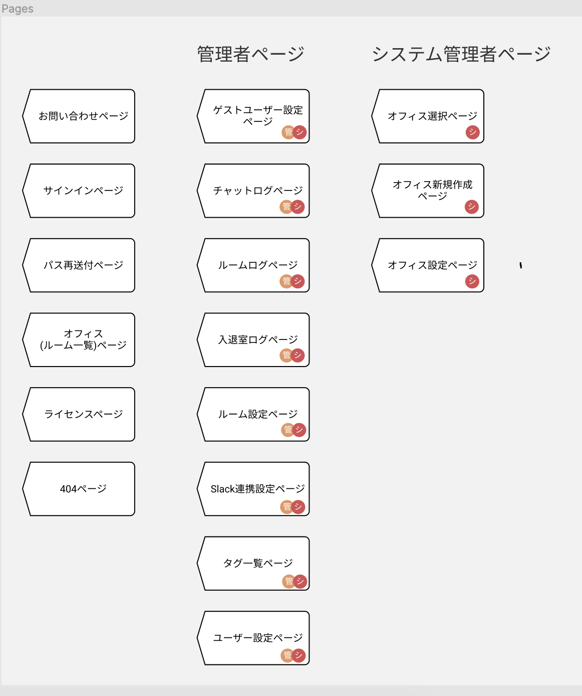

それでは、実際にパーツを使って、画面遷移図を作ってみましょう。

今回は、要件を見て一から図を作るのではなく、既に完成している[デモサイト](https://demo.tcd-theme.com/tcd063/)から、設計段階の画面遷移図を逆算して作ります。  
Design Course Tutorial (Username) の`ロジックについて`と書かれたページで制作していきましょう。

### 全ページを洗い出す

まずは、デモサイトにいくつページがあるのか数えましょう。  
そしてページ一覧としてまとめておくことでエンジニアが何ページ作成すればいいのか把握できます。  
コンポーネント化はロジックパーツでも例外ではありません。  
同じパーツを使い回す場合は必ずコンポーネント化・Variants 機能を使いましょう。  
下の画像はある案件のページ一覧です。

### 画面遷移図制作課題

ページ一覧のフレームが作成できたら、画面遷移図、共有パーツ一覧（ヘッダーなど）の 2 つのフレームを用意しましょう。  
必要があれば、適宜フレームを追加して構いません。まずは自分なりに工夫して、図を作ってみましょう。

### 解答ができたら

1. バージョンを保存する [参考](https://design-basic.netlify.app/figma/section2-3/)
2. この章で学んだことを Study Diary に書き、今回学んだ部分にチェックをつける。
3. 提出するページのリンクをコピーする。
4. PGrit でページのリンクと、`#design_review`のタグをつけてレビューを依頼する。
5. レビューで指摘されたことがあれば修正し、再び 1 から繰り返す。

レビューは基本的にコメントで行います。  
レビューされたら Figma 上で確認、コメントの意味がわからなければ reply をして`#design_review`のタグをつけて PGrit にその旨を投稿してください。

**※shinonome チームの Design Course Tutorial を編集しないように気をつけてください！万が一してしまった場合は気づいたらすぐに教えてください！**
