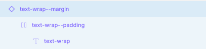
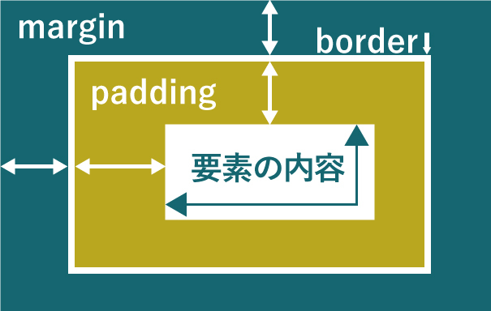
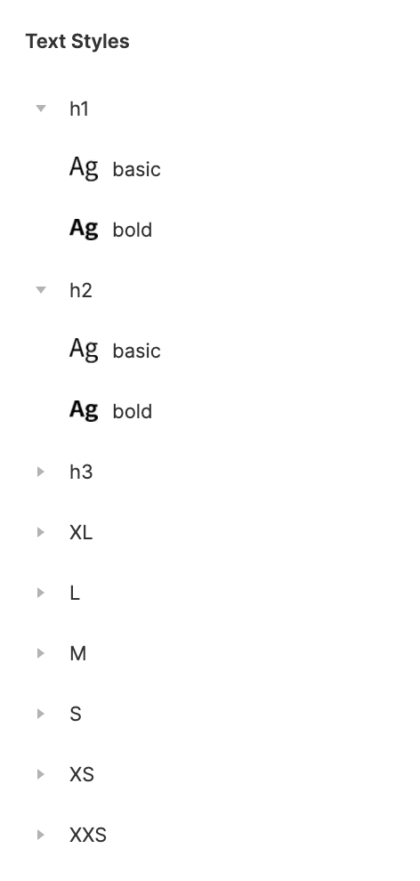
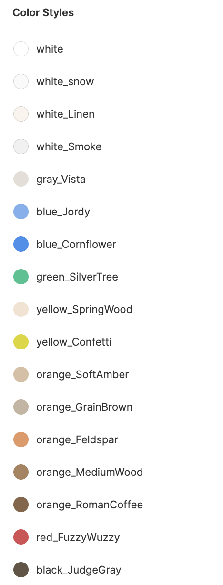

### Atomic Design とは？

Atomic Design(アトミックデザイン)とは、画面を構成する要素を、`Atoms(原子）`,`Molecules（分子）`,`Organisms(有機体）`,`Templates(テンプレート）`,`Pages(ページ）`の 5 つの階層に分け、最終的な UI と UI の基礎となるデザインシステムを同時に作成する設計方法です。

### 利点

- 機能やコンポーネント単位で考えることで、デバイスやページの概念に縛られず、動的にデザインできること。
- それぞれの階層でコンポーネント化をすることによって修正・変更しやすく、パーツの使い回しもできる。

### 例

以下の画像が instagram を Atomic Design 化 したものです。

`Atoms(原子）`,`Molecules（分子）`,`Organisms(有機体）`,`Templates(テンプレート）`,`Pages(ページ）`の階層の明確な分け方はありません。  
わかりやすく整理されており、他者から見てもわかりやすいようであれば`Templates`の階層が存在しないなどもありえます。

### カラーやテキストの Atomic Design

パーツだけではなく、Figma を使えば、カラーやテキストのスタイルを登録することができます。  
登録することによって、使っているカラーとテキストが可視化され、サイト全体の統一感にも繋がります。  
以下の画像を見てみましょう。

| カラースタイル                         | テキストスタイル                     |
| -------------------------------------- | ------------------------------------ |
|  |  |

カラーやテキストの指定をしている部分をホバーすると`４つのドット`が出現し、すでに登録されているスタイルを選択・適用したり、`+`ボタンから新しく登録することができます。  
effect もスタイルの登録ができます。使う際は必ず登録するようにしましょう。

### Shinonome のテキスト

Shinonome ではテキストを`Atoms/Text`と位置付けてコンポーネントを統一して使っています。 右サイドバーの`Assets`の`Shinonome Text Styles`から`text-wrap`を持ってきて構造を見てみましょう。  
テキストが`margin`と`padding`という名前の Auto layout でラップされているのがわかると思います。

- `text-wrap--margin` は外側の余白で他の要素との余白を取る際に用います。
- `text-wrap--padding` は内側の余白で、自分の要素の余白を取る際に用います。  
  margin と padding の違いをしっかりと理解しましょう。

| text-wrap                         | margin と padding                       |
| --------------------------------- | --------------------------------------- |
|  |  |

### 命名規則

コンポーネント・カラー・テキストは命名の仕方がとても大事です。
命名をわかりやすくすることでエンジニアにとっても自分自身デザイナーにとっても管理のしやすいデザインシステムになります。

#### コンポーネントの命名

Atomic Design をする上でパーツは全て Figma のコンポーネント機能使う必要がありますが、命名には少し工夫が必要です。  
パーツをわかりやすいように rename することが当たり前ですが、コーディングをする際に日本語は一切使いません。  
エンジニアがそのままの命名を使えるよう、**コンポーネントの命名に日本語は使わない**ようにしましょう。

命名規則は以下です。

- `階層名(atoms,moleculesなど)`/`パーツ名/(状態)`

例: `atoms/Button/default`, `atoms/Button/active`, `atoms/Button/hover`,`molecules/user-list`  
`/`で区切ることによって、パーツの検索・Variants 機能が使いやすくなります。  
`active`や`hover`などマウスのアクションが起きた時のデザインも考えましょう。  
user list など、２単語以上ある場合は`-`で単語を繋げるのがルールです。

#### テキストの命名

基本的には`Shinonome Text Styles`のスタイルを用いましょう。  
文字の大きさは`h1`,`h2`,`h3`,`XL`,`L`,`M`,`S`,`XS`,`XXS`の 9 種類に分かれています。  
こちらも`/`で区切ることによって階層が分かれて管理がしやすいです。  
Shinonome Text Styles では font-weight の普通・太いの 2 種類で`h1/basic`,`h1/bold`のように登録しています。  
h1,h2,h3 は見出しを表すものです。

#### カラーの命名

カラーの命名には[HTML CSS Color Picker](http://www.htmlcsscolor.com/)を使います。

命名規則は以下です。

- 色名は`基本色名_詳細色名`で表す
- 基本色名は Color Wheel の 6 色（`red, orange, yellow, green, blue, violet`）と白黒灰 3 色(`white, black, gray`) を合わせた 9 色を使う
- 詳細色名は HEX カラーコードを色名検索 Web サービスで検索してヒットした色名を使う
- 色の並べ方は`white->gray->blue->green->yellow->orange->red->violet->black`
- 透明度が 100%でない場合は`基本色名_詳細色名_透明度`のようにする

理由は[この記事](https://qiita.com/gotchane/items/5a84c6acd9312f70be77)を参照してください

| テキストの命名                                            | カラーの命名                                                |
| --------------------------------------------------------- | ----------------------------------------------------------- |
|  |  |

### 参考

- [公式ドキュメント ~text styles~](https://help.figma.com/hc/en-us/articles/360039957034-Create-and-Apply-Text-Styles)
- [公式ドキュメント ~color styles~](https://help.figma.com/hc/en-us/articles/360038746534-Create-styles-for-colors-text-effects-and-layout-grids#Text)

### Study Diary を書きましょう！

今回学んだ Atomic Design はエンジニアが実装する上でとても重要な知識です。  
理解できない部分は手を動かしたり調べたりしましょう。  
カラーはなぜこの命名規則でしょうか？  
自分なりに考えて Study Diary に書いてみてください。

#### 今回やったこと

- Atomic Design
- テキスト・カラーの登録
- コンポーネント・カラー・テキストの命名規則

できたら次に進みましょう。
