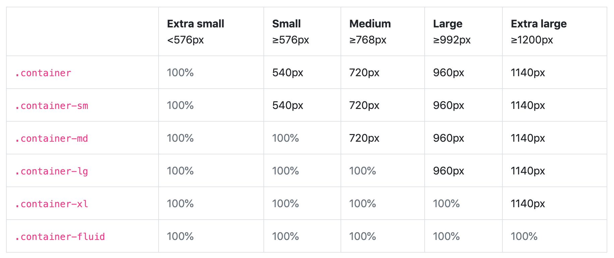

## デバイス対応とは

デバイス対応とは、スマホ・タブレット・PC など画面幅に合わせてデザインが崩れることがないようにすることです。  
まずはフロントエンド コースの[スマホ対応とレスポンシブ対応](https://basic-frontend.4nonome.com/bootstrapGit/350/)を一読しましょう。  
基本的にはレスポンシブ対応でデザインを作ることが多いです。  
ある画面サイズを境目としてデザインを切替えますが、この境目を`ブレークポイント`といいます。  
ブレイクポイントは基本的に bootstrap のブレークポイントに合わせましょう。

Design Course Tutorial (Username) の`ブレークポイント`と書かれたページにそれぞれのサイズのフレームを用意しました。  
参考にしてください。

### Study Diary を書きましょう！

[bootstrap](https://getbootstrap.jp/) とはフロントエンド でよく使う CSS フレームワークのことです。  
Twitter 社が作っており、幅広く使われています。  
ブレークポイントなどデザインシステムよく考えられて設定されているので真似しましょう。

#### 今回やったこと

- デバイス対応

できたら次に進みましょう。
