## あなたのデザイン、他人に伝わりますか？

あなたが今まで学んできたことを元に Web ページのデザインを完成させたとします。  
エンジニアにあなたの思い描いているページは実装できるでしょうか？  
エンジニアの立場になって考えてみましょう。

[You Tube](https://www.youtube.com/) を例に説明します。  
下の画像は You Tube のヘッダーのデザインとヘッダー周りの画面遷移図です。  
あなたが作ったとします。  
※画面遷移図のオレンジ色の点線は説明を割愛部分で省略していることを表しています。

| header                                      |
| ------------------------------------------- |
| 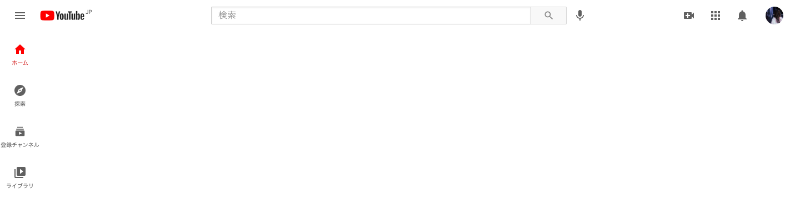 |

| logic                                     |
| ----------------------------------------- |
| 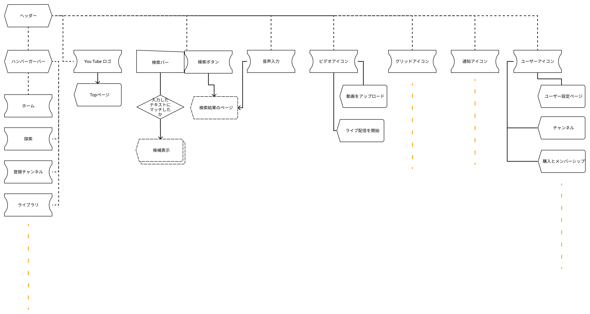 |

### assets を用意する

アセットとは簡単にいうと素材のことです。  
アイコンや YouTube のロゴなどは png や svg のデータとして扱います。  
エンジニアにどれを使っているのかわかりやすいようにアセット達を置くフレームを用意するなどしてまとめておきましょう。

また、ロゴを作ったとしましょう。それはエンジニアがそのまま使用できる状態でしょうか？  
試しにサイズを変更してみましょう。

| サイズ変更前            | サイズ変更後                          |
| ----------------------- | ------------------------------------- |
| 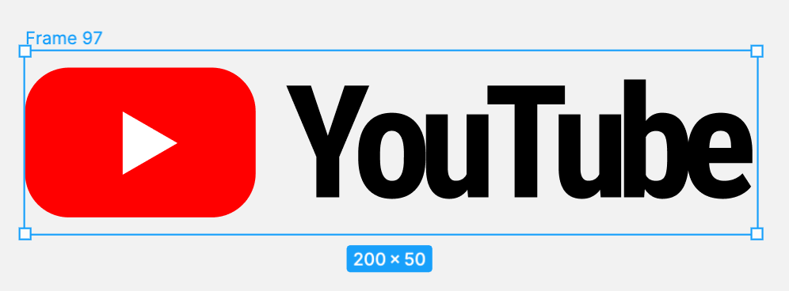 | 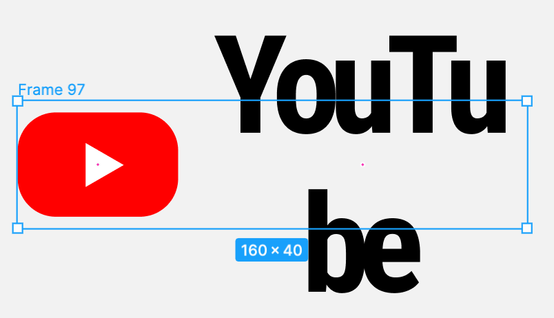 |

文字の部分がサイズが変わるのではなく、改行されてしまっています。  
これは親要素であるフレームのサイズを変えてもフォントサイズは変わらないからです。  
しかし、サイズが変わるたびにフォントサイズを変えるのはなかなか大変ですよね。  
その時に使用するのが`アウトライン化`という機能です。  
アウトライン化とはパスで構成されたオブジェクトに変換することです。  
文字のアウトライン化をすることで、フォントの情報が破棄され文字が図形化されます。  
一度アウトライン化したフォントは、元に戻すことができないので、フォントの情報を text styles に登録しておくなど修正・変更がしやすい状態にしておきましょう。  
アウトライン化したいものを選択し右クリックでアウトライン化できる表示が出てきます。

| アウトライン化                | アウトライン化完了後                          |
| ----------------------------- | --------------------------------------------- |
| 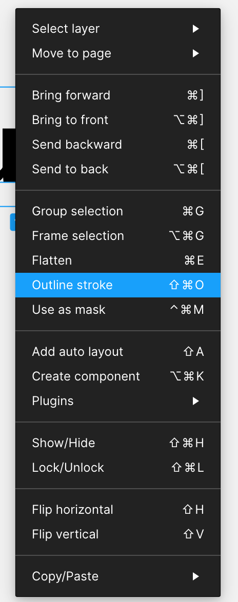 | 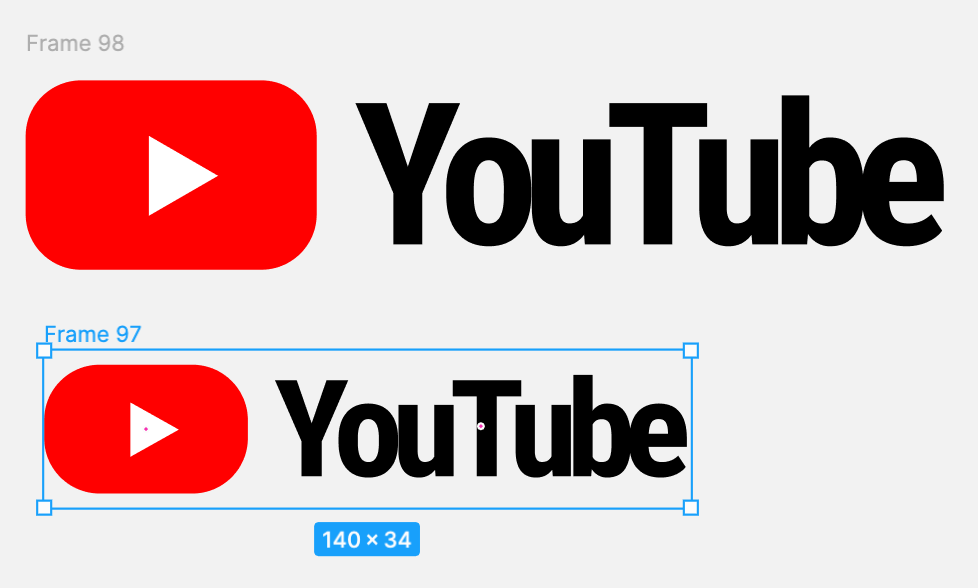 |

問題なくリサイズできました。  
ロゴなどの素材データを作った際はこのようにサイズを変えてみて表示が崩れないか必ず確認しましょう。  
また、オブジェクト名もそのままエンジニアが使用できるよう今回の場合は`logo`のような適した名前にしましょう。

### マウスアクションを伝える

マウスアクションの観点でパーツの状態を考えると以下の3つの状態があります。</br>
・デフォルト（マウスをかざしていない状態）</br>
・ホバー（マウスをパーツにかざした状態）</br>
・アクティブ（マウスでパーツをクリックしている状態）

| デフォルト                              | ホバー時                            | アクティブ時                          |
| --------------------------------------- | ----------------------------------- | ------------------------------------- |
| 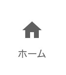 | 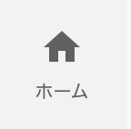 | 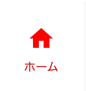 |

デフォルト、ホバー、アクティブの3つをデザインすると、エンジニアはこのような疑問を持ちます。

```
ホバーして色がどのように変わるのか？ 例えば、、、

・何秒かけて色が変化する？
・どのように変わる？
・ホバーしてすぐ変化が始まってもいい？
```

これらを伝える手段が、`Shinonome Check Listの進捗管理CheckCard`もしくは`コメント＆メモ`です。
ShinonomeのAssetsの中にあるので確認しましょう。

| 進捗管理CheckCard                   | コメント＆メモ                          |
| ----------------------------------- | --------------------------------------- |
| 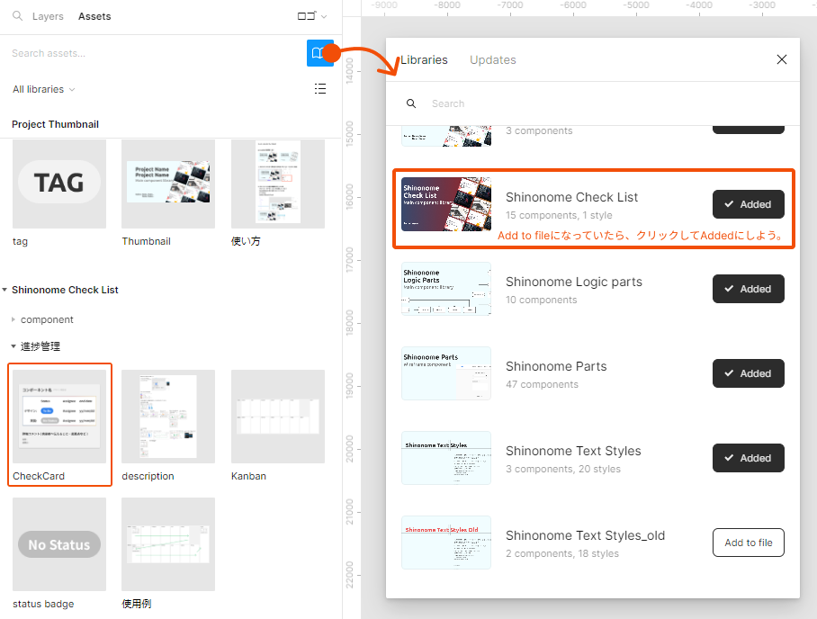 | 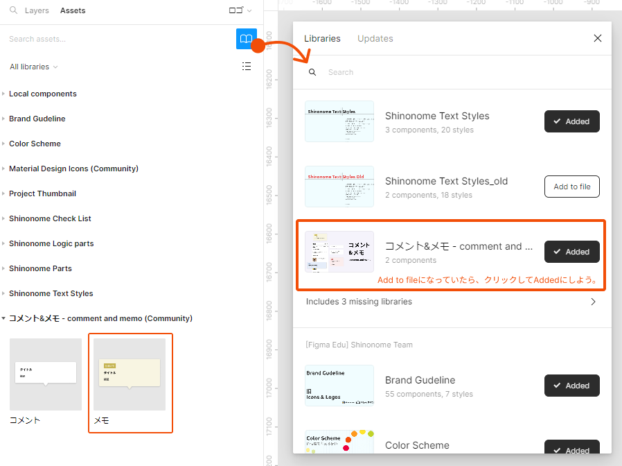 |

記載例です。

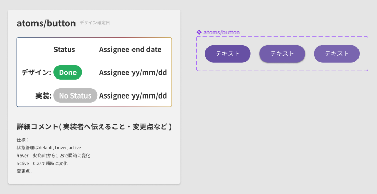

他にもハンバーガーバー をクリックすると、以下のメニューが表示されます。

| 通常時                                      | メニュー詳細表示                      |
| ------------------------------------------- | ------------------------------------- |
|  | 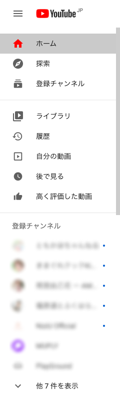 |

こちらもエンジニアはこのような疑問を持ちます。

```
どのように表示される？例えば、、、

・フェードイン？
・スライドイン？
・普通にパッと表示される？
```

[このサイト](https://play-asset.com/)のようにアニメーションのあるメニューも多いです。  
このような場合も上と同様の対応をしましょう。

### 文字の折り返しを伝える

Web ページの幅は可変です。  
文字の幅がデバイスの幅を上回ってしまった場合も考慮することが大切です。

[[right | 動画名は２行目で省略され、チャンネル名は１行目で省略されますね。<br/>このような振る舞いを示すこともデザイナーの重要な役目です。<br/>はみ出てしまう文字の折り返しのパターンは主に以下の３つです。]]
| 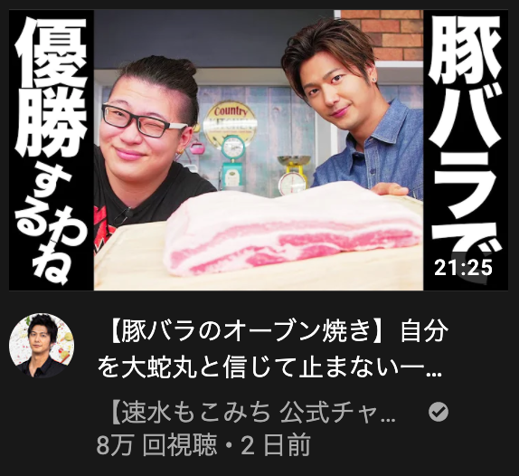

```
・改行され下にずっと続いている
・...の省略記号で省略する
・スクロールでユーザーに続きを読むかどうか判断させるようにする
```

### パターンを伝える

ヘッダーのデザイン表示パターンはもっと必要です。

```
・トップページと動画個別ページでデザインが違う
・登録チャンネルがない(少ない)場合のデザイン
・ログインしている時のしていない時のコンテンツの違い
・ダークモードのデザイン
```

他にももっとあるでしょう。

### 参考リンク

- [interactive components](https://help.figma.com/hc/en-us/articles/360061175334-Create-interactive-components-with-variants)
- [エンジニアが知りたいアニメーション](https://qiita.com/7968/items/812d6a21fc4dd9ae9c75)

### 個人シートに学んだことを記入しましょう！


地道で面倒な作業に思えるかもしれませんがこれをしないとエンジニアの確認するコストが増え、負荷がかかってしまいます。  
デザインをするということは使うユーザーやサービスを実装するエンジニアを思いやることです。

#### 今回やったこと

- assets を用意する
- マウスアクション・タップアクションを伝える
- パターンを伝える

できたら次に進みましょう。
