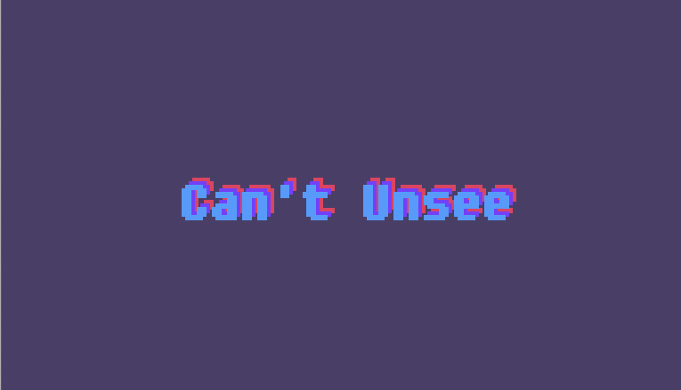

いいデザインとは何でしょうか。  
デザインする上で大事なのは、使う人の立場になって、このデザインは使いやすい・わかりやすいのか考えることです。  
ここで必要なのが`UI`,`UX`という概念です。

### UI とは

UI はユーザーインターフェイスの略です。  
例えば何かの WEB サイトを PC やスマホ、タブレットで見ているとき、その画面上で見られる情報（フォントやデザイン等）すべてが UI にあたります。

### UX とは

UX はユーザーエクスペリエンスの略。

例えばあなたが、とある WEB サイトを訪問したとしましょう。  
あなたはその WEB サイトを見てどのように感じますか？
例えば、

- デザインが美しい
- フォントが見やすい（読みやすい）
- なんの情報がどこにあるか分かりやすい
- ページの読み込み速度が速くて使いやすい

これらの感想が 全て UX。
商品やサービスに触れて、ユーザーが感じることすべてが UX となります。

### Can't Unsee とは

**[Can't Unsee](https://cantunsee.space/)**とは、どちらが良いデザインか簡単に何か学べるクイズ形式のサイトです。  
`Tutorial`,`Easy`,`Medium`,`Hard` の 4 段階で構成されています。  
なぜそのデザインが良いのか悪いのか、解説もしっかり読みましょう。

### 全問正解するまで取り組もう！

Can't Unsee で満点を取ることが今回の課題です。  
全問正解したらスコアのスクリーンショットを Study Diary に載せ、感想や学んだこと・調べたことを書いてみてください。  
クリアしたら Study Diary のチェックリストを更新して次に進みましょう。
