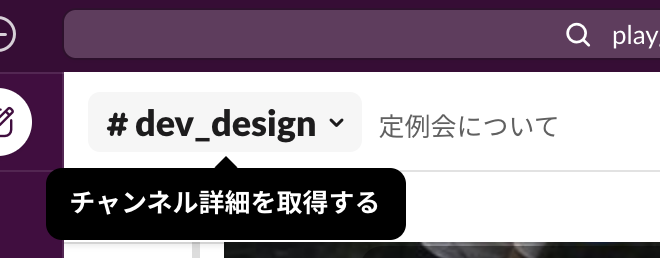
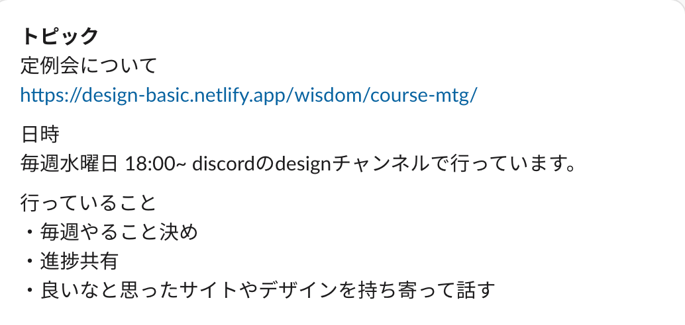

週 1 回のペースで 30 分から１時間程度コース受講者を対象に定例会・勉強会を行っています。  
参加必須なので出来るだけ時間を空けておいて下さい。  
授業などで毎週絶対参加できない場合は日時を変更するので相談してください。

#### 開催時間

slack の`#dev_design`チャンネルのチャンネル情報を確認してください。

#### 参加できない場合

slack の`#dev_design` チャンネルにて出来るだけ早く連絡してください。

| チャンネル上部の名前をクリック | トピックを確認                 |
| ------------------------------ | ------------------------------ |
|  |  |

### 定例会前日~当日までに PGrit ですること

- 目標の振り返り・達成度(達成しなかった場合は原因と何割達成できたか)
- １週間でいいと思ったデザイン・配色・HP などを載せ、どういう点がいいか考察する
  ([このページ参考にしてね](./wisdom/section1))

### 定例会が終わった後にすること

- [学習申告フォーム](https://docs.google.com/forms/d/e/1FAIpQLSeKyNsvpVw2KTxsWFtQCAgiQ2ydK6o4Sop9r1JpEjGjiptCOw/viewform)を提出する
- 必達・理想目標の 2 つを PGrit で宣言する
- 次の定例会までに１週間でいいと思ったデザイン・配色・HP などを溜めておく
