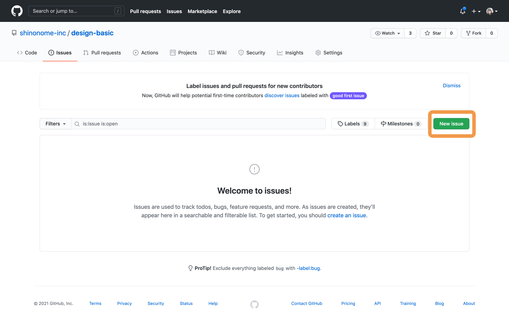

### わからないことがあった時

- 課題のやり方がわからないなど教材に関することは、PGrit で`#design_review`のタグをつけてトゥートすることによって講師が確認します。
- 考えすぎず考えましょう。質問するタイミングは教材・公式ドキュメントをよく読んで`+15 分`調べた時です。  
  [参考記事](https://qiita.com/seki_uk/items/4001423b3cd3db0dada7)  
  まずは[質問ページ](https://github.com/shinonome-inc/design-basic/issues?q=is%3Aissue+label%3AQuestion+)に自分の疑問点が載っていないか確認しましょう。

### Question issue を立てましょう！

質問ページにもなければ自分で質問しましょう！
[markdown 記法](https://qiita.com/Minalinsky_1911/items/b684cfabe0f2fde0c67b)で書いてみてください。

1. [issue ページ](https://github.com/shinonome-inc/design-basic/issues)にアクセス
2. 右上の`New issue`をクリック
3. `Question Template`の`Get started`をクリック
4. title の`Question Title`をわからないことに即した名前に変更、Assignees に自分を選択する
5. Labels から自分のわからないセクションを選択する
6. 項目を**全て**埋める
7. 右下の`Submit new issue`をクリックする
8. 疑問点が解決したら、どのように解決したかを記述し`Close issue`をクリック

| New issue                        | Get started                           |
| -------------------------------- | ------------------------------------- |
|  |  |

| Question Template の書き方                             |
| ------------------------------------------------------ |
|  |
