ここではデザインをする際によく使うサイトを紹介します。  
おすすめ順に並べています。  
いいと思ったデザインはブックマークをしておきましょう！

### デザイン例を探す

dribbble で十分事足りますが類似したサービスがたくさんあるので、ここではいくつか紹介します。

| [dribbble](https://dribbble.com/) | [uplabs](https://www.uplabs.com/) | [pinterest](https://www.pinterest.jp/) |
| --------------------------------- | --------------------------------- | -------------------------------------- |
| 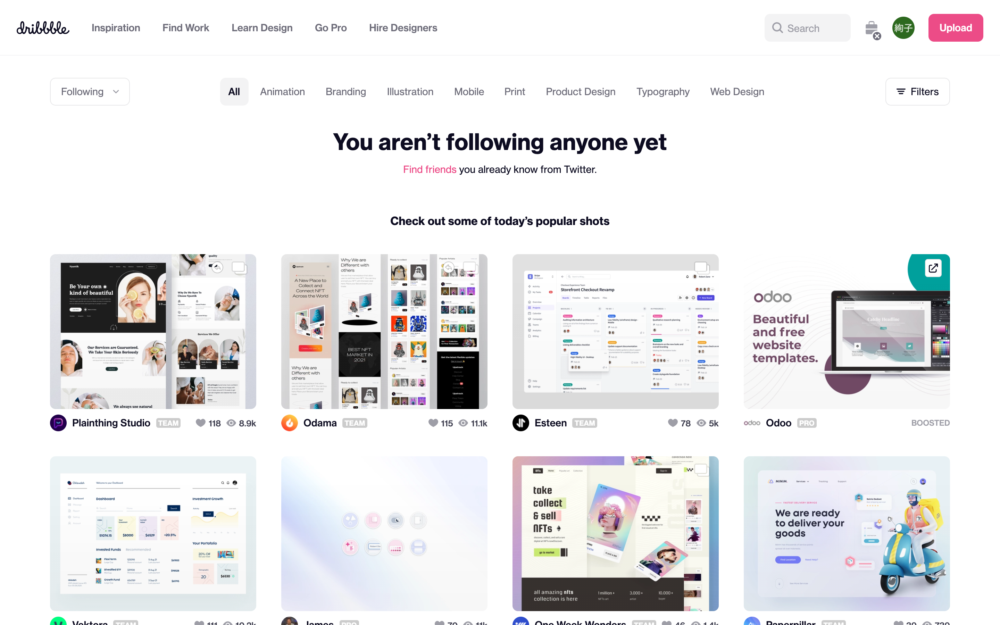   | 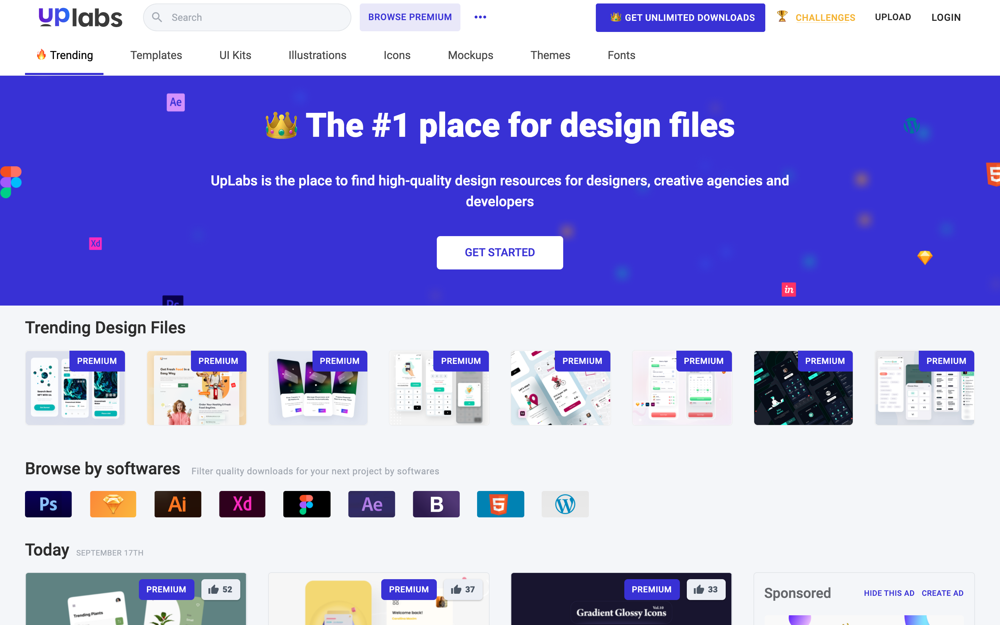       |       |

### 画像素材

`O-DAN`は日本語で検索可能、複数のサイトから商用利用可のもののみを検索してくれるので最も便利です。  
`Unsplash` は Figma でプラグインを提供している([プラグインとコミュニティ](/figma/section5/)参照)ので使い勝手がいいです。  
また少し毛色が違いますが、`isometric love` は種類は少ないものの可愛いオブジェクトを提供してくれています。  
案件で使う際は、`利用規約`をよく見て使うようにしましょう(画像加工は可能か、利用枚数に上限はないかなど。)。

| [O-DAN](https://o-dan.net/ja/) | [Unsplash](https://unsplash.com/) | [shutterstock](https://www.shutterstock.com/) |
| ------------------------------ | --------------------------------- | --------------------------------------------- |
|       |    |        |

| [Adobe Stock](https://stock.adobe.com/jp/) | [Pexels](https://pexels.com/ja-jp/) |
| ------------------------------------------ | ----------------------------------- |
| 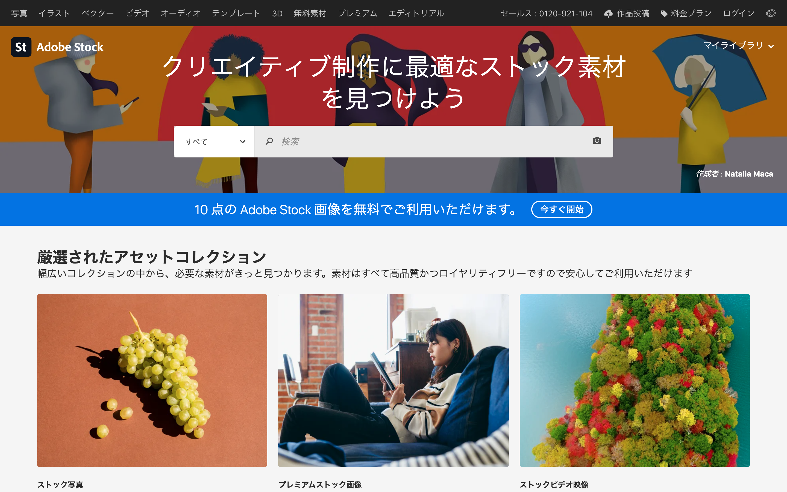      |          |

| [Burst](https://burst.shopify.com) | [GIRLY DROP](https://girlydrop.com) |
| ---------------------------------- | ----------------------------------- |
|           |  |

### 絵素材

`Open Peeps`は[定例会(#01 参照)](https://www.notion.so/0da57c003ede4c559398e28f50e3af65)でも扱いましたね。  
色合いは設定してからダウンロードできるもの、svg でダウンロードすれば figma 上でも調整することができます。
こちらも案件で使う際は、`利用規約`をよく見て使うようにしましょう。

| [Open Peeps](https://blush.design/collections/open-peeps) | [Storyset](https://storyset.com/) |
| --------------------------------------------------------- | --------------------------------- |
| 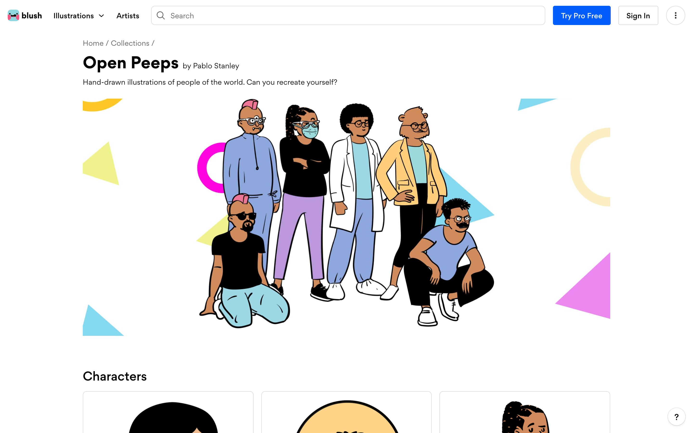                       | 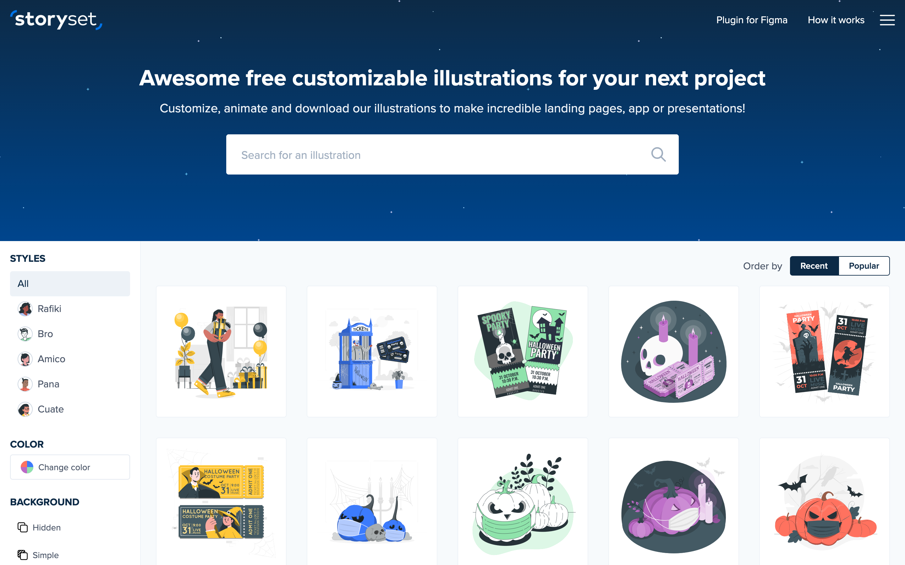   |

| [isometric love](https://www.isometriclove.com/) | [Loose Drawing](https://loosedrawing.com/) |
| ------------------------------------------------ | ------------------------------------------ |
| 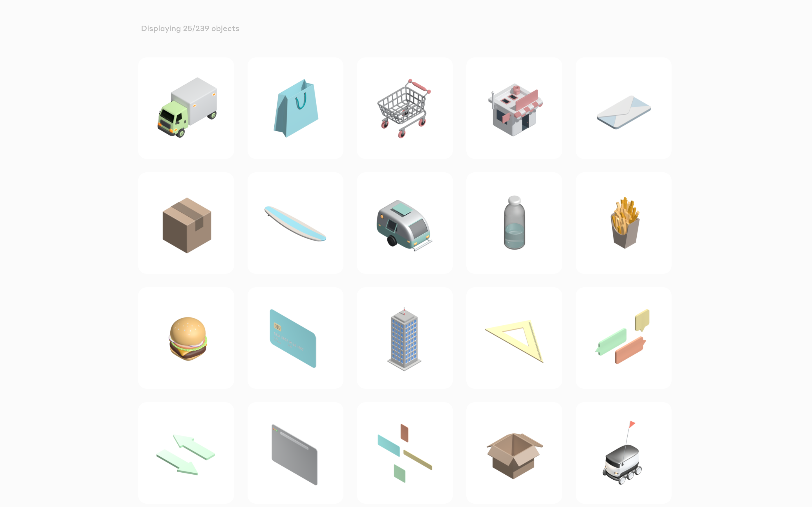      | 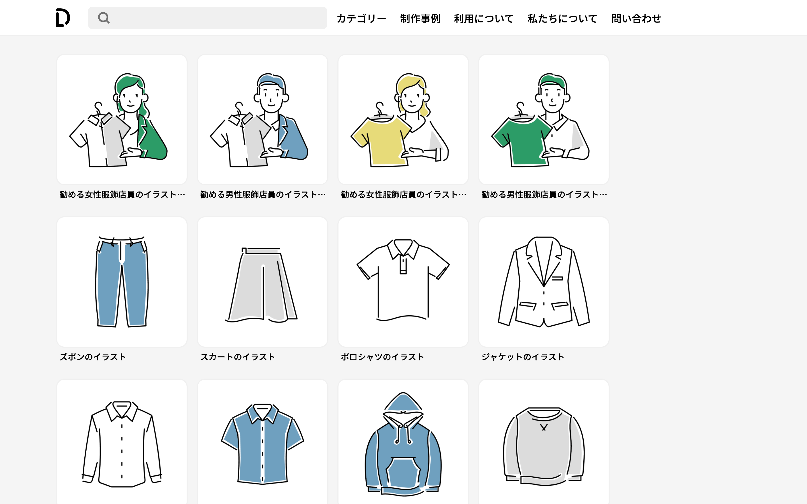  |

### アイコン素材

基本的には Google Icons を使うのがおすすめです。  
Figma 上でのアイコンの使い方はこちら。

| [Google Icons](https://fonts.google.com/icons) | [Font Awesome](https://fontawesome.com/icons?d=gallery) | [Feather](https://feathericons.com/) |
| ---------------------------------------------- | ------------------------------------------------------- | ------------------------------------ |
| 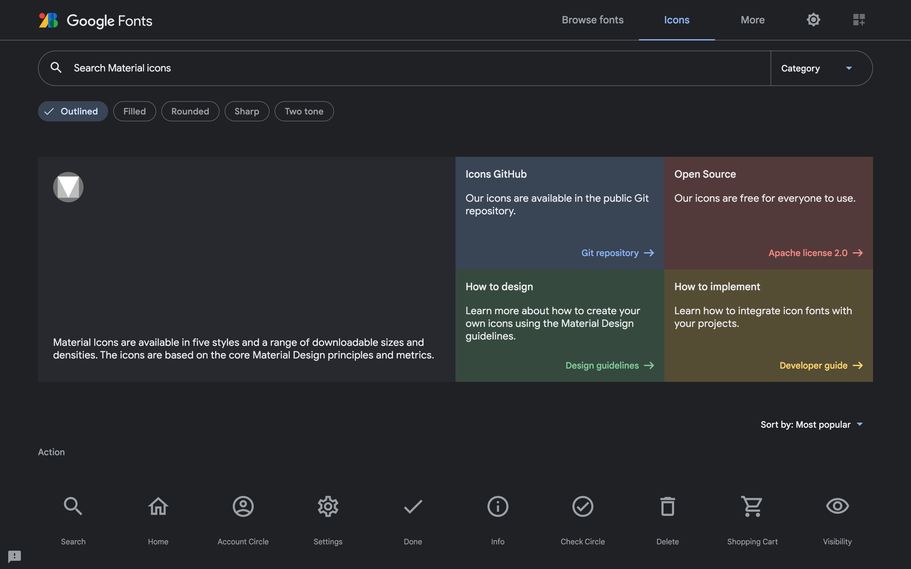        | 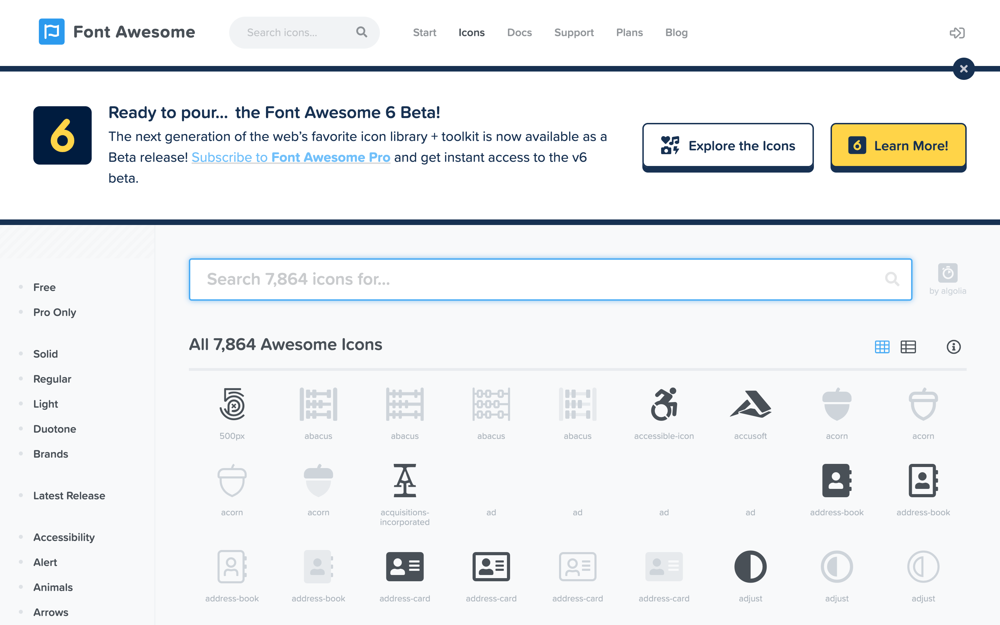                 | 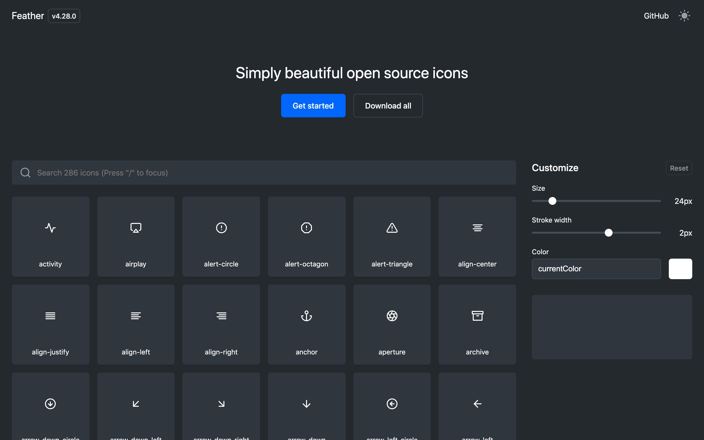        |

| [Forge Icons](https://icons.theforgesmith.com/) | [Tabler Icons](https://tablericons.com/) | [Unicons icon library](https://iconscout.com/unicons/explore/line) |
| ----------------------------------------------- | ---------------------------------------- | ------------------------------------------------------------------ |
|            | 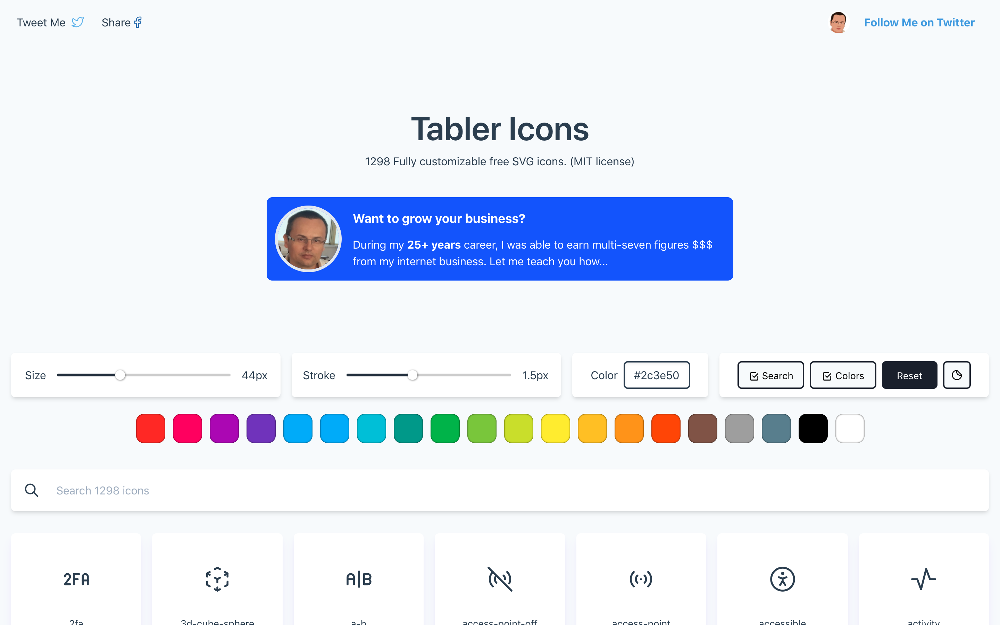  | 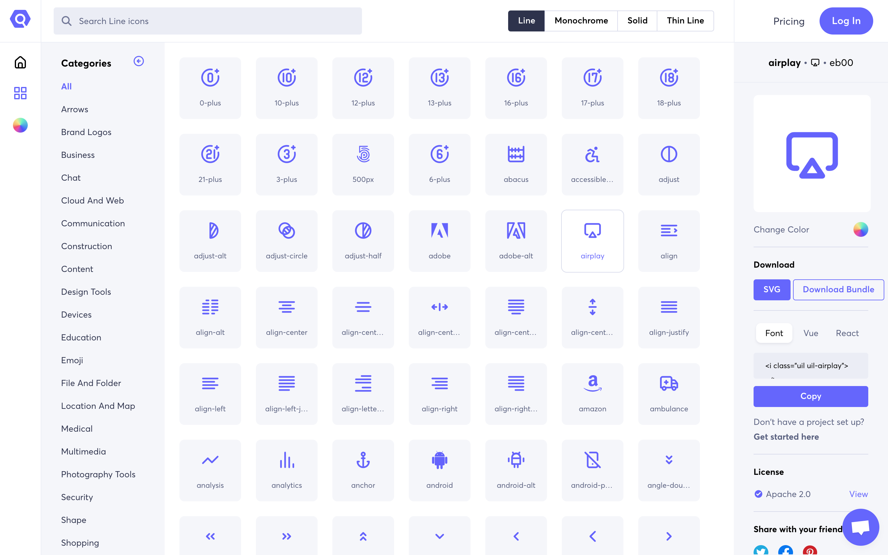                    |

### 配色

- [配色難民と化した新人デザイナーに捧ぐ。本当に役立つ配色サービスまとめ](https://liginc.co.jp/399974)

### 番外編

Web デザインとは少し違いますが、[Pinterest](https://www.pinterest.jp/search/pins/?rs=ac&len=2&q=concept%20board&eq=concep&etslf=4342&term_meta%5B%5D=concept%7Cautocomplete%7C0&term_meta%5B%5D=board%7Cautocomplete%7C0)で`concept board`と検索すると、様々なポスターのデザインを見ることができます。  
あまり機会はないかもしれませんが、パンフレット制作時などに役立つと思います。  

